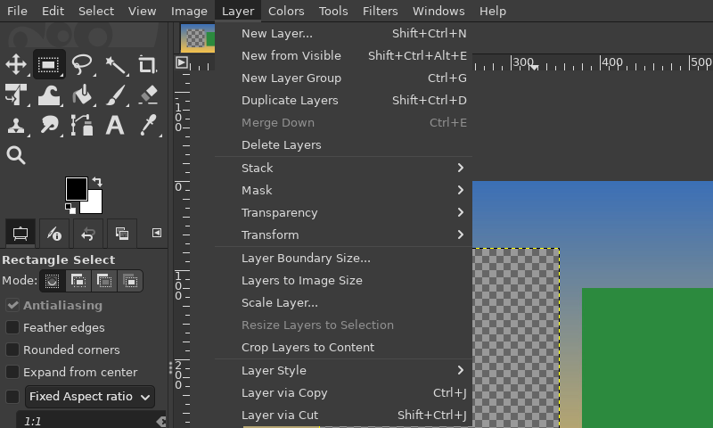
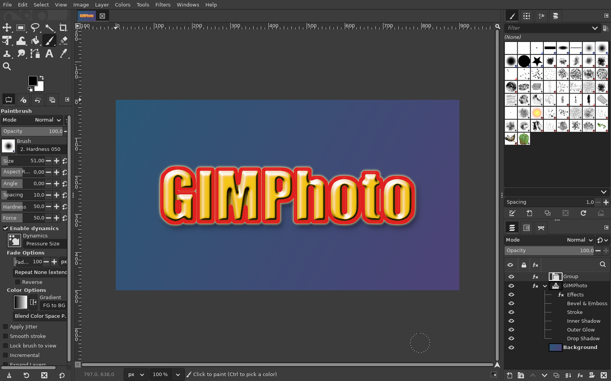
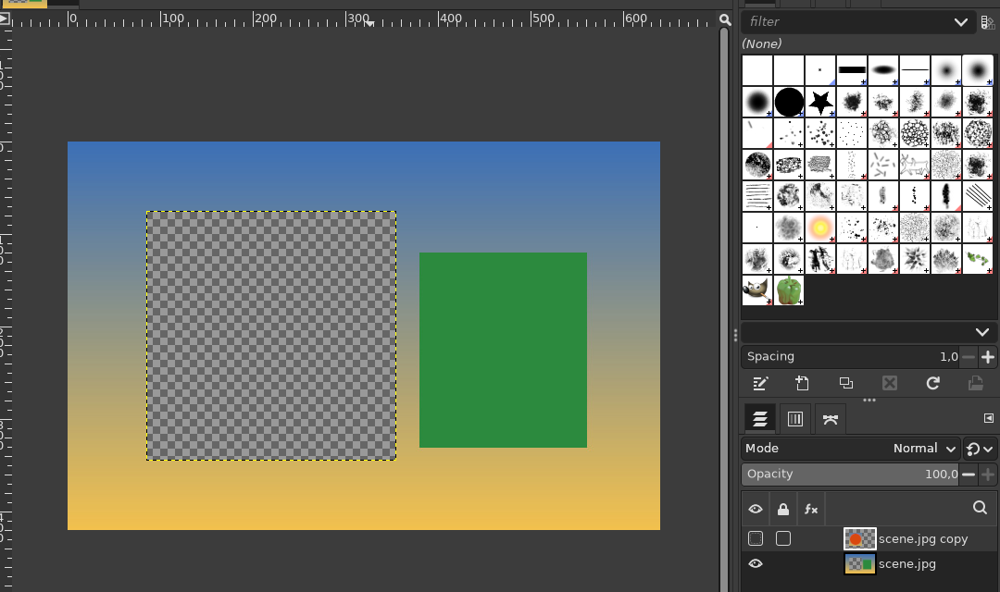

# GIMPhoto

**GIMPhoto is a fork of GIMP focused on Photoshop-style tools and
interface.** It is to GIMP what Linux Mint is to Ubuntu: the same program
underneath, GIMP 3.2.6, kept up to date with every official GIMP release,
with its own tools and interface on top for people who know Photoshop.

The features are tracked as [GitHub issues](../../issues) on the
[project board](https://github.com/users/diegochagas/projects/1).

## Features

Every change GIMPhoto makes to GIMP, each with its own page: how to use
it, before/after screenshots, what changed in GIMP's code, limits.

| Feature | Photoshop equivalent | Where | Docs |
|---|---|---|---|
| **Layer Style (fx) button** in the Layers panel, opening a Photoshop-style Layer Style dialog (shadows, glows, stroke, bevel, overlays) | Layers panel › fx | core patch + plug-in | [layer-style-fx-button.md](docs/features/layer-style-fx-button.md) |
| **Layer effects listed under each layer** in the Layers panel, collapsible, with an eye per effect and one for all | Layers panel › layer › Effects | core patch | [layer-effects-rows.md](docs/features/layer-effects-rows.md) |
| **Photoshop shortcuts by default**: Ctrl+D deselects, Ctrl+J / Ctrl+Shift+J make a layer via copy / cut, Ctrl+T transforms, V/M/L/W/B/S/E… pick the same tools, Ctrl+Tab switches images | Photoshop's default keyboard shortcuts | core patch + keymap | [photoshop-shortcuts.md](docs/features/photoshop-shortcuts.md) |
| **Layer via Copy / Layer via Cut** (Ctrl+J / Ctrl+Shift+J): a new layer from the selected area, in place; Cut also removes it from the original | Layer › New › Layer via Copy / Cut | plug-in + keymap | [layer-via-copy-cut.md](docs/features/layer-via-copy-cut.md) |

Apart from these, GIMPhoto is plain GIMP: its own user profile, GIMP's
default theme and layout.

### Layer Style (fx) button

The **fx** button at the bottom of the Layers panel, with its menu open, on a
text layer with a stroke and a drop shadow:


Each entry opens the Layer Style dialog on that effect, previewing live on
the canvas:


### Photoshop shortcuts by default

Menus show Photoshop's shortcuts, and the keys do what they do in
Photoshop (here Ctrl+G, Ctrl+E, Ctrl+J and Shift+Ctrl+J, Shift+Ctrl+D for Duplicate Layers):



### Layer effects in the Layers list

A layer's effects listed under it, collapsible, each with its own eye:



### Layer via Copy / Cut

With a selection, Ctrl+J copies the selected area into a new layer, in
place, and Ctrl+Shift+J cuts it out of the layer:



## Why a patched build?

Plug-ins, themes and shortcuts (see
[gimp-setup](https://github.com/diegochagas/gimp-setup)) already bring a lot
of Photoshop to the official GIMP, but they can only add **menu entries and
dialogs**. Anything in GIMP's own interface (a tool in the toolbox, a button
in the Layers panel, how a window is laid out, how a tool behaves on the
canvas) is compiled into GIMP. GIMPhoto changes that code directly.

## How it works

```
Flathub's GIMP recipe ──┐
(flatpak/upstream/)     ├─ tools/make_manifest.py ─> flatpak/io.github.diegochagas.GIMPhoto.json
GIMPhoto's patches ─────┘                                     │
(patches/series)                                       scripts/build (flatpak-builder)
                                                              │
                                     GIMPhoto, installed next to the official GIMP
```

- **The base is Flathub's recipe** for the official GIMP Flatpak, vendored
  in `flatpak/upstream/`: same GIMP version, same libraries, same build
  options and sandbox. GIMPhoto's generated manifest differs only in its app
  ID (`io.github.diegochagas.GIMPhoto`), its launcher name, its own user
  profile and the patches it applies.
- **GIMPhoto's changes are a patch series** in `patches/`, applied to GIMP's
  source after Flathub's own patch. One patch = one feature = one pull
  request.
- **It installs next to the official GIMP**, not over it, with **its own user
  profile** (`~/.var/app/io.github.diegochagas.GIMPhoto/config/GIMP`). Plug-ins,
  themes and shortcuts installed for the official GIMP (`~/.config/GIMP/3.x`)
  do not apply: GIMPhoto starts as plain GIMP plus its own features
  (Photoshop's shortcuts included), so each feature can be tested on its own. Flathub's GIMP add-ons (G'MIC,
  Resynthesizer), when installed, load in both.
- **Updating to a new GIMP** is `scripts/sync-flathub`: it pulls Flathub's
  new recipe and checks that every patch still applies; patches that no
  longer do are adapted in a normal git checkout (see
  [CONTRIBUTING.md](CONTRIBUTING.md#updating-gimp)).

## Install (build it yourself)

Releases with ready-made Flatpak bundles will come with the first feature.
Until then, build it, on any Linux with Flatpak, without sudo:

```bash
git clone --recursive https://github.com/diegochagas/gimphoto.git && cd gimphoto
scripts/bootstrap-tools   # Flathub's flatpak-builder + the GNOME SDK (~1.5 GB, once)
scripts/build             # compiles GIMP and its libraries: about an hour the first time
scripts/smoke             # checks the installed build
flatpak run io.github.diegochagas.GIMPhoto
```

GIMPhoto then also appears in the applications menu. Later builds only
recompile what changed. To remove it, with its profile:
`flatpak uninstall --user --delete-data io.github.diegochagas.GIMPhoto`.

## Scripts

| Script | What it does |
|---|---|
| `scripts/bootstrap-tools` | Installs Flathub's builder app and the SDK the recipe needs (per user) |
| `scripts/build` | Builds and installs GIMPhoto (`--no-install`: only build) |
| `scripts/smoke` | Checks the installed build: starts, GIMP version, its own user profile, launcher name |
| `scripts/source` | Checks out GIMP's source with the patches as git commits in `work/gimp`, to write features |
| `scripts/export-patches` | Turns those commits back into `patches/` |
| `scripts/sync-flathub` | Updates to Flathub's latest GIMP recipe and checks the patches still apply |
| `scripts/check` | The gate: lint, unit tests, manifest and keymap up to date, patches apply (pre-push hook and CI) |
| `tools/make_keymap.py` | Turns `defaults/photoshop-keymap.tsv` into GIMPhoto's default `shortcutsrc` and the keymap docs table |

## Contributing

Features are proposed and tracked as GitHub issues, organized on the
[project board](https://github.com/users/diegochagas/projects/1); each one is implemented as one patch in one pull request.
[CONTRIBUTING.md](CONTRIBUTING.md) explains the workflow.

## License

GPL-3.0-or-later, the license of GIMP itself ([LICENSE](LICENSE)). The
patches in `patches/` modify GIMP and are distributed under the same
license.
