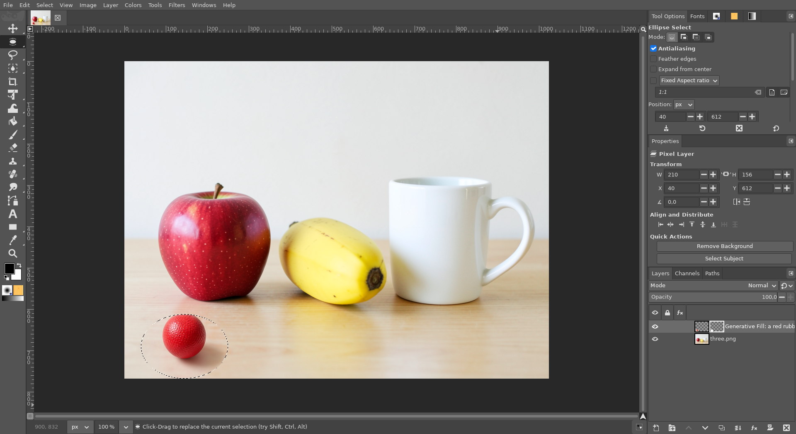

# GIMPhoto


**GIMPhoto is a fork of GIMP focused on Photoshop-style tools and
interface.** It is to GIMP what Linux Mint is to Ubuntu: the same program
underneath, GIMP 3.2.6, kept up to date with every official GIMP release,
with its own tools and interface on top for people who know Photoshop.

> **Only want some Photoshop features on the GIMP you already have?** Use
> [gimp-setup](https://github.com/diegochagas/gimp-setup): it adds them to
> the official GIMP as plug-ins, shortcuts and a theme, without replacing
> it.



The features are tracked as [GitHub issues](../../issues) on the
[project board](https://github.com/users/diegochagas/projects/1).

## Features

Every change GIMPhoto makes to GIMP, each with its own page: how to use
it, before/after screenshots, what changed in GIMP's code, limits. The
screenshots of each feature are on its page.

| Feature | Photoshop equivalent | Where | Docs |
|---|---|---|---|
| **Layer Style (fx) button** in the Layers panel, opening a Photoshop-style Layer Style dialog (shadows, glows, stroke, bevel, overlays) | Layers panel › fx | core patch + plug-in | [layer-style-fx-button.md](docs/features/layer-style-fx-button.md) |
| **Layer effects listed under each layer** in the Layers panel, collapsible, with an eye per effect and one for all | Layers panel › layer › Effects | core patch | [layer-effects-rows.md](docs/features/layer-effects-rows.md) |
| **Gradient Overlay and Pattern Overlay** in the Layer Style dialog: Photoshop's gradient styles, GIMP's patterns, live preview, saved in the XCF | Layer Style › Gradient / Pattern Overlay | GEGL operations + plug-in | [gradient-pattern-overlay.md](docs/features/gradient-pattern-overlay.md) |
| **PSD with editable text**: Photoshop Type layers open as editable GIMP text, GIMP text exports as Type layers Photoshop can edit; Layer Styles kept both ways | PSD round trip | plug-in + bundled Node.js | [psd-editable-text.md](docs/features/psd-editable-text.md) |
| **Photoshop shortcuts by default**: Ctrl+D deselects, Ctrl+J / Ctrl+Shift+J make a layer via copy / cut, Ctrl+T transforms, V/M/L/W/B/S/E… pick the same tools, Ctrl+Tab switches images | Photoshop's default keyboard shortcuts | core patch + keymap | [photoshop-shortcuts.md](docs/features/photoshop-shortcuts.md) |
| **Photoshop-style defaults**: toolbox in one column with Photoshop's tool groups, Tool Options, Properties and Layers stacked on the right, dark canvas surround, larger layer previews (from PhotoGIMP); GIMPhoto's own splash screen and icon | Photoshop's default workspace | defaults + branding | [photoshop-style-defaults.md](docs/features/photoshop-style-defaults.md) |
| **Photoshop theme**: Photoshop's medium-grey interface (panels, tab strips, Adobe blue, flat tool tiles, `#282828` pasteboard), named panel tabs | Photoshop's default workspace colours | theme + defaults | [photoshop-theme.md](docs/features/photoshop-theme.md) |
| **Layer via Copy / Layer via Cut** (Ctrl+J / Ctrl+Shift+J): a new layer from the selected area, in place; Cut also removes it from the original | Layer › New › Layer via Copy / Cut | plug-in + keymap | [layer-via-copy-cut.md](docs/features/layer-via-copy-cut.md) |
| **Shape tools** (U) in the toolbox, one group as Photoshop's flyout: Rectangle, Ellipse, Triangle, Polygon, Star, Line and Custom Shape (heart, arrow, speech bubble…), drawn as vector layers, fill and stroke in Tool Options | Shape tools (U) | core patch + icons | [shape-tool.md](docs/features/shape-tool.md) |
| **Smart Objects**: Convert to Smart Object, Edit Contents, Replace Contents, in the Layers panel's right-click menu; scale and transform without losing quality; kept in XCF and PSD, both ways with Photoshop | Layer › Smart Objects | plug-ins + core patch | [smart-objects.md](docs/features/smart-objects.md) |
| **ComfyUI with GIMPhoto**: the local AI backend (ComfyUI, installed by linux-mint-setup) starts when GIMPhoto opens and stops when it closes, freeing the GPU | — (Photoshop's AI runs in Adobe's cloud) | plug-in + sandbox permission | [comfyui-with-gimphoto.md](docs/features/comfyui-with-gimphoto.md) |
| **Properties panel** above Layers: the selected layer's kind; Transform (W/H linked, X/Y, rotation, flips); Align and Distribute (one layer to the canvas, several to each other); Quick Actions (Remove Background, Select Subject) | Properties panel | core patch + defaults | [properties-panel.md](docs/features/properties-panel.md) |
| **Select Subject** (AI): the main subject of the picture becomes the selection, from *Select › Subject* or the Properties panel's Quick Action; BiRefNet on the local ComfyUI, nothing uploaded | Select › Subject | plug-in + local AI | [select-subject.md](docs/features/select-subject.md) |
| **Object Selection tool** (AI, W): drag a box around an object and the object becomes the selection; Shift adds, Ctrl subtracts; SAM 2.1 on the local ComfyUI, nothing uploaded | Object Selection tool (W) | core patch + plug-in + local AI | [object-selection.md](docs/features/object-selection.md) |
| **Quick Selection tool** (Shift+W): paint over an area and the selection grows to its edges; Shift adds, Alt subtracts, [ / ] brush size; GIMP's hidden Paint Select, with the GEGL operation it needs built in | Quick Selection tool (Shift+W) | core patch + GEGL operation | [quick-selection.md](docs/features/quick-selection.md) |
| **Remove Background** (AI): the selected layer's subject becomes its layer mask, not applied, from the Properties panel's Quick Action or *Layer › Remove Background*; BiRefNet on the local ComfyUI, nothing uploaded | Properties › Quick Actions › Remove Background | plug-in + local AI | [remove-background.md](docs/features/remove-background.md) |

Apart from these, GIMPhoto is plain GIMP, with its own user profile.

## Why a patched build?

Plug-ins, themes and shortcuts (see
[gimp-setup](https://github.com/diegochagas/gimp-setup)) already bring a lot
of Photoshop to the official GIMP, but they can only add **menu entries and
dialogs**. Anything in GIMP's own interface (a tool in the toolbox, a button
in the Layers panel, how a window is laid out, how a tool behaves on the
canvas) is compiled into GIMP. GIMPhoto changes that code directly.

## How it works

```
Flathub's GIMP recipe ──┐
(flatpak/upstream/)     ├─ tools/make_manifest.py ─> flatpak/io.github.diegochagas.GIMPhoto.json
GIMPhoto's patches ─────┘                                     │
(patches/series)                                       scripts/build (flatpak-builder)
                                                              │
                                     GIMPhoto, installed next to the official GIMP
```

- **The base is Flathub's recipe** for the official GIMP Flatpak, vendored
  in `flatpak/upstream/`: same GIMP version, same libraries, same build
  options and sandbox. GIMPhoto's generated manifest differs only in its app
  ID (`io.github.diegochagas.GIMPhoto`), its launcher name, its own user
  profile and the patches it applies.
- **GIMPhoto's changes are a patch series** in `patches/`, applied to GIMP's
  source after Flathub's own patch. One patch = one feature = one pull
  request.
- **It installs next to the official GIMP**, not over it, with **its own user
  profile** (`~/.var/app/io.github.diegochagas.GIMPhoto/config/GIMPhoto`). Plug-ins,
  themes and shortcuts installed for the official GIMP (`~/.config/GIMP/3.x`)
  do not apply: GIMPhoto starts as plain GIMP plus its own features
  (Photoshop's shortcuts included), so each feature can be tested on its own. Flathub's GIMP add-ons (G'MIC,
  Resynthesizer), when installed, load in both.
- **Updating to a new GIMP** is `scripts/sync-flathub`: it pulls Flathub's
  new recipe and checks that every patch still applies; patches that no
  longer do are adapted in a normal git checkout (see
  [CONTRIBUTING.md](CONTRIBUTING.md#updating-gimp)).

## Install (build it yourself)

Releases with ready-made Flatpak bundles will come with the first feature.
Until then, build it, on any Linux with Flatpak, without sudo:

```bash
git clone --recursive https://github.com/diegochagas/gimphoto.git && cd gimphoto
scripts/bootstrap-tools   # Flathub's flatpak-builder + the GNOME SDK (~1.5 GB, once)
scripts/build             # compiles GIMP and its libraries: about an hour the first time
scripts/smoke             # checks the installed build
flatpak run io.github.diegochagas.GIMPhoto
```

GIMPhoto then also appears in the applications menu. Later builds only
recompile what changed. To remove it, with its profile:
`flatpak uninstall --user --delete-data io.github.diegochagas.GIMPhoto`.

## Scripts

| Script | What it does |
|---|---|
| `scripts/bootstrap-tools` | Installs Flathub's builder app and the SDK the recipe needs (per user) |
| `scripts/build` | Builds and installs GIMPhoto (`--no-install`: only build) |
| `scripts/smoke` | Checks the installed build: starts, GIMP version, its own user profile, launcher name |
| `scripts/source` | Checks out GIMP's source with the patches as git commits in `work/gimp`, to write features |
| `scripts/export-patches` | Turns those commits back into `patches/` |
| `scripts/sync-flathub` | Updates to Flathub's latest GIMP recipe and checks the patches still apply |
| `scripts/check` | The gate: lint, unit tests, manifest and keymap up to date, patches apply (pre-push hook and CI) |
| `tools/make_keymap.py` | Turns `defaults/photoshop-keymap.tsv` into GIMPhoto's default `shortcutsrc` and the keymap docs table |

## Contributing

Features are proposed and tracked as GitHub issues, organized on the
[project board](https://github.com/users/diegochagas/projects/1); each one is implemented as one patch in one pull request.
[CONTRIBUTING.md](CONTRIBUTING.md) explains the workflow.

## License

GPL-3.0-or-later, the license of GIMP itself ([LICENSE](LICENSE)). The
patches in `patches/` modify GIMP and are distributed under the same
license.
