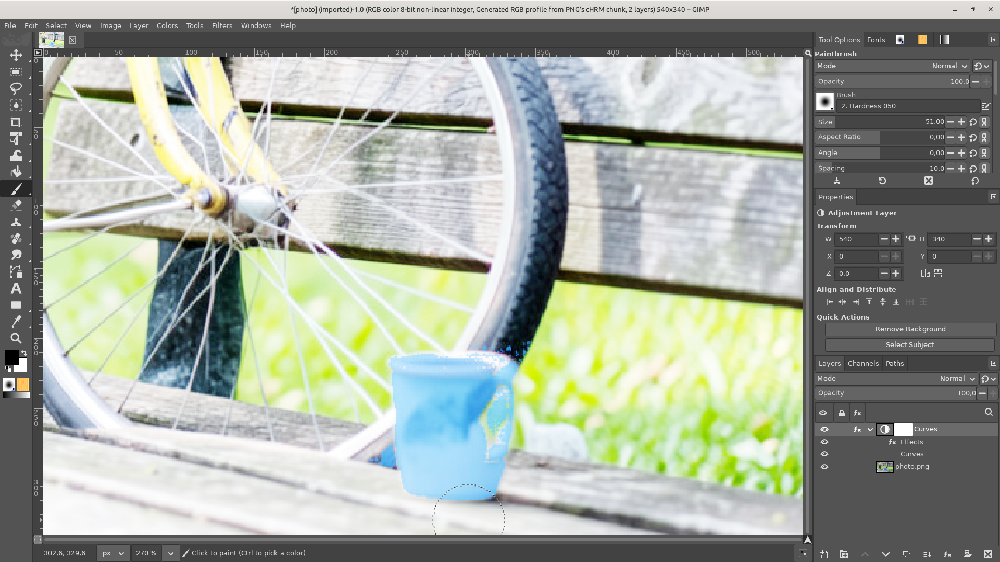
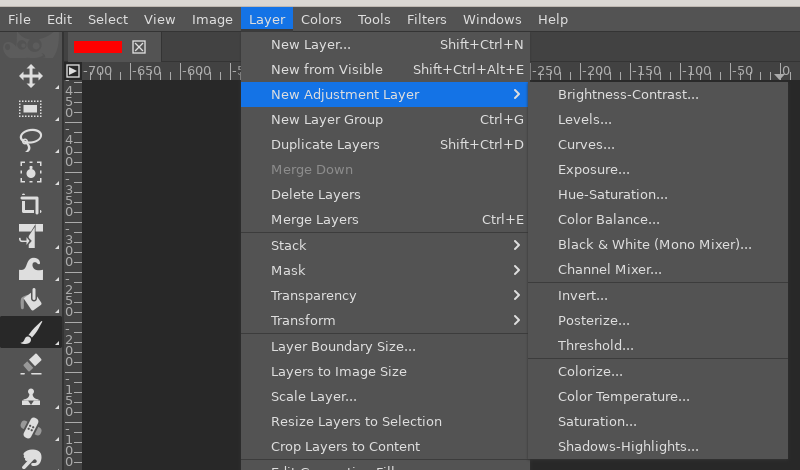
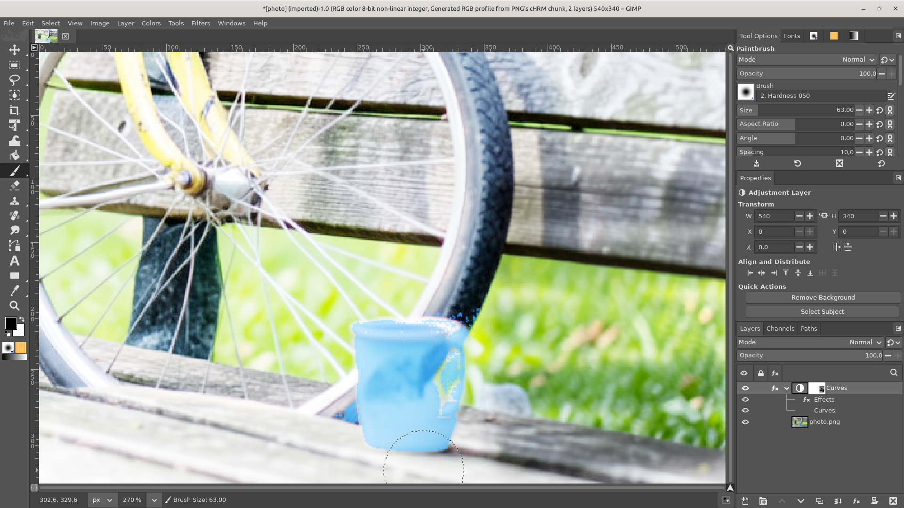

# Adjustment layers

**Issue:** [#67](https://github.com/diegochagas/gimphoto/issues/67) ·
**Patch:** [`patches/0016-…`](../../patches/0016-Adjustment-layers-Layer-New-Adjustment-Layer-applied.patch) ·
**Icon:** [`icons/gimphoto-adjustment-layer.svg`](../../icons/gimphoto-adjustment-layer.svg)

Photoshop's **adjustment layers** (*Layer › New Adjustment Layer › Curves,
Levels, Hue/Saturation…*): a layer that holds no pixels and applies its
adjustment to **everything below it**. It has its own mask (made from the
selection), opacity and blend mode, can be hidden, reordered, duplicated
and edited again at any time, and the layers under it are never changed.

GIMP 3.2's non-destructive filters are close, but a filter only changes
**the layer it is on**: to adjust several layers at once you have to put
them in a group and filter the group, which changes the structure of the
document and does not survive a PSD. GIMPhoto adds the real thing on top
of GIMP's filters: an adjustment layer is a GIMP layer whose filter stack
is applied to what is composited below it instead of to its own (empty)
pixels, so every GIMP colour filter becomes an adjustment layer, with the
same dialogs.

## Before and after

| GIMP: the Curves filter on the photo's own layer | GIMPhoto: a Curves adjustment layer above the photo |
|---|---|
|  |  |

With the adjustment on its own layer, the photo keeps its pixels, the
adjustment can be moved, masked and blended like any layer, and hiding
or deleting it brings the original back.

## Use

1. Select the layer the adjustment should sit above (or nothing: it goes
   on top). With a selection, the adjustment layer's mask is made from it
   and the selection is dropped, as in Photoshop.
2. **Layer › New Adjustment Layer ›** pick the adjustment (also in the
   Layers panel's right-click menu). Photoshop's ones first: Brightness-
   Contrast, Levels, Curves, Exposure, Hue-Saturation, Color Balance,
   Black & White (Mono Mixer), Channel Mixer, Invert, Posterize,
   Threshold; then GIMP's own: Colorize, Color Temperature, Saturation,
   Shadows-Highlights.

   

3. The adjustment's dialog opens on the new layer; the canvas previews
   it. **OK** keeps the adjustment layer, **Cancel** removes it again
   (Photoshop never leaves an empty adjustment layer behind).
4. Once the dialog is closed, the layer's **mask** is what is edited:
   paint black on it to hold the adjustment back, white to let it
   through. Its **opacity** fades the adjustment, its **blend mode**
   blends it (a Curves layer in *Luminosity* changes contrast without
   shifting colours).
5. **Double-click** the adjustment layer to change its settings. The
   adjustment is also listed under the layer, with its own eye, as every
   GIMP filter is in GIMPhoto's Layers panel.
6. Drag it in the stack: it adjusts whatever is below it. Inside a layer
   group it adjusts only the group's layers below it, as in Photoshop.
   **Merge Down** bakes it into the layer below.

## What changed

**GIMP's code** (`patches/0016-…`), one new class and a few hooks:

- `app/core/gimpadjustmentlayer.[ch]`: `GimpAdjustmentLayer`, a
  `GimpLayer` whose `get_source_node` returns a pass-through (`gegl:nop`)
  with an *input* pad instead of GIMP's buffer source. `GimpDrawable`
  already links a layer's input, the backdrop (what is composited below
  it in its group), to any source node that has one, so the layer's filter
  stack runs on the backdrop and the layer's mode node blends the result
  over it with the layer's mode, opacity and mask. Nothing else in the
  pipeline needed changing: the filter tool's live preview, the effects
  rows, masks, undo and Merge Down (which uses the real graph) all work
  as for any layer. The layer reports its own area as its bounding box,
  is always the size of the canvas (`gimpimage-resize.c` resizes it with
  the canvas whatever the layer set says) and has its position locked.
- `app/actions/layers-actions.c`, `layers-commands.[ch]`: the
  `layers-new-adjustment-*` actions (one per GIMP colour filter, their
  value is the `filters-*` action whose dialog opens), creating the layer
  above the selected one with a mask from the selection, opening the
  filter's dialog on it, removing the layer again when the dialog is
  cancelled and switching to the mask when it is confirmed (it watches
  the layer's `filters-changed` signal and the active filter tool). A
  double click on an adjustment layer (`layers-edit`) reopens its filter.
- `menus/image-menu.ui.in.in`, `menus/layers-menu.ui`: the *New
  Adjustment Layer* submenu.
- `app/xcf/`: the XCF property `PROP_GIMPHOTO_ADJUSTMENT_LAYER` (1000,
  clear of GIMP's own numbers) marks the layer; loading converts the
  layer to the class with `gimp_layer_from_layer`, as GIMP does for link
  layers. GIMP without this patch skips the property and opens the file
  with an empty layer carrying the filters (the adjustment is not shown
  there, but nothing is lost).
- `app/widgets/gimpviewrendererdrawable.c`: the Layers panel shows the
  adjustment icon as the layer's thumbnail, as Photoshop does.
- `app/widgets/gimppropertieseditor.c`: the Properties panel names the
  kind *Adjustment Layer*.

**Icons** (`icons/gimphoto-adjustment-layer*.svg`): Photoshop's
half-filled circle, installed into GIMP's icon theme by the build.

**Smoke test** (`scripts/smoke`, `tests/smoke_adjustment_layer.py`):
`tests/fixtures/adjustment-layer.xcf`, made in GIMPhoto (a red layer, an
Invert adjustment layer with a half-black mask), opens with the
adjustment layer and flattens to cyan under the white half of the mask
and red under the black half; saved and reopened, the same.

## Limits

- **PSD**: Photoshop's adjustment layers in a PSD are still dropped by
  GIMP's PSD plug-in, and GIMPhoto's are exported as empty layers; both
  ways are [#89](https://github.com/diegochagas/gimphoto/issues/89).
- Vibrance, Photo Filter, Selective Color and Color Lookup are not GIMP
  filters yet: [#71](https://github.com/diegochagas/gimphoto/issues/71),
  [#72](https://github.com/diegochagas/gimphoto/issues/72),
  [#73](https://github.com/diegochagas/gimphoto/issues/73),
  [#74](https://github.com/diegochagas/gimphoto/issues/74). Gradient Map
  is a plug-in in GIMP, not a filter, so it is not in the submenu either.
- The layer's own pixels are never shown, but GIMP still lets you paint
  on them when the layer (not its mask) is the selected drawable:
  nothing changes on the canvas. GIMPhoto switches to the mask after the
  adjustment is created; click the mask thumbnail to come back to it.
- Leave **Merge filter** unticked in the adjustment's dialog: merging
  bakes the adjustment into the layer's own empty pixels, so GIMPhoto
  treats it as a cancel and removes the layer.
- Photoshop's Adjustments panel (one-click buttons) and the Layers
  panel's half-circle button are not there: the submenu is the way in.
