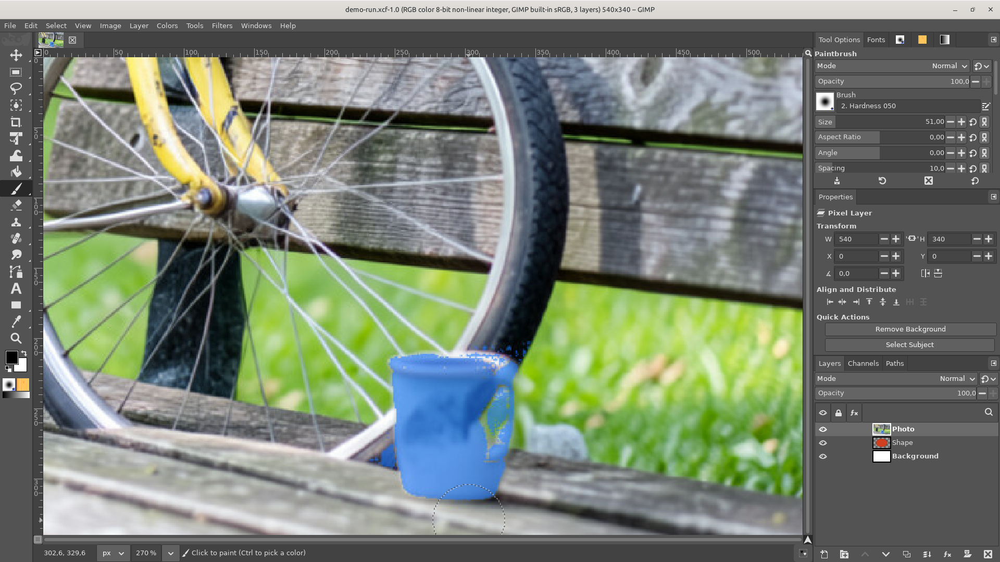
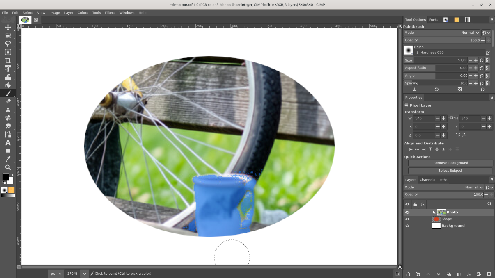
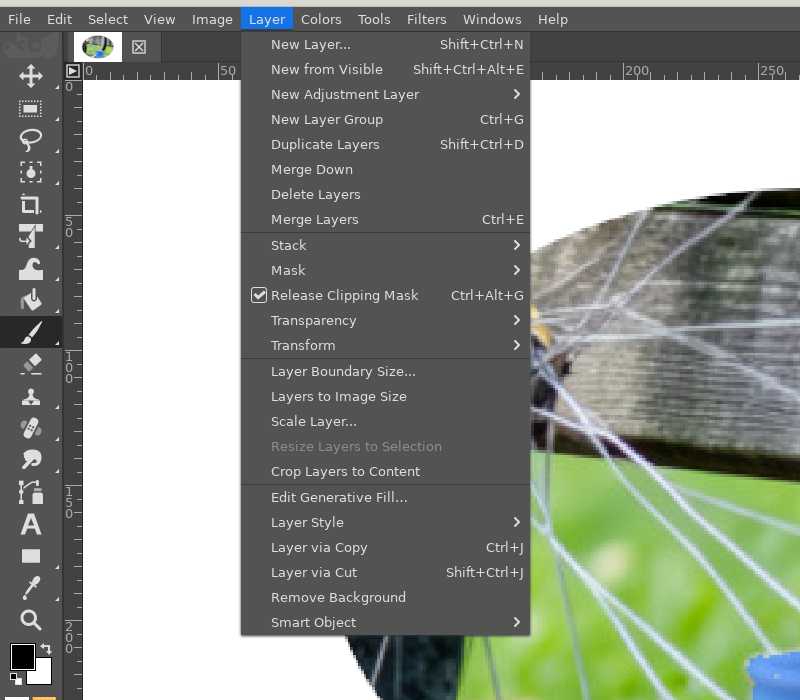
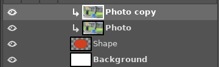

# Clipping masks

**Issue:** [#68](https://github.com/diegochagas/gimphoto/issues/68) ·
**Patch:** [`patches/0017-…`](../../patches/0017-Clipping-masks-Create-Release-Clipping-Mask-Alt-clic.patch) ·
**Icon:** [`icons/gimphoto-clipping-mask.svg`](../../icons/gimphoto-clipping-mask.svg)

Photoshop's **clipping masks**: *Layer › Create Clipping Mask* (Ctrl+Alt+G),
or Alt+click on the line between two layers in the Layers panel, clips a
layer to the layer below it, its *base*: it shows only where the base has
pixels. Several layers can be clipped to the same base; each keeps its own
blend mode, opacity and mask; the base's mode, opacity and mask apply to
the whole group. Clipped layers are drawn indented, with a bent arrow. It
is how a photo is put inside a shape or text, how a colour or an
adjustment is limited to one layer, how shading is painted on a drawing
without going over its edges.

GIMP has no clipping masks. Its *Clip to backdrop* composite mode clips a
layer to **everything** below it, so the usual recipe is a layer group
holding the base and the clipped layers, and that is what GIMP's PSD
importer makes of a Photoshop clipping mask ("Group added by GIMP").
GIMPhoto adds the real thing: a *clipped* flag on the layer, the stack
composites the clipped layers onto their base, and the PSD plug-in reads
and writes Photoshop's clipping flag.

## Before and after

| GIMPhoto before: the photo covers the page | GIMPhoto: the photo clipped to the shape |
|---|---|
|  |  |

## Use

1. Put the layer to clip directly above the layer it should be clipped
   to (the base) and select it.
2. **Layer › Create Clipping Mask** (Ctrl+Alt+G), also in the Layers
   panel's right-click menu, or hold **Alt** and click the line between
   the two layers. The entry reads *Release Clipping Mask* on a clipped
   layer; Ctrl+Alt+G toggles.

   

3. More layers above can be clipped to the same base: each one is
   composited onto the base and the clipped layers below it, with its
   own mode, opacity and mask, confined to the base's pixels.
4. The base's opacity, mode and mask apply to the whole clipped group.
   Hiding the base hides the clipped layers; moving a clipped layer to
   the bottom of its group, or above an unclipped layer, releases it,
   as in Photoshop. **Merge Down** bakes a clipped layer into its base;
   **Flatten** and **Merge Visible** composite through the clipping.
5. An adjustment layer can be clipped too: it then adjusts its base
   only, Photoshop's way of adjusting one layer.

Alt+click needs the window manager to leave Alt+click to the
application: on Cinnamon and GNOME the default "Alt+drag moves windows"
takes it (change the modifier in the window settings, or use the menu
and the shortcut).

## What changed

**GIMP's code** (`patches/0017-…`):

- `app/core/gimplayer.[ch]`: the `clipped` flag (`gimp_layer_set_clipped`,
  undoable; `gimp_layer_can_be_clipped`: not the bottom layer of a group),
  the `clipped-changed` signal, and the `gimphoto-clipped` parasite that
  mirrors the flag, so plug-ins and the XCF carry it with no PDB
  procedure. A clipped layer's effective composite mode is *Clip to
  backdrop*. A base's node gets two extra pads: a `clip-base` output with
  its own pixels (Normal over nothing, with its mask) and a `clip-result`
  input that takes the place of its pixels at its mode node, so the base's
  mode, opacity and mask apply to the composited group.
- `app/core/gimplayerstack.c`, `gimpfilterstack.[ch]`: a `graph_changed`
  hook runs after every change GimpFilterStack makes to the stack's graph;
  the layer stack then rewires it: the base's `clip-base` feeds the first
  clipped layer, each clipped layer the next, the last one the base's
  `clip-result`, and the chain of unclipped layers skips the clipped ones.
  A clipped layer with no base below it (bottom of the group, or a hidden
  base) is left out, as an ordinary layer. A layer added with the parasite
  (a loaded file, a plug-in) becomes clipped.
- `app/core/gimpimage-merge.c`: a merge whose top layer is clipped reads
  the composite at the base.
- Undo: `GIMP_UNDO_LAYER_CLIPPED` in `GimpLayerPropUndo`.
- `app/actions/layers-actions.c`, `layers-commands.[ch]`, `menus/`: the
  `layers-clipping-mask` toggle (*Create* / *Release Clipping Mask*, the
  label follows the first selected layer), in the Layer menu after the
  Mask submenu and in the Layers panel's menu.
- `app/widgets/gimpcontainertreeview.[ch]`: a `gap_clicked` class hook for
  Alt+click within 4 px of the line between two rows;
  `gimplayertreeview.c` implements it and shows the bent-arrow icon before
  a clipped layer's thumbnail, which indents it.
- `app/menus/menus.c`: a shortcut move from `-` (no old action) adds a
  shortcut new to GIMPhoto to profiles that already have a `shortcutsrc`,
  when the action has none; `defaults/shortcut-moves.tsv` version 2 adds
  Ctrl+Alt+G that way.
- `plug-ins/file-psd`: clipped PSD layers load as clipped layers (the
  parasite) instead of GIMP's group, and export with Photoshop's clipping
  byte.

**Keymap** (`defaults/photoshop-keymap.tsv`): `layers-clipping-mask` on
Ctrl+Alt+G.

**Smoke test** (`scripts/smoke`, `tests/smoke_clipping_mask.py`):
`tests/fixtures/clipping-mask.xcf` (a white layer, a red block on a
transparent layer, a blue layer clipped to it, made in GIMPhoto) flattens
to blue inside the block and white outside; saved and reopened, and
exported to PSD and loaded again, the layer is still clipped.

## Limits

- A clipped **pass-through group** is not clipped (GIMP composites
  pass-through groups straight into the backdrop); set the group to
  Normal to clip it.
- The base's **filters** (layer effects) apply to the base's pixels before
  the clipped layers are composited onto them: a drop shadow on the base
  stays under the clipped layers, as in Photoshop; a blur on the base
  blurs only the base.
- Photoshop's Blending Options "Blend Clipped Layers as Group" is always
  on.
- `psd-text` (editable text in PSD) keeps the clipping byte of layers it
  does not rewrite.
