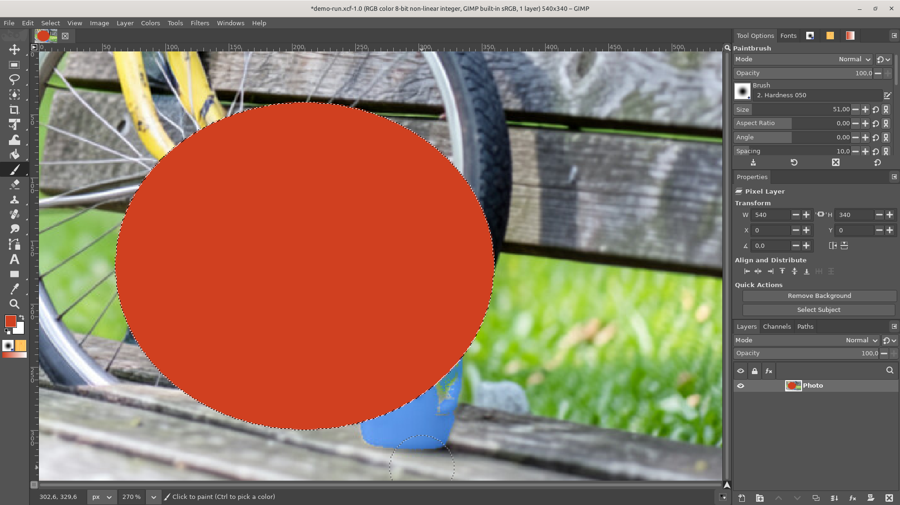
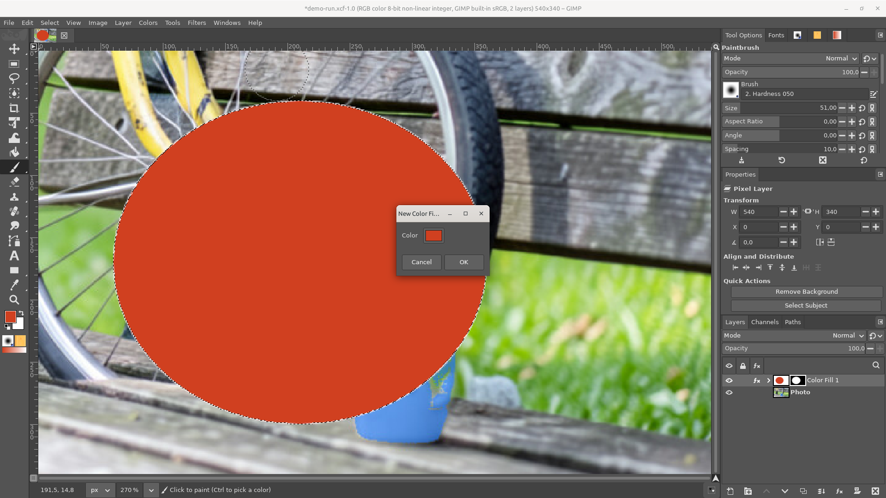
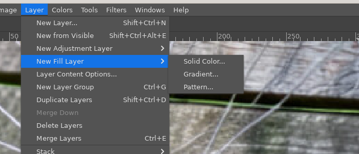
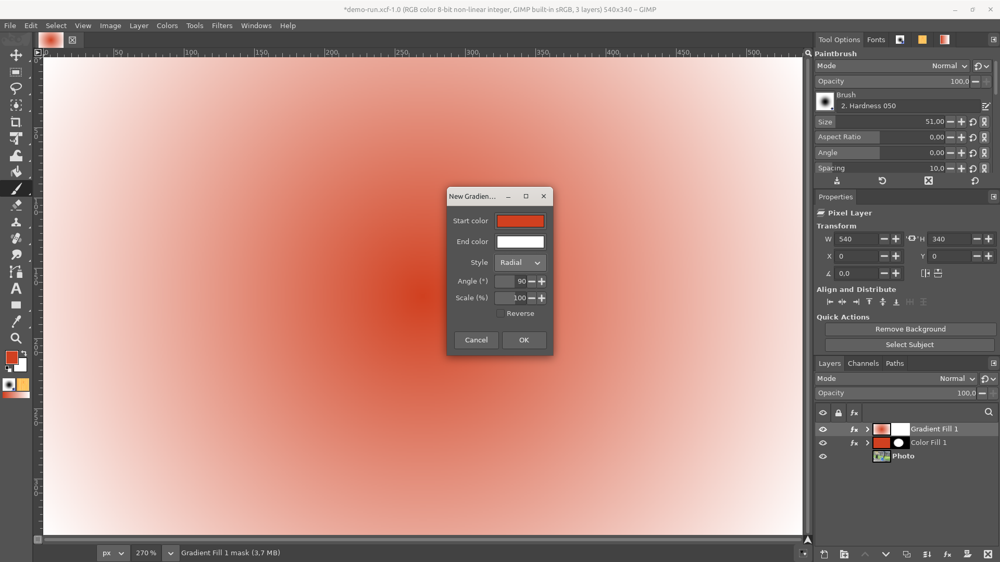

# Fill layers

**Issue:** [#69](https://github.com/diegochagas/gimphoto/issues/69) ·
**Plug-in:** [`plugins/fill-layers/`](../../plugins/fill-layers/) ·
**Patch:** [`patches/0018-…`](../../patches/0018-Fill-layers-Layer-New-Fill-Layer-submenu-Layer-Conte.patch)

Photoshop's **fill layers** (*Layer › New Fill Layer › Solid Color /
Gradient / Pattern*): a canvas-sized layer filled live by a colour, a
gradient or a pattern, with a mask made from the selection, whose content
is changed later with *Layer › Layer Content Options* or a double click
on the layer. The Gradient tool's "live" gradients and the Properties
panel's fill editing are the same idea.

GIMP fills a layer once: *Edit › Fill with FG Color* or the Gradient tool
write pixels, and changing the colour afterwards means refilling, losing
the mask's work. GIMPhoto's fill layers keep the fill as a GIMP
non-destructive filter on a canvas-sized layer: `gegl:color-overlay` for
Solid Color, GIMPhoto's own `gimphoto:gradient-overlay` (Photoshop's Linear,
Radial, Angle, Reflected and Diamond styles) for Gradient and
`gimphoto:pattern-overlay` for Pattern. The canvas shows the filter, the
XCF keeps it, the mask limits it, and the dialog reopens on it.

## Before and after

| GIMPhoto before: a colour filled once into a layer | GIMPhoto: a Solid Color fill layer, masked by the selection |
|---|---|
|  |  |

## Use

1. Make a selection if the fill should cover only part of the picture:
   it becomes the fill layer's mask and is dropped, as in Photoshop.
   Select the layer the fill should sit above.
2. **Layer › New Fill Layer › Solid Color…**, **Gradient…** or
   **Pattern…** (also in the Layers panel's right-click menu). The layer
   appears above the selected one and its dialog opens:

   

   - *Solid Color*: the colour (the foreground colour to start).
   - *Gradient*: start and end colours (foreground to background to
     start), the style (Linear, Radial, Angle, Reflected, Diamond), the
     angle, the scale, Reverse.
   - *Pattern*: a GIMP pattern (the current one to start) and its scale.

   The canvas previews every change; **OK** keeps the layer as one undo
   step, **Cancel** leaves nothing behind and keeps the selection.

   

3. Paint on the mask (it is what the layer edits after OK) to limit the
   fill; the layer's opacity and blend mode apply as usual (a Color Fill
   in *Color* mode tints the picture, a Pattern Fill in *Multiply* adds
   texture).
4. **Double-click** the fill layer, or *Layer › Layer Content
   Options…*, to change its colour, gradient or pattern again. The fill is
   also listed under the layer as a filter, with its own eye.

## What changed

**Plug-in** (`plugins/fill-layers/`): `fill_layers.py` holds the logic
(create the canvas-sized opaque layer above the selected one, the mask
from the selection, the `gimphoto-fill` parasite naming the kind
(persistent and undoable, so undo takes the layer away cleanly), the
filter and its settings, reading them back) and `fill-layers.py` the
procedures `gimphoto-fill-layer-solid` / `-gradient` / `-pattern` and
`gimphoto-fill-layer-edit` with their dialogs, previewed live on the
filter (the preview runs with the undo history frozen; OK recreates the
layer with the final settings as one step). The pattern cache of the
layer-style plug-in (`gimphoto-patterns/` in the profile) turns the GIMP
pattern into the file `gimphoto:pattern-overlay` reads.

**GIMP's code** (`patches/0018-…`), small: the *New Fill Layer* submenu
and *Layer Content Options* placed after *New Adjustment Layer* in the
Layer menu and the Layers panel's menu (`menus/`), a double click on a
layer carrying the parasite running *Layer Content Options*
(`app/actions/layers-commands.c`, like smart objects and generated
layers), the Properties panel naming the kind *Fill Layer*, and
`gimp-drawable-filter-update` recording GIMP's *Edit filter* undo when a
plug-in changes an effect already on a layer, as GIMP's own filter
dialogs do (`pdb/groups/drawable_filter.pdb`): without it, undoing
*Layer Content Options* left the new colour in place. Nothing is
recorded while a plug-in previews with the undo history frozen.

**Smoke test** (`scripts/smoke`, `tests/smoke_fill_layers.py`): the
plug-in's module makes a red Solid Color fill masked by a right-half
selection (red on the right, white on the left; the dialog's preview
keeps the selection; the parasite is undoable), a mid tone and the
foreground colour read back as the same sRGB colour, a black-to-white
Gradient (darker left than right) and a Pattern fill (not white) on a
white image; the settings read back; saved and reopened, the fills and
their kinds are still there.

## Limits

- Gradient fills are two colours (the overlay operation's); Photoshop's
  multi-stop gradient presets and GIMP's gradients are not used yet.
- The layer underneath the fill is opaque white (the overlay operations
  paint where the layer has pixels): deleting the fill's filter leaves a
  white layer, and painting on the layer itself (not its mask) is hidden
  under the fill.
- PSD: fill layers export as pixel layers; Photoshop's `SoCo` / `GdFl` /
  `PtFl` both ways are part of
  [#89](https://github.com/diegochagas/gimphoto/issues/89).
