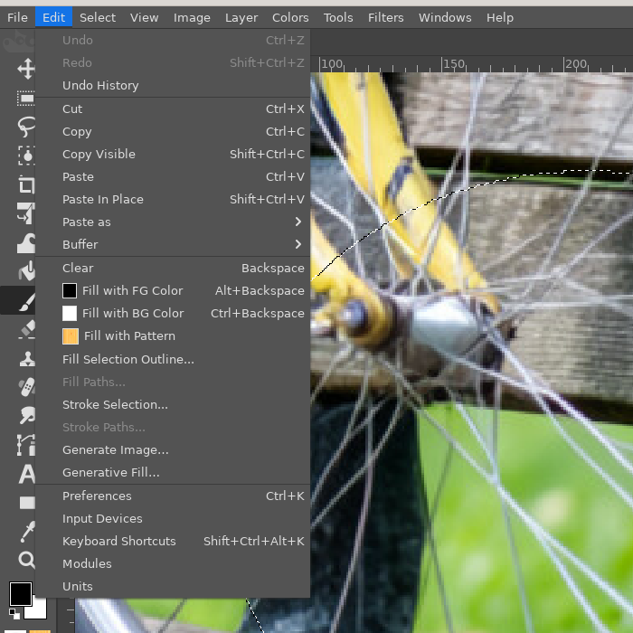
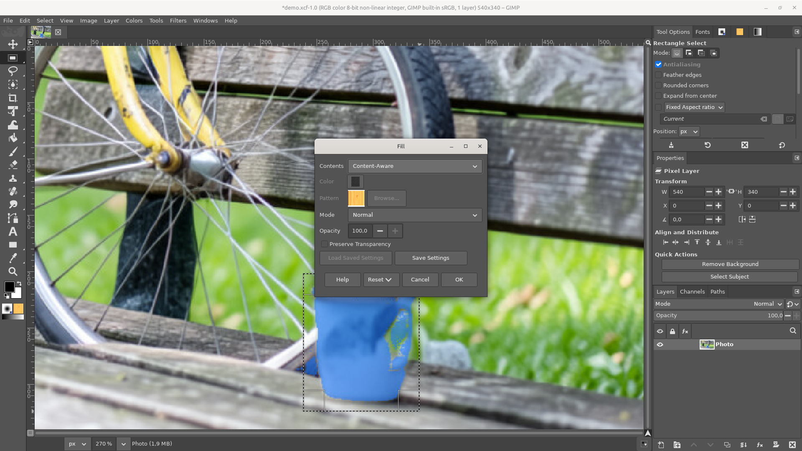
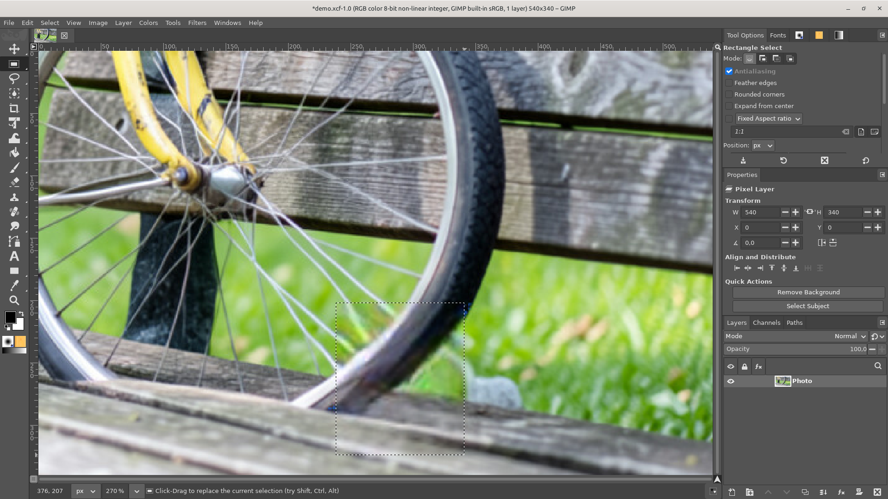
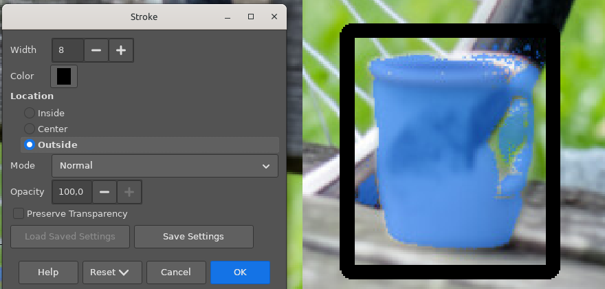

# Fill and Stroke dialogs

**Issue:** [#70](https://github.com/diegochagas/gimphoto/issues/70) ·
**Plug-in:** [`plugins/fill-stroke/`](../../plugins/fill-stroke/) (Content-Aware:
[`plugins/generative-fill/`](../../plugins/generative-fill/))

Photoshop's **Edit › Fill…** (Shift+F5, or Shift+Backspace) fills the
selection, or the whole layer when nothing is selected, with a choice of
contents: Foreground Color, Background Color, Color…, Content-Aware,
Pattern, History, Black, 50% Gray or White, in a blending mode and at an
opacity, optionally keeping the layer's transparent pixels transparent
(*Preserve Transparency*). **Edit › Stroke…** draws a line of a given
width and colour along the selection's edge, *Inside*, *Center* or
*Outside* it, with the same blending options. Both remember the last
settings.

GIMP fills in one step with no dialog (*Edit › Fill with FG Color*, *BG
Color*, *Pattern*: Normal, 100%) and strokes centred on the edge only
(*Edit › Stroke Selection*, whose dialog is about paint tools and line
styles). GIMPhoto adds Photoshop's two dialogs; GIMP's own commands stay
where they were, and Alt+Backspace / Ctrl+Backspace still fill with the
foreground / background colour at once.

## Before and after

| GIMPhoto before: fill with the foreground colour, nothing to choose | GIMPhoto: Edit › Fill, Photoshop's dialog |
|---|---|
|  |  |

## Use

**Fill**

1. Select what to fill (nothing selected: the whole layer) and the layer,
   mask or channel to fill.
2. **Edit › Fill…** (Shift+F5 or Shift+Backspace) and choose:
   - *Contents*: Foreground Color, Background Color, Color (the *Color*
     button below), Content-Aware, Pattern (the *Pattern* chooser below),
     History, Black, 50% Gray, White.
   - *Mode*: Photoshop's blending modes (Normal, Dissolve, Behind, Clear,
     Darken, Multiply, Color Burn, … Luminosity).
   - *Opacity*, and *Preserve Transparency* to leave transparent pixels
     transparent (the layer's alpha is locked while it fills).
3. **OK**: one undo step. The dialog opens with the last settings.

*Content-Aware* fills the selection from the picture around it with the
local LaMa, the model of the [Remove tool](remove-tool.md): nothing
leaves the computer. It needs the local AI
([local-ai-setup](https://github.com/diegochagas/local-ai-setup)); without
it a message says so and nothing changes.

*History* brings back the layer as it was when the image was last saved
(the layer with the same name in the saved file; a one-layer file such as
a photo gives its only layer), inside the selection. Photoshop's History
fills from the state the History panel names, by default the opened file;
the image has to be saved (or opened from a file) first.

**Stroke**

1. Make a selection (nothing selected: the layer's opaque shape is
   stroked, as in Photoshop) and select the layer.
2. **Edit › Stroke…**: *Width* (1 to 250 px), *Color*, *Location*
   (*Inside*, *Center*, *Outside*), *Mode*, *Opacity*, *Preserve
   Transparency*.

## What changed

**Plug-in** (`plugins/fill-stroke/`): `fill_stroke.py` holds the logic and
`fill-stroke.py` the procedures `gimphoto-fill` and `gimphoto-stroke`
(menu *Edit*, in GIMP's fill and stroke section, where GIMP lists plug-in
entries after its own, in alphabetical order), with GIMP's own
procedure dialog: the arguments are what the dialog shows, GIMP remembers
the last values, and scripts run them with arguments.

- Colours, patterns, black, gray and white go through GIMP's fill
  (`gimp-drawable-edit-fill`), which takes the context's paint mode and
  opacity and respects the layer's alpha lock: *Preserve Transparency*
  locks the alpha while it fills.
- History and Content-Aware make a layer with the pixels (the saved layer
  read again; LaMa's result), copy it into a named buffer (the clipboard
  is left alone) and paste it into the selection as a floating selection
  with the mode and opacity, anchored on the layer, then remove it.
- Stroke turns the edge into a ring: the selection grown by the width
  (*Outside*), by half of it (*Center*) or not at all (*Inside*), minus the
  selection shrunk by the width (*Inside*), half of it (*Center*) or not at
  all (*Outside*), and fills the ring with the colour. The selection comes
  back as it was.

**Content-Aware** (`plugins/generative-fill/`): the procedure
`gimphoto-content-aware-source` sends the selection and the picture around
it to the local LaMa, as the Remove tool does, and returns the result as a
layer for the Fill dialog to composite.

**Keymap** (`defaults/photoshop-keymap.tsv`): `gimphoto-fill` on Shift+F5
and Shift+Backspace; `shortcut-moves.tsv` version 3 gives Shift+F5 to
profiles that already have their own shortcuts (Shift+Backspace reaches
new profiles).

**Smoke test** (`scripts/smoke`, `tests/smoke_fill_stroke.py`): on white
images, a foreground fill covers only the selection; Multiply green at 50%
tints white half way and leaves red outside the selection; Black, 50% Gray
and White; a pattern paints; Preserve Transparency leaves transparent
pixels transparent and unlocks the alpha again (without it they are
filled); History brings back the layer as saved inside the selection
only; a 4 px stroke lands inside, centred on or outside a square
selection, which is kept, with no channel left behind; with nothing
selected the layer's shape is stroked; `gimphoto-fill` and
`gimphoto-stroke` run with arguments. Content-Aware without the local AI
says where to install it and changes nothing
(`tests/smoke_select_subject.py`).

## Limits

- *History* reads the saved file: not GIMP's undo history, and not a
  snapshot from a History panel (GIMP has none).
- *Content-Aware* has no options (Photoshop's *Color Adaptation*, or the
  separate *Content-Aware Fill* workspace with its sampling area): LaMa
  decides from the picture around the selection.
- *Stroke* corners: *Outside* and *Center* round the outer corners (the
  selection grown), as Photoshop's *Outside* does; *Inside* keeps them
  square.
- Existing profiles get Shift+F5 only (a shortcut new to GIMPhoto is added
  once, to a command that has none); add Shift+Backspace in *Edit ›
  Keyboard Shortcuts* if wanted.
