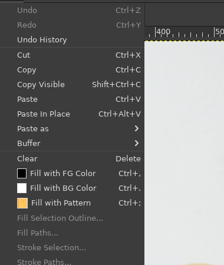
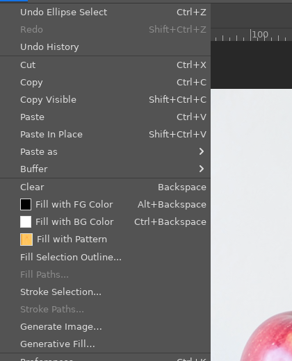
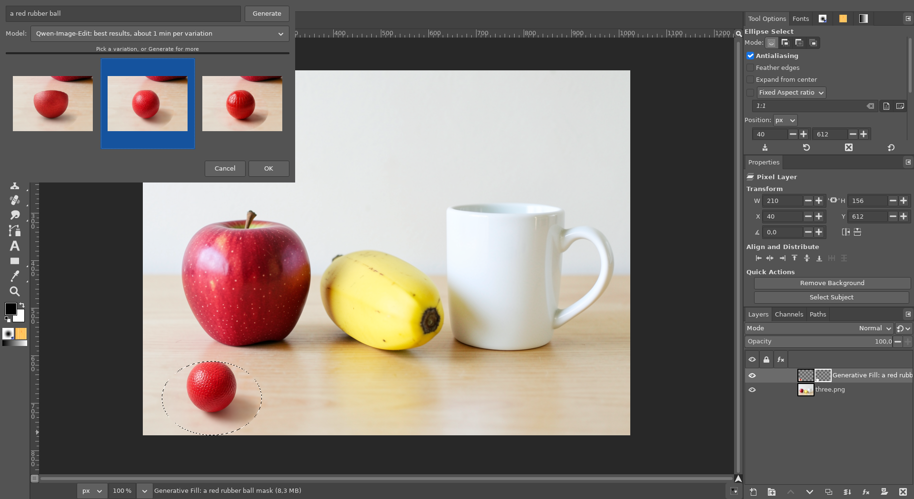
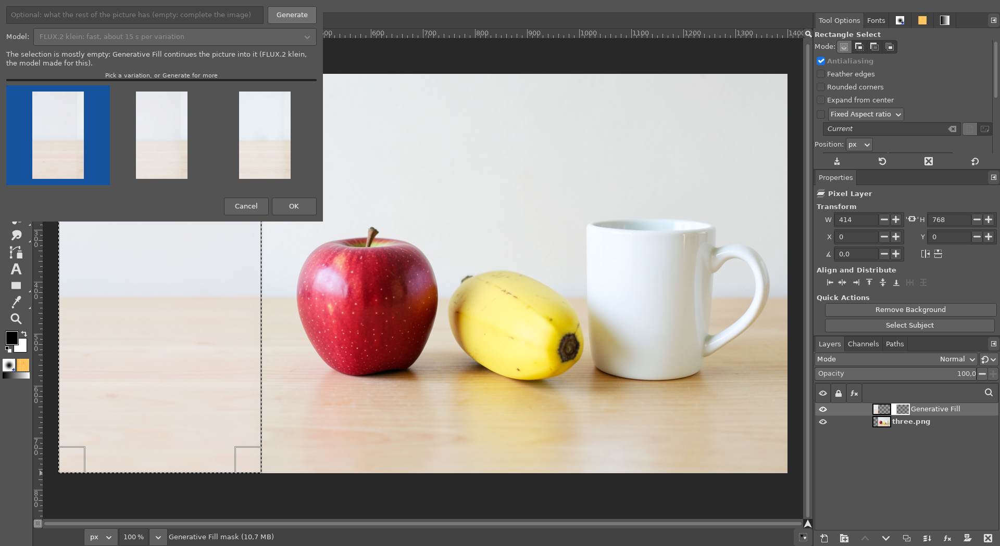
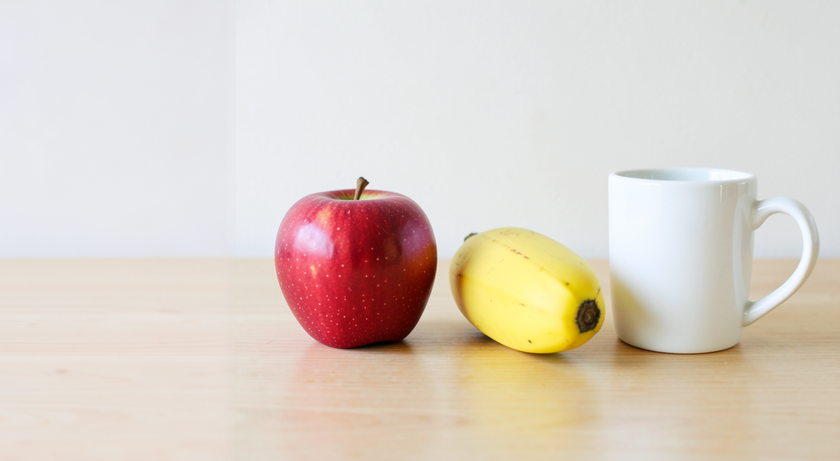
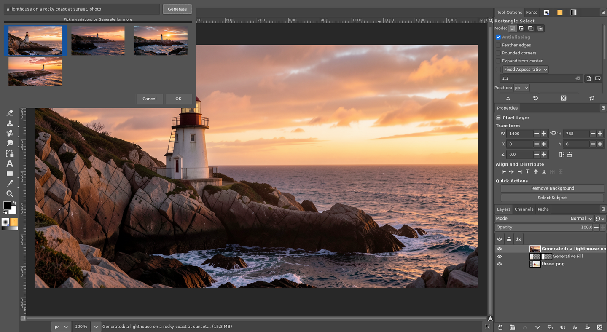
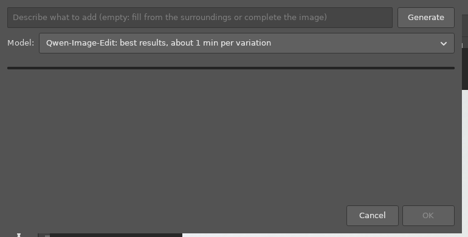
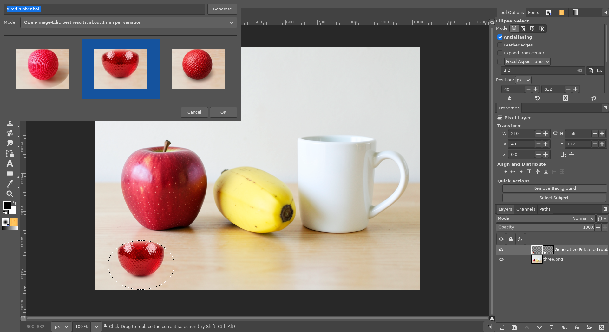

# Generative Fill and Generate Image (AI)

**Issue:** [#30](https://github.com/diegochagas/gimphoto/issues/30) ·
**Plug-in:** [`plugins/generative-fill/`](../../plugins/generative-fill/) ·
**Patch:** [`patches/0013-…`](../../patches/0013-Layers-dock-double-click-opens-a-generated-layer-s-G.patch) (double click) ·
**Backend:** [ComfyUI with GIMPhoto](comfyui-with-gimphoto.md)

Photoshop's **Edit › Generative Fill** and **Edit › Generate Image**:
- **Generative Fill:** select an area, describe what goes there, and pick
  one of three variations. It is added as a new layer masked to the
  selection, so the picture underneath is untouched. Leave the prompt
  empty to fill the area from its surroundings. Select a part of the image
  that is empty (transparent, or canvas added with *Image › Canvas Size*)
  and it **completes the image**: the picture continues into it.
- **Generate Image:** an image the size of the canvas, from a prompt, as a
  new layer.

A local AI model on this computer does it (no account, nothing uploaded),
on the local ComfyUI:
- **Qwen-Image-Edit**, the default for Generative Fill: objects with real
  shading and shadows, about a minute per variation on a 6 GB GPU;
- **FLUX.2 klein**, in the window's model menu: about 15 s per variation,
  flatter results. It also completes images and makes Generate Image's
  pictures.

## Before and after

| Plain GIMP: Edit menu | GIMPhoto: Generate Image and Generative Fill after Fill and Stroke |
|---|---|
|  |  |

An ellipse selected on the empty table, prompt *a red rubber ball*: three
variations with Qwen-Image-Edit, the chosen one shown on the canvas
while the window is open:

**Completing an image:** the photo on a wider canvas, its left side empty
and selected, an empty prompt. The window says it will continue the
picture; the wall and the table continue into the empty side:

**Generate Image**, prompt *a lighthouse on a rocky coast at sunset,
photo*:

The pictures are generated with the local FLUX.2 klein model.

## Use

**Generative Fill**
1. Select the area: any selection tool, soft edges included.
2. *Edit › Generative Fill…*
3. Type a prompt, or leave it empty, and press **Generate** (or Enter in
   the prompt). The prompt's hint says what an empty prompt does:

   

   The three variations appear one by one; the first one is shown on the
   canvas as soon as it is ready. Click another to see it instead.
   **Stop** stops the run; **Generate** again adds three more.
4. **OK**, or closing the window, keeps the one shown, as a new layer
   named after its prompt (above the layer that was selected when the
   window opened); **Discard** throws them away. The layer is masked
   to the selection. It is one undo step.
5. **Change it later:** double-click the layer in the Layers panel (or
   *Layer › Edit Generative Fill…*). The window opens again with its
   variations, the current one selected: pick another, or Generate more
   (from the picture as it is now, without that layer). OK or closing the
   window replaces the layer's pixels with the chosen variation, in one
   undo step, keeping its mask, position and visibility; **Cancel** leaves
   it as it was.

   

The variations are kept in the layer (parasites, saved in the XCF): the
window can open again after GIMPhoto is closed and the file reopened.
At most 12 are kept: the latest, and always the one chosen. Each keeps
the prompt it was made with, which names the layer.

The model sees the visible image (all layers), as Photoshop's
Generative Fill does.

**Completing an image:** select the empty part, a little of the picture
included (for example after *Image › Canvas Size*), and open Generative
Fill. When most of the selection is empty, the window says so and uses
FLUX.2 klein, the model this was made for. With an empty prompt, it
sometimes repeats something near the edge of the picture, such as a
second apple. If it does, describe what the rest of the picture has (*a
wooden table and a plain wall*) and generate again. Where the selection
meets the picture, the new layer fades into it, so there is no visible
seam.

**Generate Image:** *Edit › Generate Image…*, a prompt, Generate, pick one,
OK (or close the window); a double click on its layer opens it again. The picture is made at about 1 megapixel in the canvas's proportions,
then scaled to the canvas.

**Needs** the local AI: ComfyUI with the `qwen` and `klein` model sets,
installed by
[local-ai-setup](https://github.com/diegochagas/local-ai-setup).
GIMPhoto starts and stops it ([ComfyUI with GIMPhoto](comfyui-with-gimphoto.md)).
Without it, the window says so and where to install it, and nothing is
added.

## How it works

- **Plug-in** `plugins/generative-fill/`, with the procedures
  `gimphoto-generative-fill` and `gimphoto-generate-image`. They are added
  to the Edit menu's Fill/Stroke section (`<Image>/Edit/[Stroke]`).
  - The window is GTK. The AI runs in a background thread that only
    speaks HTTP, so the window stays responsive. The variation shown on
    the canvas is added with the undo history frozen, and replaced by the
    real layer, in one undo group, on OK.
  - What the model gets: the visible image, flattened, and the selection
    as a white-on-black mask. When completing an image, only the empty
    area and 64 px of picture around it are sent. With the 256 px or more
    the client uses by default, the model copied a nearby apple in 2 of 3
    tries; with 64 px, in none of 3.
  - The layer: the variation cropped to the selection, with the mask
    written into its layer mask. Its parasites: `gimphoto-generative` (the
    job: prompt, model, the boxes), `gimphoto-generative-mask` (what the
    model was given as the selection) and `gimphoto-generative-0…11` (the
    variations, PNGs the size of the layer), the PNGs as base64: parasite
    data goes through GIMP's Python binding as signed bytes. Reopened, the layer is only
    hidden under the preview while the window is open, then replaced by a
    new one in one undo group. When completing an image, the mask is
    feathered by 24 px where the selection meets the picture, and stays
    fully opaque over the empty part.
- **Double click** (`patches/0013-…`, `app/actions/layers-commands.c`):
  GIMP's double click on a layer (the `layers-edit` action) runs the
  plug-in's `gimphoto-generative-edit` when the layer has the
  `gimphoto-generative` parasite, as it already runs Edit Contents for a
  smart object; other layers open their attributes as in GIMP.
- **ComfyUI graphs:** `plugins/comfyui-service/comfyui_client.py` is
  gimp-setup's ComfyUI client (MIT), vendored unchanged. It holds the
  tuned FLUX.2 klein / Qwen-Image-Edit inpainting (with a second pass when
  a fill comes back unchanged), the outpainting for completing images, and
  text to image. Non-interactive runs (scripts) make one variation with
  the given prompt and model and apply it.

**Tests:**
- `scripts/smoke` (`tests/smoke_generative_layer.py`): a Generative Fill
  layer made from three stand-in variations keeps them through an XCF save
  and reload, opens again with the same prompt, model and chosen one, and
  changing the variation replaces the layer (same name, masked); no AI is
  called. Without the base64 it fails on the first PNG byte above 127.
- `scripts/smoke`: the three procedures are registered. With ComfyUI recorded
  as missing, they fail with a message naming local-ai-setup, add no
  layer and leave the selection alone. Tests never call the real ComfyUI.
- On the built app, with the real ComfyUI:
  - the screenshots above;
  - one Ctrl+Z removing the added layer, and redo bringing it back;
  - in a batch run, the completion layer's mask going from 1.0 over the
    empty part to 0.49 at the selection's edge and 0.05 24 px into the
    picture;
  - Generate Image making a canvas-size layer in 17 s.

## Limits

- Qwen-Image-Edit takes about a minute per variation on a 6 GB GPU (3–4
  minutes for three). Pick one as soon as it looks right; you do not have
  to wait for the others.
- Completing an image always uses FLUX.2 klein, and can repeat what is
  near the edge (see Use).
- The entries are in alphabetical order (*Generate Image* before
  *Generative Fill*): GIMP sorts plug-in entries within a section.
- No Photoshop *Generative Expand* in the Crop tool, and no reference
  image for Generate Image.
