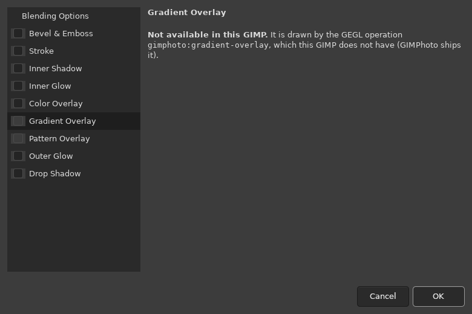
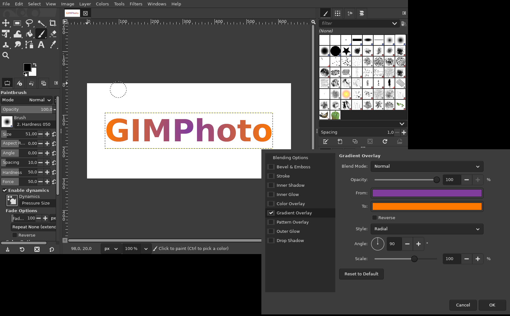
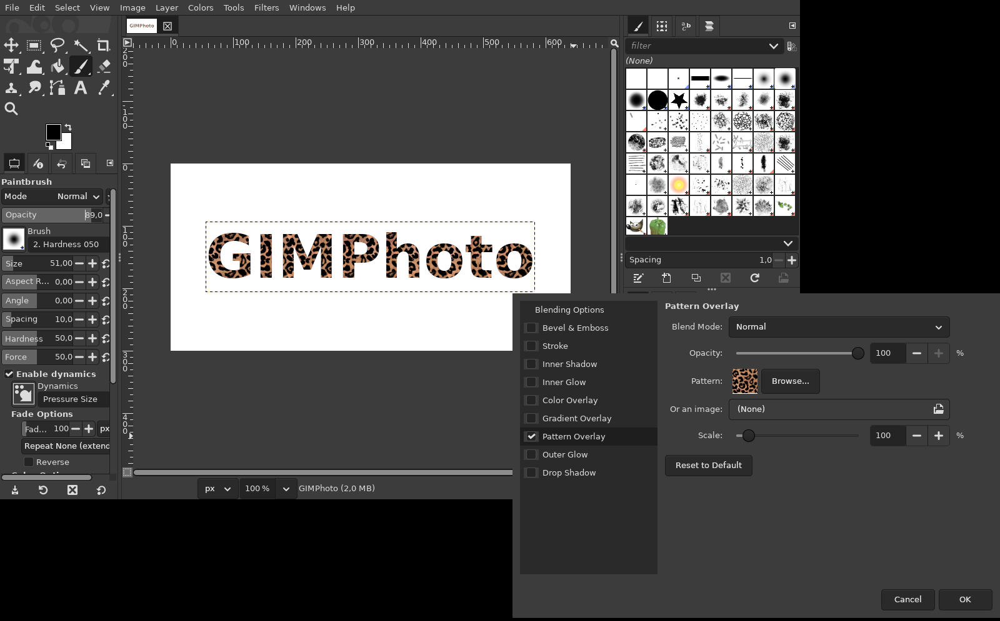

# Gradient Overlay and Pattern Overlay

**Issue:** [#4](https://github.com/diegochagas/gimphoto/issues/4) ·
**GEGL operations:** [`gegl/`](../../gegl/) ·
**Plug-in:** [`plugins/layer-style/`](../../plugins/layer-style/)

Two of Photoshop's layer effects that GIMP has no operation for. GIMPhoto
draws them with two GEGL operations of its own, so they work like the other
effects of the [Layer Style dialog](layer-style-fx-button.md): live preview,
non-destructive, one eye each in the Layers list, and saved in the XCF.

## Before and after

| Before: greyed out | GIMPhoto |
|---|---|
|  |  |

## Use

**fx → Gradient Overlay…** or **fx → Pattern Overlay…** in the Layers
panel (or *Layer > Layer Style*).

| Setting | Gradient Overlay | Pattern Overlay |
|---|---|---|
| Blend Mode, Opacity | as in Photoshop | as in Photoshop |
| Colours | From / To (two colours) | — |
| Style | Linear, Radial, Angle, Reflected, Diamond | — |
| Angle, Scale, Reverse | as in Photoshop | Scale |
| Pattern | — | any of GIMP's patterns, or an image file |

The effect covers only the layer's pixels (its transparency is kept) and is
laid out on the layer, as Photoshop's *Align with Layer* / *Link with
Layer*. Stacking is Photoshop's: Color Overlay over Gradient Overlay over
Pattern Overlay.

## What changed

**GEGL operations** (C, [`gegl/`](../../gegl/)), built by the manifest's
`gimphoto-gegl-ops` module against the GEGL in the build and installed into
GEGL's plug-in folder:

- `gimphoto:gradient-overlay`: for every pixel, the gradient colour at its
  position on the layer's bounding box (style, angle, scale, offset,
  reverse), with the layer's alpha. The filter's own blend mode and opacity
  mix it with the layer.
- `gimphoto:pattern-overlay`: tiles an image file (loaded once, in
  `prepare()`) from the layer's corner, with the layer's alpha.

They are real operations, not a graph built by the plug-in, so GIMP saves
them in the XCF with their settings and redraws them when the file is
opened again.

**Plug-in** (`plugins/layer-style/`): the two effects use these
operations instead of `lb:effects` (LinuxBeaver's GEGL plug-ins, which GIMP
does not ship); the Gradient page gains *Style*, the Pattern page GIMP's
pattern chooser and *Scale*. A GIMP pattern is exported once as a PNG to
`gimphoto-patterns/` in GIMPhoto's profile, the file the operation reads.

**Tests:** `tests/smoke_overlays.py`, run by `scripts/smoke`: both
operations as layer filters (only on the layer's pixels, the right colours),
still drawn after saving and reopening an XCF, and the plug-in's radial
gradient and GIMP pattern.

## Limits

- Two colour stops: no multi-stop gradients or GIMP gradients yet.
- No offsets in the dialog (Photoshop lets you drag the gradient or pattern
  on the canvas); the operations have them.
- The pattern is linked to the layer: Photoshop's *Snap to Origin* with the
  link off is not available.
- An XCF with a Pattern Overlay refers to the pattern file by its path: on
  another computer, re-pick the pattern.
