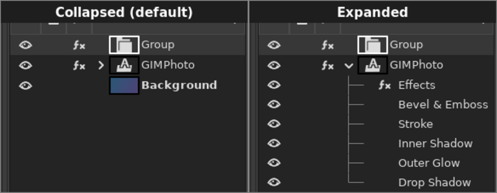
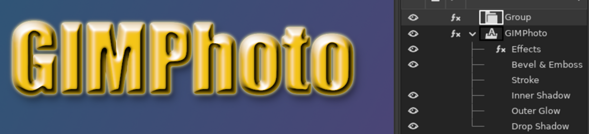

# Layer effects listed under each layer

**Issue:** [#6](https://github.com/diegochagas/gimphoto/issues/6) ·
**Patch:** [`patches/0002-Layers-dock-list-each-layer-s-effects-under-it-with-.patch`](../../patches/0002-Layers-dock-list-each-layer-s-effects-under-it-with-.patch)

Like Photoshop's Layers panel, a layer with effects shows them **in the
Layers list itself**, each with its own eye. GIMP only shows an fx mark
on the layer and a separate popover window.

## Use

- A layer with effects gets an **arrow** on its left. The list is
  **collapsed by default**: click the arrow to show the effects. GIMPhoto
  remembers it per layer, also while you change the effects in the Layer
  Style dialog.
- **Effects** row: its eye turns all the layer's effects off, or back on.
- One row per effect, with its own eye.
- **Double-click** an effect: the Layer Style dialog opens on that effect
  (on the "Effects" row: on Blending Options). For a filter that is not a
  Layer Style (any GIMP filter, e.g. a Gaussian Blur added with
  *Filters*), GIMP's own Layer Effects editor opens.
- Clicking an effect row selects its layer, as in Photoshop.

Stroke turned off with its eye; the bevel, inner shadow, glow and drop
shadow stay:

## Order

Layer Style effects are listed in **Photoshop's order** (Bevel & Emboss,
Stroke, Inner Shadow, Inner Glow, Color/Gradient/Pattern Overlay, Outer
Glow, Drop Shadow), one row per effect even when GIMP draws it with two
filters (a centered stroke). Other filters follow, in GIMP's order.

## What changed

**GIMP's code** (`patches/0002-…`):

- `app/widgets/gimpdrawabletreeview.c`: the effect rows. Each one stores
  its layer's own view renderer, so all the code that reads a row as "a
  layer" keeps working (and selects the layer). New model columns mark
  real item rows and effect rows: on effect rows the layer's eye, lock,
  thumbnail and editable name cells are hidden, and the effect's own eye,
  icon and name shown. Effect rows are not drop targets. The rows are
  refreshed on the layer's `filters-changed` signal, which GIMP also emits
  when a filter is turned on or off or edited, so the eyes follow GIMP's
  own fx popover and undo. "Item activated" (double-click) checks whether
  the click was on an effect row.
- `app/widgets/gimpcontainertreeview.h`, `gimpcontainertreestore.c`: the
  list's model column array was a fixed 16 and the Layers list already used
  13; it is now 32, and adding a column past the limit fails safely
  instead of overwriting memory.

## Limits

- **Group layers** keep GIMP's fx popover only: their child rows are
  layers.
- Turning an effect off is not an undo step (as in GIMP's own popover).
- Opening the Layer Style dialog re-applies the style it remembers, which
  turns hidden Layer Style effects back on.
- Effects cannot be dragged to another layer (Photoshop can).

## Test

1. `scripts/build && scripts/smoke`, then open an image in GIMPhoto, add
   a text layer and give it a Layer Style with a few effects (fx button).
2. The layer shows an arrow, collapsed. Expand it: Effects + one row per
   effect, in Photoshop's order.
3. Turn one effect's eye off and on; then the Effects eye.
4. Double-click an effect: the dialog opens on it; change a value: the
   rows stay expanded.
5. Move the layer with the up/down buttons, delete it, undo: the rows
   follow the layer, no warnings on the terminal.
