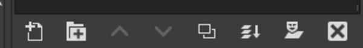
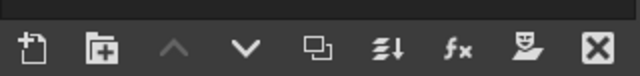
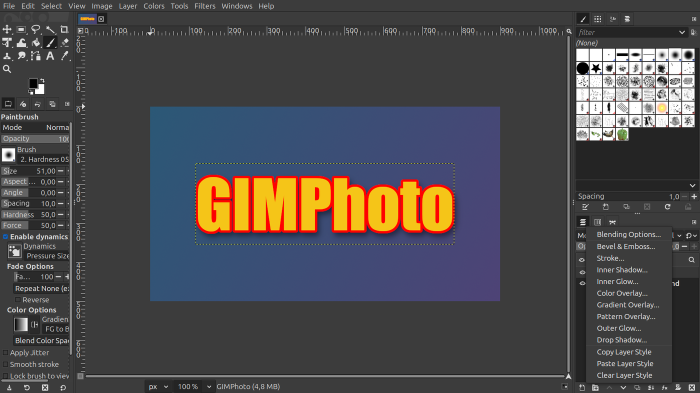
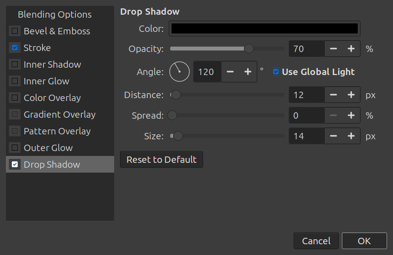
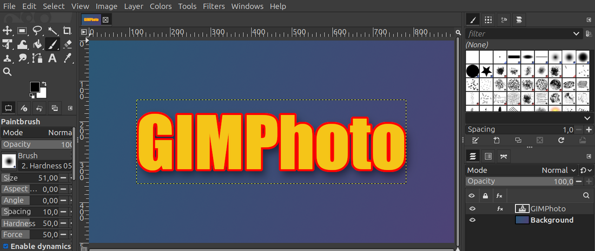
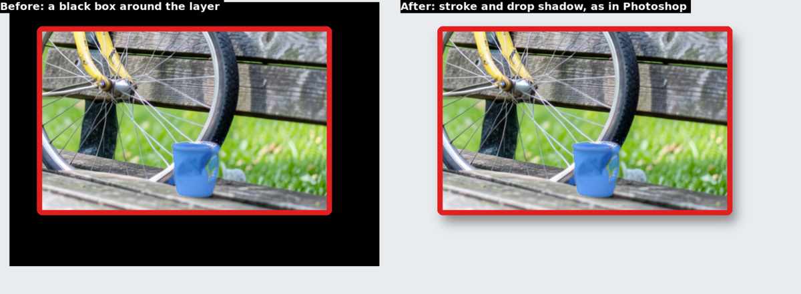

# Layer Style (fx) button in the Layers panel

**Issue:** [#1](https://github.com/diegochagas/gimphoto/issues/1) ·
**Patch:** [`patches/0001-Layers-dock-add-the-Layer-Style-fx-button.patch`](../../patches/0001-Layers-dock-add-the-Layer-Style-fx-button.patch) ·
**Plug-in:** [`plugins/layer-style/`](../../plugins/layer-style/)

Photoshop's Layers panel has an **fx** button that opens a menu of layer
effects. GIMPhoto adds the same button to GIMP's Layers panel, with the same
menu, opening a Photoshop-style Layer Style dialog.

## Before and after

| Plain GIMP | GIMPhoto |
|---|---|
|  |  |

## Use

1. Select a layer and click **fx** at the bottom of the Layers panel.
2. Pick an effect: the Layer Style dialog opens on it, already ticked, and
   previews on the canvas while you change its settings.

| Menu entry | What it does |
|---|---|
| Blending Options… | Opens the Layer Style dialog (layer opacity, every effect) |
| Bevel & Emboss…, Stroke…, Inner Shadow…, Inner Glow…, Color Overlay…, Gradient Overlay…, Pattern Overlay…, Outer Glow…, Drop Shadow… | Opens the dialog on that effect |
| Copy / Paste / Clear Layer Style | Copies the selected layer's effects, pastes them on the selected layers, removes them |

The effects are non-destructive GIMP filters named *Layer Style: …*: they
show in the Layers panel's own fx column, and the dialog opens them again
with the settings they were made with. OK in the dialog is one undo step.

## What changed

**GIMP's code** (`patches/0001-…`), only `app/widgets/gimplayertreeview.c`:

- one include (`gimpaction.h`) and two private fields (`style_button`, `style_menu`);
- in `gimp_layer_tree_view_constructed()`, the button (icon
  `GIMP_ICON_EFFECT`, the same as GIMP's fx column), placed before the
  mask button as in Photoshop;
- at the end of the file, the menu: rebuilt on each click, each entry
  activating a `plug-in` action (`layer-style-dialog`,
  `layer-style-drop-shadow`, …) through the dock's UI manager. An entry is
  insensitive when its procedure is missing or cannot run on the selection.
- in `gimp_layer_tree_view_finalize()`, the menu is destroyed with the
  view, so it never points back at a freed panel.

**Plug-in** (`plugins/layer-style/`, installed by the build as a system
plug-in): the Layer Style dialog and its renderer, from gimp-setup; see
[plugins/README.md](../../plugins/README.md).

## Layers without transparency

A layer from a JPEG or an opaque PNG has no alpha channel, so a drop shadow,
an outer glow or an outside stroke would have nowhere to paint. Like
Photoshop, where every layer has transparency, the Layer Style adds an alpha
channel to the layer first (*Layer → Transparency → Add Alpha Channel*).

## Limits

- **Gradient Overlay and Pattern Overlay** are drawn by `lb:effects`, from
  LinuxBeaver's GEGL plug-ins, which plain GIMP does not have: in GIMPhoto
  they show greyed out, saying so.
- Satin, Contours and the blend modes of shadows and glows have no GEGL
  counterpart (see the plug-in's
  [documentation](https://github.com/diegochagas/gimp-setup/blob/main/docs/LAYER_STYLE.md#limits)).

## Test

1. `scripts/build && scripts/smoke`, then `flatpak run io.github.diegochagas.GIMPhoto`.
2. Open an image, add a text layer, click **fx → Drop Shadow…**: the dialog
   opens on Drop Shadow, ticked, and the shadow shows on the canvas.
3. OK, then *Edit → Undo*: one step removes the style.
4. With no image open, the fx button's entries are insensitive.
