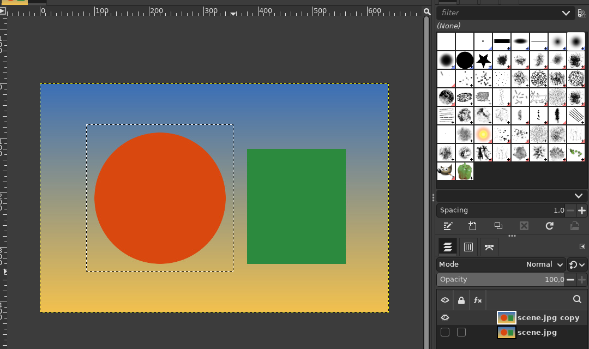
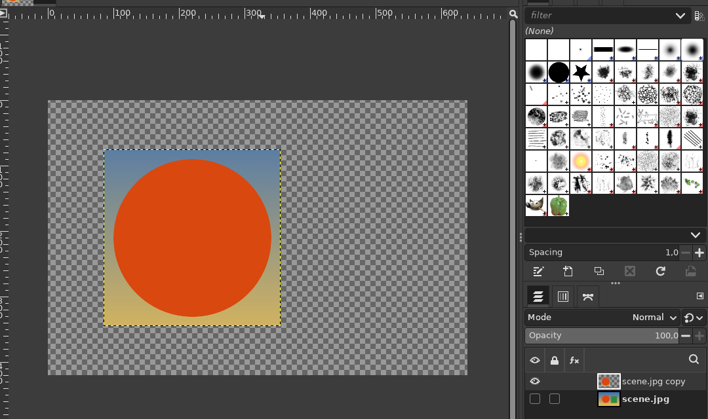

# Layer via Copy / Layer via Cut (Ctrl+J / Ctrl+Shift+J)

**Issue:** [#15](https://github.com/diegochagas/gimphoto/issues/15) ·
**Plug-in:** [`plugins/layer-via/`](../../plugins/layer-via/) ·
**Keymap:** [`defaults/photoshop-keymap.tsv`](../../defaults/photoshop-keymap.tsv)

In Photoshop, Ctrl+J with a selection makes a new layer from just the
selected area, in place (*Layer > New > Layer via Copy*), and Ctrl+Shift+J
does the same and removes that area from the original (*Layer via Cut*).
GIMP has neither: its closest command, Duplicate Layers, ignores the
selection. GIMPhoto adds both, with Photoshop's keys.

## Before and after

Ctrl+J with a rectangle selected:

| Before (Duplicate Layers: the whole layer) | GIMPhoto (Layer via Copy: the selected area) |
|---|---|
|  |  |

Ctrl+Shift+J, the new layer hidden to show the hole the cut left in the original:

## Use

1. Select an area on a layer (any selection tool).
2. **Ctrl+J** (*Layer > Layer via Copy*): a new layer above it with only
   that area, at the same place. **Ctrl+Shift+J** (*Layer > Layer via Cut*):
   the same, and the area becomes transparent in the original layer.

As in Photoshop, the selection is dropped and the new layer is selected.
Each command is one undo step.

| Case | What happens |
|---|---|
| No selection, Ctrl+J | The selected layers are duplicated (Photoshop's Ctrl+J without a selection) |
| No selection, Ctrl+Shift+J | Nothing, with a message: Layer via Cut needs a selection |
| Selection outside the layer | Nothing, with a message: the selected area is empty |
| Group layer, or several layers with a selection | Nothing, with a message: select one layer that is not a group |
| Layer without transparency (an opened JPEG) | It gets an alpha channel, so the cut leaves transparency, as Photoshop layers do |

## What changed

**Plug-in** [`plugins/layer-via/`](../../plugins/layer-via/), installed by
the build as a system plug-in (no change to GIMP's code):

- `layer-via.py` registers `gimphoto-layer-via-copy` and
  `gimphoto-layer-via-cut` in the Layer menu;
- `layer_via.py` does the work: duplicates the layer, clears it outside
  the selection, crops it to the selection's bounds and, for Cut, clears
  the selection from the original.

**Keymap:** the two procedures are GIMP actions of the same name, so
`defaults/photoshop-keymap.tsv` puts Ctrl+J and Ctrl+Shift+J on them;
`tools/make_keymap.py` accepts `gimphoto-*` actions from `plugins/`.
Duplicate Layers keeps GIMP's Shift+Ctrl+D.

**Tests:** `tests/smoke_layer_via.py`, run by `scripts/smoke`: copy, cut,
no selection, the new layer's place and size, the selection dropped.

## Limits

- Existing GIMPhoto profiles keep their saved shortcuts: reset them
  (*Preferences > Interface > Reset Keyboard Shortcuts*, then restart), or
  set Ctrl+J / Ctrl+Shift+J on *Layer via Copy* / *Layer via Cut* in
  *Edit > Keyboard Shortcuts*.
- The new layer keeps the original's name plus "copy", not Photoshop's
  "Layer 1".
