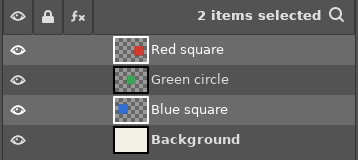
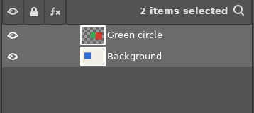
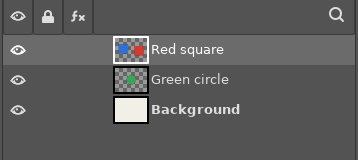
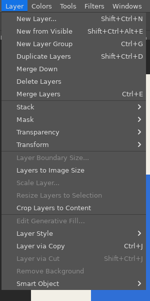
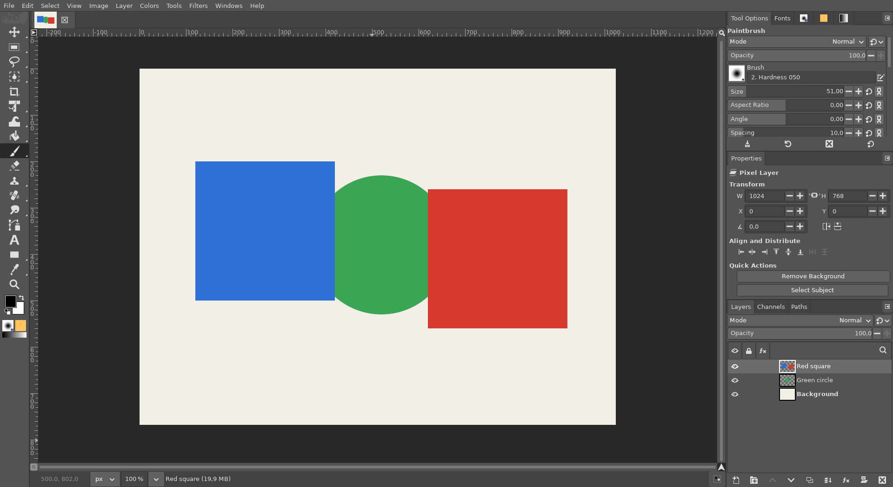

# Merge Layers (Ctrl+E) and Merge Visible (Ctrl+Shift+E)

**Issue:** [#58](https://github.com/diegochagas/gimphoto/issues/58) ·
**Plug-in:** [`plugins/merge-layers/`](../../plugins/merge-layers/) ·
**Keymap:** [`defaults/photoshop-keymap.tsv`](../../defaults/photoshop-keymap.tsv)

In Photoshop, **Ctrl+E** (*Layer › Merge Layers*) turns the selected layers
into one layer. GIMP has no command for that: its *Merge Down*, which Ctrl+E
ran in GIMPhoto until now, merges **each** selected layer into the one
below it. **Ctrl+Shift+E** (*Merge Visible*) merges at once in Photoshop,
where GIMP's *Merge Visible Layers…* opens a dialog first. GIMPhoto now does
both as Photoshop.

## Before and after

Four layers; *Red square* and *Blue square* are selected:

| Before: Ctrl+E merged each one down (red into the circle, blue into the background) | GIMPhoto: Ctrl+E makes them one layer, *Red square*, above the circle |
|---|---|
|  |  |

*Layer › Merge Layers*, under *Merge Down*:

The image after Ctrl+E (the blue square, merged into the top layer, is now
above the circle, as in Photoshop):

## Use

**Ctrl+E** or *Layer › Merge Layers*, in one undo step:

| Selected | What happens (as in Photoshop) |
|---|---|
| Two or more layers | They become one layer, in the place of the top one and with its name. Layers in between that are not selected stay where they are, under it. A selected group is merged in as one layer |
| One layer | *Merge Down*: it merges into the visible layer below it, which keeps its name. Nothing below, or a group below: a message, nothing changes |
| One layer group | *Merge Group*: the group becomes one layer with its name |
| Layers inside a group | They are merged inside the group, where the top one is |

Selected layers that are hidden are left as they are; one hidden layer
selected alone is not merged (a message says so). If GIMP refuses a step
(a layer it cannot move or merge), the merge stops with a message and
Ctrl+Z undoes what was merged before it.

**Ctrl+Shift+E** merges every visible layer of the image into one at
once, with no dialog: GIMP's *Merge Visible Layers* with the options last
used in its dialog. *Image › Merge Visible Layers…* still opens the dialog
for its options (clipping, hidden layers, only the group).

## How it works

- **Plug-in** `plugins/merge-layers/` (`gimphoto-merge-layers`, *Layer ›
  Merge Layers*, in the menu's first section next to *Merge Down*); the
  logic is in `merge_layers.py`:
  1. the selected, visible layers are taken top to bottom (a layer inside
     a selected group goes with the group); groups are merged first
     (`GroupLayer.merge`);
  2. each one is moved right under the top one and merged into it
     (*Merge Down*, expanded as needed); the result is renamed after the
     top layer.
- **Keymap:** Ctrl+E is `gimphoto-merge-layers`, Ctrl+Shift+E is GIMP's
  `layers-merge-layers-last-values` (it was `layers-merge-down` and
  `image-merge-layers`).
- **`defaults/gimprc`:** `layer-merge-active-group-only` is off, so Merge
  Visible merges the whole image, as Photoshop's, and not only the selected
  layer's group (GIMP's default).

**Tests:** `scripts/smoke` runs `tests/smoke_merge_layers.py` in the app:
- several layers with one in between that is not selected;
- one layer, merged down, and one with nothing below;
- a group;
- layers inside a group;
- several with a group and a hidden layer among them.

`tests/test_keymap.py` checks the keymap as for every shortcut. On the built
app: the screenshots above, one Ctrl+Z undoing Ctrl+E, and Ctrl+Shift+E
merging with no dialog.

## Limits

- Text layers become pixel layers, as in Photoshop.
- Ctrl+Shift+E uses the options last chosen in *Merge Visible Layers…*:
  changing them there changes the shortcut too.
