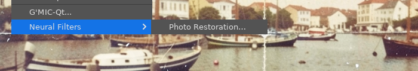
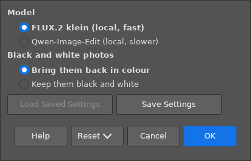
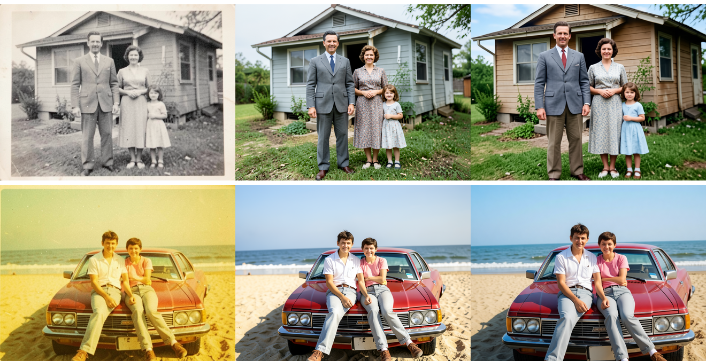
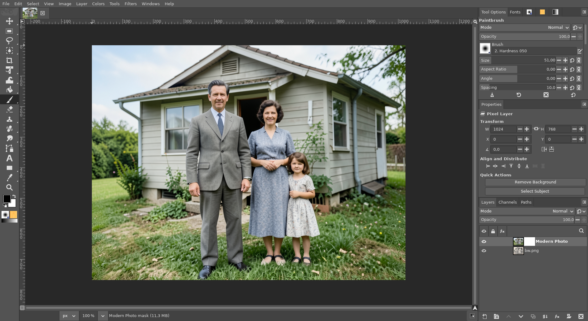

# Modern Photo (AI)

**Issue:** [#61](https://github.com/diegochagas/gimphoto/issues/61) ·
**Plug-in:** [`plugins/photo-restoration/`](../../plugins/photo-restoration/) ·
**Backend:** [ComfyUI with GIMPhoto](comfyui-with-gimphoto.md)

A Neural Filter that Photoshop does not have: an old photo, redrawn as if
it had been taken today with a modern phone camera. The result is sharp and
clean, with true colours and no grain, fading, colour cast or damage. Black
and white comes back in colour, unless asked not to. The people, their
clothes, the place and the framing are kept, as far as the model can. A
local AI model on this computer does it (no account, nothing uploaded). The
result is a new layer above the photo.

It sits next to [Photo Restoration](photo-restoration.md):
*Filters › Neural Filters › Modern Photo…*.

## Before and after

| Before: Photo Restoration alone in Neural Filters | GIMPhoto: Modern Photo below it |
|---|---|
|  |  |

The window:

Two old photos. Left, the photo; middle, with FLUX.2 klein (about
25 s); right, with Qwen-Image-Edit (about 100 s). klein mostly keeps the
framing and the scene; Qwen-Image-Edit moves closer in and changes more
(the house's colour). Both change faces a little:

In GIMPhoto: the *Modern Photo* layer above the old photo:

The photos are generated with the local FLUX.2 klein model.

## Use

1. Open the photo. Select an area first to show the result only inside it.
2. *Filters › Neural Filters › Modern Photo…*
3. Choose:
   - **Model:** FLUX.2 klein (fast) or Qwen-Image-Edit (slower);
   - **Black and white photos:** bring them back in colour, or keep them
     black and white. A black and white or sepia photo is recognised by
     itself; a colour photo stays in colour.
4. **OK**. The *Modern Photo* layer goes above the selected layer, in one
   undo step.

The whole layer is the model's picture, so **faces can change**. The layer
has a mask: paint it black where you want the old photo back (a face, an
expression), or lower the layer's opacity.

**Needs** the local AI: ComfyUI with the `klein` (or `qwen`) model set,
installed by
[local-ai-setup](https://github.com/diegochagas/local-ai-setup).
GIMPhoto starts and stops it ([ComfyUI with GIMPhoto](comfyui-with-gimphoto.md)).
Without it, Modern Photo says so and where to install it, and the image is
left alone.

## How it works

- **Procedure** `gimphoto-modern-photo`, in the Photo Restoration plug-in
  (`plugins/photo-restoration/`), which it shares its export and layer code
  with:
  1. the visible image goes to the model with the prompt, through the
     whole-image edit graph of gimp-setup's ComfyUI client (vendored in
     `plugins/comfyui-service/`, as Photo Restoration uses it);
  2. the model's picture, at the photo's size, becomes the *Modern Photo*
     layer with a white mask, limited to the selection if there is one.
- **The prompt** (`modern_photo.py`) is the one from photo-restore's
  modernize-photos: a modern iPhone's look (sharp, clean, Smart HDR, true
  colours), with everything that makes the photo look old removed, and
  every person, their clothes, every object, the place, the light and the
  framing kept.
- **Black and white:** `modern_photo.is_monochrome` looks at a 64×64
  thumbnail. Grey or toned (sepia) prints have one tint over the whole
  photo, so their colours hardly differ from each other; faded colour
  prints still do. For a black and white photo the prompt adds "give it
  realistic, natural colours", or "keep it black and white".
- **Why FLUX.2 klein by default:** on the two photos above, it kept the
  framing and the scene closer than Qwen-Image-Edit, in about a quarter of
  its time.
  Qwen-Image-Edit started from the photo (strength below 1, as
  photo-restore can) gave the old photo back unchanged at 0.7 and 0.5, so
  there is no strength setting.

**Tests:**
- `tests/test_modern_photo.py`: grey and sepia pixels are black and white,
  faded colours are not; the prompt asks for colour or black and white only
  for black and white photos; the edit is asked at the model's working size
  and comes back at the photo's.
- `scripts/smoke`: the procedure is registered; without the local AI it
  names local-ai-setup and adds no layer; `tests/smoke_modern_photo.py`
  runs the black-and-white check on GIMP images (a Grayscale-mode one, a
  sepia one and a red and blue one) through the plug-in's own thumbnail.
- On the built app, with the real ComfyUI: the screenshots above.

## Limits

- Faces, hands and small details are redrawn: the people look like
  themselves, but not exactly. Paint the mask black to keep the originals.
- Each run is different (a new random seed): the framing can move a
  little closer or further, and running it again gives another version.
- The model works at about 1 megapixel: a large scan comes back softer
  than the original's size suggests.
- The colours given to a black and white photo are the model's guess.
- RGB and Grayscale images. A Grayscale one (as black and white scans
  often open) is turned into RGB, in the same undo step, so the colours
  can show.
