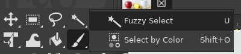
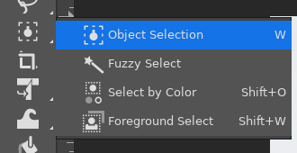
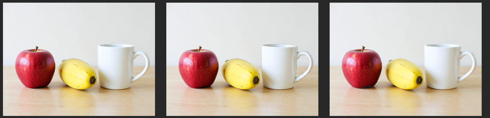
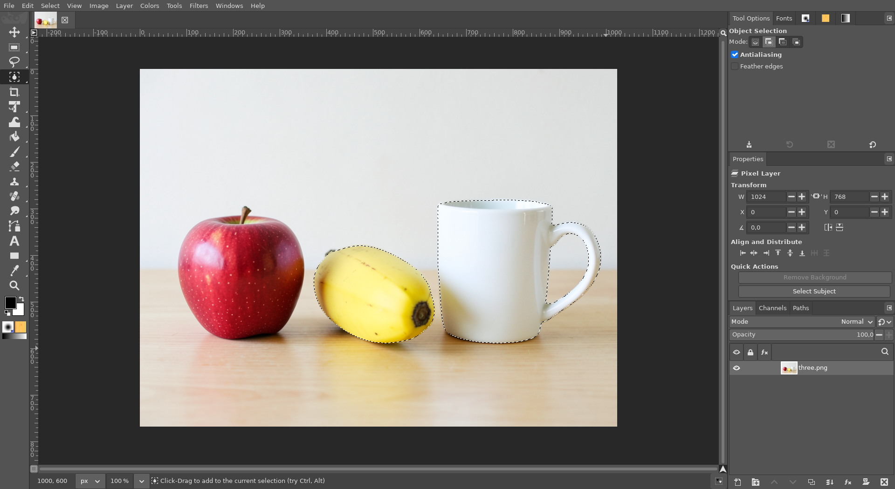

# Object Selection tool (AI)

**Issue:** [#32](https://github.com/diegochagas/gimphoto/issues/32) ·
**Patch:** [`patches/0011-…`](../../patches/0011-Object-Selection-tool-drag-a-box-around-an-object-to.patch) ·
**Plug-in:** [`plugins/ai-select/`](../../plugins/ai-select/) ·
**Backend:** [ComfyUI with GIMPhoto](comfyui-with-gimphoto.md)

Photoshop's **Object Selection tool** (W): drag a box around an object and
the object, not the box, becomes the selection. GIMPhoto adds it to the
toolbox, first in the W group (Photoshop's Magic Wand group), with a local
AI model on this computer (no account, nothing uploaded): **SAM 2.1**
(Segment Anything) on the local ComfyUI.

## Before and after

| Plain GIMP: W group without it | GIMPhoto: Object Selection first in the W group |
|---|---|
|  |  |

A box dragged around the banana, then one around the mug with **Shift**
held (added to the selection), then one around the apple without Shift
(replaces it):

The banana and the mug, in GIMPhoto:

The picture is generated with the local FLUX.2 klein model.

## Use

1. Pick **Object Selection** in the toolbox (**W**).
2. Drag a box around the object. It need not be tight: the object inside
   it is selected, its edges following the object.
3. **Shift** while starting the drag adds to the selection, **Ctrl**
   subtracts from it, **Shift+Ctrl** intersects; or pick the mode in Tool
   Options, as with GIMP's other selection tools.

Each box is one undo step. The first box after GIMPhoto starts also loads
the model (a few seconds); later boxes take 1–2 seconds. What the model
sees is the visible picture (all layers), as Photoshop's "Sample All
Layers".

**Needs** the local AI: ComfyUI with the `sam` model set, installed by
[local-ai-setup](https://github.com/diegochagas/local-ai-setup).
GIMPhoto starts and stops it ([ComfyUI with GIMPhoto](comfyui-with-gimphoto.md)).
Without it, the tool says so and where to install it, and the selection is
left alone.

## What changed

**GIMP's code** (`patches/0011-…`):

- `app/tools/gimpobjectselecttool.c/.h` (new): a selection tool (so it gets
  GIMP's Shift/Ctrl modes and Tool Options) that draws the box while you
  drag and, on release, runs the plug-in procedure `gimphoto-object-select`
  with the box in image pixels and the selection mode. The canvas tool has
  to be C: a plug-in cannot draw on the canvas or be a toolbox tool.
- Registered in `app/tools/gimp-tools.c` and `app/tools/meson.build`.

**Plug-in** `plugins/ai-select/` (procedure `gimphoto-object-select`, no
menu entry):

1. reads where ComfyUI is from the `gimphoto-comfyui` parasite of
   `comfyui-service`, and waits while ComfyUI is still starting;
2. sends the visible picture inside the box plus a margin (a quarter of
   the box, so the model sees where the object ends), at most 2048 px;
3. SAM 2.1 returns the mask of the object in the box, which becomes the
   selection in the chosen mode, in one undo group.

The ComfyUI graph (SAM 2.1 with local-ai-setup's `BBoxFromJSON` node) is
in the shared client `plugins/comfyui-service/comfyui_api.py`.

**Icons:** `icons/gimphoto-object-select.svg` (and `-symbolic`): a dashed
box around an object, filled shapes only (GTK fills every shape of a
symbolic icon).

**Defaults:**

- `defaults/toolrc`: the W group starts with Object Selection, then Fuzzy
  Select, Select by Color and Foreground Select.
- `defaults/photoshop-keymap.tsv`: **W** picks Object Selection, as in
  Photoshop; Fuzzy Select stays one click away in the group.

**Tests:**
- `tests/test_comfyui_api.py` (no network): the SAM graph sent, with the
  box; missing nodes and failed runs explained.
- `scripts/smoke`: the tool is compiled in and the procedure registered;
  with ComfyUI recorded as missing, the procedure fails with a message
  naming local-ai-setup and leaves the selection alone. Tests never call
  the real ComfyUI.
- On the built app, with the real ComfyUI: the screenshots above (replace,
  Shift to add, replace again), and Ctrl taking the mug back out of the
  banana + mug selection.

## Limits

- Rectangle mode only: Photoshop's lasso mode (draw roughly around the
  object) and its *Object Finder* (highlight objects on hover) are not
  there.
- A profile that already existed gets the new toolbox: GIMP finds its
  saved toolbox without Object Selection out of date and uses GIMPhoto's
  default one, W group included (changes made to the toolbox's order in
  that profile are lost once). It keeps its shortcuts, though: **W** stays
  Fuzzy Select there (*Edit › Keyboard Shortcuts* gives W to Object
  Selection).
- The box is sent to the AI as drawn; a box that cuts through the object
  selects the part SAM judges the object to be.
