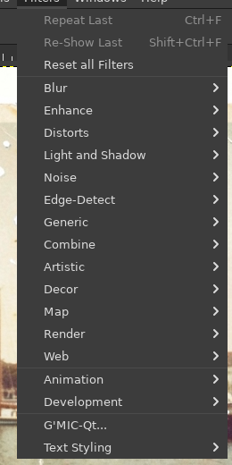
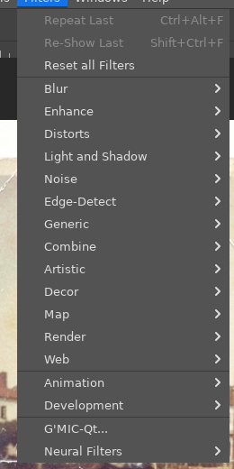
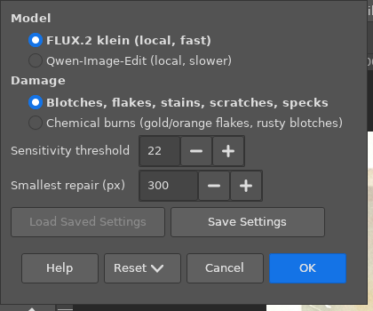
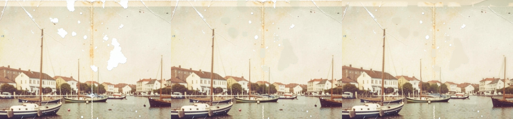
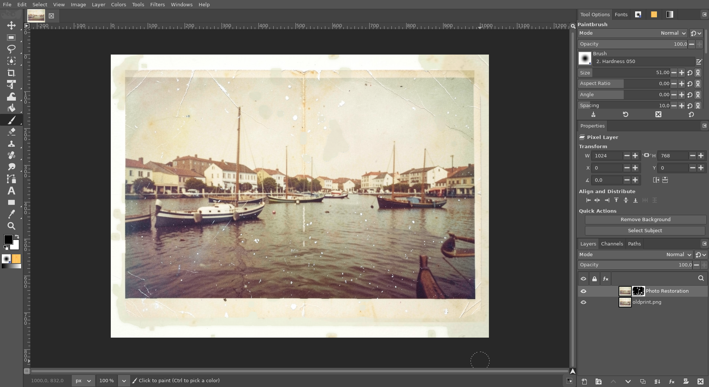

# Photo Restoration (AI)

**Issue:** [#34](https://github.com/diegochagas/gimphoto/issues/34) ·
**Plug-in:** [`plugins/photo-restoration/`](../../plugins/photo-restoration/) ·
**Backend:** [ComfyUI with GIMPhoto](comfyui-with-gimphoto.md)

Photoshop's **Photo Restoration** neural filter, for scanned photo prints.
White and brown blotches, flakes, stains, scratches and specks are painted
over by a local AI model on this computer (no account, nothing uploaded).
Only the damaged spots are taken from it: the result is a new layer whose
mask is the damage that was repaired, over the untouched scan.

It is gimp-setup's *AI Restore Photo* (the same method and mask), in
Photoshop's place: *Filters › Neural Filters › Photo Restoration…*.

## Before and after

| Plain GIMP's Filters menu: no Neural Filters | GIMPhoto's: *Neural Filters* at the end |
|---|---|
|  |  |

The window:

A damaged print. Left, the scan; middle, with FLUX.2 klein (about a
minute); right, with Qwen-Image-Edit (about 2 minutes). The blotches are
gone, leaving faint patches where the tone does not quite match. The thin
scratches, the crease and some specks stay:

In GIMPhoto: the *Photo Restoration* layer, with its damage mask, above
the scan:

The print is generated with the local FLUX.2 klein model.

## Use

1. Open the scan. Select an area first to repair only the damage inside
   it.
2. *Filters › Neural Filters › Photo Restoration…*
3. Choose:
   - **Model:** FLUX.2 klein (fast) or Qwen-Image-Edit (slower; better on
     chemical burns, but it tends to repaint faces);
   - **Damage:** blotches, flakes, stains, scratches, specks; or chemical
     burns (gold/orange flakes, rusty blotches);
   - **Sensitivity threshold:** how much the model must have changed a spot
     for it to count as repaired. Lower catches faint damage, but also
     changes that are not damage;
   - **Smallest repair:** smaller changed spots are ignored, unless the
     change is strong.
4. **OK**. The *Photo Restoration* layer goes above the selected layer, in
   one undo step.

The layer holds the model's whole picture, colour-matched to the scan.
Paint its mask white where damage was missed, and black where the model
changed something it should not have (a face, an expression). When the
repair covers more than half the photo, or nothing at all, a message says
so.

**Needs** the local AI: ComfyUI with the `klein` (or `qwen`) model set,
installed by
[linux-mint-setup's ComfyUI steps](https://github.com/diegochagas/linux-mint-setup#local-ai-image-models-comfyui).
GIMPhoto starts and stops it ([ComfyUI with GIMPhoto](comfyui-with-gimphoto.md)).
Without it, Photo Restoration says so and where to install it, and the
image is left alone.

## How it works

- **Plug-in** `plugins/photo-restoration/`, procedure
  `gimphoto-photo-restoration`, from gimp-setup's `ai-restore-photo`:
  1. the visible image goes to the model, which redraws it with the damage
     painted over (`comfyui_client.restore`, from gimp-setup's ComfyUI
     client vendored in `plugins/comfyui-service/`);
  2. `restore_mask.py`, vendored unchanged from gimp-setup:
     - aligns the model's picture on the scan;
     - matches its colours to the scan's;
     - keeps it only where the two still differ, in regions large enough,
       grown and feathered;
  3. the result becomes a layer with that mask, limited to the selection
     if there is one.
- **numpy, scipy and Pillow**, which `restore_mask.py` needs, are not in
  the GNOME runtime or in Flathub's GIMP. GIMPhoto ships them:
  - `plugins/photo-restoration/python-wheels.tsv` lists the official PyPI
    wheels for the runtime's Python 3.14 (x86_64), each with its SHA-256;
  - the generator turns that list into a module that installs them, offline,
    into `/app/lib/python3.14/site-packages`;
  - that adds about 225 MB to the installed app.
- **Licences:** numpy and scipy BSD-3-Clause; Pillow MIT-CMU (HPND);
  gimp-setup's files MIT.

**Tests:**
- `tests/test_manifest.py`: the wheels module installs offline
  (`--no-index`) into the app, x86_64 only; every wheel in a
  `python-wheels.tsv` is a pinned PyPI cp314 wheel.
- `scripts/smoke`:
  - the procedure is registered;
  - without the local AI it names linux-mint-setup and adds no layer;
  - `tests/smoke_restore_mask.py`, run with the app's own Python on its
    numpy, scipy and Pillow: a white blotch on a grey "scan", painted over
    in the "model's" picture, is the one region in the mask, and nothing
    else of the scan is.
- On the built app, with the real ComfyUI: the screenshots above.

## Limits

- Large blotches are repaired best. Thin scratches, creases and small
  specks are often left, because their changes are below the sensitivity
  threshold or the smallest repair.
- The patches where blotches were can be a little flat, or a different
  tone.
- RGB images only.
- Of Photoshop's other Neural Filters, only GIMPhoto's own
  [Modern Photo](modern-photo.md) is in the submenu.
