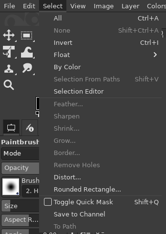

# Photoshop shortcuts by default

**Issue:** [#8](https://github.com/diegochagas/gimphoto/issues/8) ·
**Patch:** [`patches/0002-Photoshop-shortcuts-by-default.patch`](../../patches/0002-Photoshop-shortcuts-by-default.patch) ·
**Keymap:** [`defaults/photoshop-keymap.tsv`](../../defaults/photoshop-keymap.tsv)

GIMPhoto starts with Photoshop's keyboard shortcuts: **Ctrl+D** deselects
(in GIMP it duplicates the whole image into a new tab), **Ctrl+J** /
**Ctrl+Shift+J** make a layer via copy / cut ([Layer via Copy / Cut](layer-via-copy-cut.md)), **Ctrl+E** /
**Ctrl+Shift+E** merge layers / merge visible ([Merge Layers](merge-layers.md)), **Ctrl+T** transforms, **V** is the Move tool,
**B** the brush, **Ctrl+L / M / U** open Levels, Curves and Hue-Saturation,
and so on. Menus show the new shortcuts next to their entries, as GIMP's
own did.

## Before and after

| Plain GIMP | GIMPhoto |
|---|---|
|  |  |

## Use

Nothing to set up: a new GIMPhoto profile has these shortcuts. Change any of
them in **Edit > Keyboard Shortcuts** (Ctrl+Alt+Shift+K) as in GIMP; your
changes are saved in your profile's `shortcutsrc` and kept.

**Edit > Preferences > Interface > Reset Keyboard Shortcuts to Default
Values** brings back GIMPhoto's (Photoshop's) shortcuts on the next start.
The *Reset* button in the Keyboard Shortcuts dialog resets one action to
**GIMP's** shortcut instead, since that is GIMP's own built-in default.

**When GIMPhoto moves a shortcut** to another command (Ctrl+E from Merge
Down to [Merge Layers](merge-layers.md), for instance), a profile that has
already run GIMPhoto gets the move too, once, at the next start. GIMP
reads the profile's own saved shortcuts instead of GIMPhoto's defaults, so
without this they would never arrive. The move is made only if the old
command still has that shortcut: one you changed yourself is left alone,
and all your other shortcuts are kept. The moves are listed in
`defaults/shortcut-moves.tsv`, and patch
[`0015-…`](../../patches/0015-Default-shortcut-updates-reach-existing-profiles.patch)
applies them (the profile remembers the last one in its
`gimphoto-shortcuts-version` file).

Photoshop shortcuts that have no GIMP action doing the same job (Hand tool
H, Rotate View R, Shape tool U until [#2](https://github.com/diegochagas/gimphoto/issues/2),
Black & White, Camera Raw…) are left free.

## The keymap

Photoshop CC 2019 and later, Windows/Linux keys. A GIMP action keeps its
own GIMP shortcut too, unless Photoshop uses that key for something else.

<!-- keymap:start (generated by tools/make_keymap.py, do not edit) -->
| Photoshop command | GIMPhoto | GIMP action | Plain GIMP |
|---|---|---|---|
| Move Tool (V) | V | `tools-move` | M |
| Rectangular Marquee Tool (M) | M | `tools-rect-select` | R |
| Elliptical Marquee Tool (Shift+M) | Shift+M | `tools-ellipse-select` | E |
| Lasso Tool (L) | L | `tools-free-select` | F |
| Magnetic Lasso Tool (Shift+L) | Shift+L | `tools-iscissors` | I |
| Object Selection Tool (W; Magic Wand is in its toolbox group) | W | `tools-object-select` | – |
| Quick Selection Tool (Shift+W) | Shift+W | `tools-paint-select` | – |
| Crop Tool (C) | C | `tools-crop` | Shift+C |
| Eyedropper Tool (I) | I | `tools-color-picker` | O |
| Ruler Tool (Shift+I) | Shift+I | `tools-measure` | Shift+M |
| Healing Brush Tool (J) | J | `tools-heal` | H |
| Brush Tool (B) | B | `tools-paintbrush` | P |
| Pencil Tool (Shift+B) | Shift+B | `tools-pencil` | N |
| Clone Stamp Tool (S) | S | `tools-clone` | C |
| Eraser Tool (E) | E | `tools-eraser` | Shift+E |
| Gradient Tool (G) | G | `tools-gradient` | G |
| Paint Bucket Tool (Shift+G) | Shift+G | `tools-bucket-fill` | Shift+B |
| Dodge / Burn Tool (O) | O | `tools-dodge-burn` | Shift+D |
| Pen Tool (P) | P | `tools-path` | B |
| Horizontal Type Tool (T) | T | `tools-text` | T |
| Rectangle Tool (U; the other shape tools are in its toolbox group) | U | `tools-shape-rectangle` | – |
| Zoom Tool (Z) | Z | `tools-zoom` | Z |
| Edit > Free Transform (Ctrl+T) | Ctrl+T | `tools-unified-transform` | Shift+T |
| Filter > Liquify (Ctrl+Shift+X) | Ctrl+Shift+X | `tools-warp` | W |
| Edit in Quick Mask Mode (Q) | Q | `quick-mask-toggle` | Shift+Q |
| Default Foreground/Background Colors (D) | D | `context-colors-default` | D |
| Switch Foreground/Background Colors (X) | X | `context-colors-swap` | X |
| File > Close All (Ctrl+Alt+W) | Ctrl+Alt+W | `file-close-all` | Ctrl+Shift+W |
| File > Export > Export As (Ctrl+Alt+Shift+W) | Ctrl+Alt+Shift+W | `file-export-as` | Ctrl+Shift+E |
| GIMPhoto: File > Overwrite (as in gimp-setup) | Ctrl+Alt+E | `file-overwrite` | – |
| File > Export > Save for Web (Ctrl+Alt+Shift+S); GIMPhoto: File > Export to the last file | Ctrl+Alt+Shift+S | `file-export` | Ctrl+E |
| Edit > Redo (Ctrl+Shift+Z) | Ctrl+Shift+Z | `edit-redo` | Ctrl+Y |
| Edit > Copy Merged (Ctrl+Shift+C) | Ctrl+Shift+C | `edit-copy-visible` | Ctrl+Shift+C, Shift+Copy |
| Edit > Paste Special > Paste in Place (Ctrl+Shift+V) | Ctrl+Shift+V | `edit-paste-in-place` | Ctrl+Alt+V, Alt+Paste |
| Edit > Paste Special > Paste Into (Ctrl+Alt+Shift+V) | Ctrl+Alt+Shift+V | `edit-paste-into` | – |
| Fill with Foreground Color (Alt+Backspace) | Alt+Backspace | `edit-fill-fg` | Ctrl+, |
| Fill with Background Color (Ctrl+Backspace) | Ctrl+Backspace | `edit-fill-bg` | Ctrl+. |
| Edit > Clear (Backspace / Delete) | Backspace, Delete | `edit-clear` | Delete |
| Edit > Fill... (Shift+F5 / Shift+Backspace) | Shift+F5, Shift+Backspace | `gimphoto-fill` | – |
| Edit > Preferences > General (Ctrl+K) | Ctrl+K | `dialogs-preferences` | – |
| Edit > Keyboard Shortcuts (Ctrl+Alt+Shift+K) | Ctrl+Alt+Shift+K | `dialogs-keyboard-shortcuts` | – |
| Image > Adjustments > Levels (Ctrl+L) | Ctrl+L | `filters-levels` | – |
| Image > Adjustments > Curves (Ctrl+M) | Ctrl+M | `filters-curves` | – |
| Image > Adjustments > Hue/Saturation (Ctrl+U) | Ctrl+U | `filters-hue-saturation` | – |
| Image > Adjustments > Color Balance (Ctrl+B) | Ctrl+B | `filters-color-balance` | – |
| Image > Adjustments > Desaturate (Ctrl+Shift+U) | Ctrl+Shift+U | `filters-desaturate` | – |
| Image > Adjustments > Invert (Ctrl+I) | Ctrl+I | `filters-invert-perceptual` | – |
| Image > Auto Tone (Ctrl+Shift+L) | Ctrl+Shift+L | `drawable-levels-stretch` | – |
| Image > Image Size (Ctrl+Alt+I) | Ctrl+Alt+I | `image-scale` | – |
| Image > Canvas Size (Ctrl+Alt+C) | Ctrl+Alt+C | `image-resize` | – |
| Layer > New > Layer (Ctrl+Shift+N) | Ctrl+Shift+N | `layers-new` | Ctrl+Shift+N |
| Layer > Create Clipping Mask (Ctrl+Alt+G) | Ctrl+Alt+G | `layers-clipping-mask` | – |
| Layer > New > Layer via Copy (Ctrl+J; no selection: duplicate the layer) | Ctrl+J | `gimphoto-layer-via-copy` | – |
| Layer > New > Layer via Cut (Ctrl+Shift+J) | Ctrl+Shift+J | `gimphoto-layer-via-cut` | – |
| Layer > Group Layers (Ctrl+G) | Ctrl+G | `layers-new-group` | – |
| Layer > Merge Layers (Ctrl+E; one layer: Merge Down; a group: Merge Group) | Ctrl+E | `gimphoto-merge-layers` | – |
| Layer > Merge Visible (Ctrl+Shift+E, no dialog) | Ctrl+Shift+E | `layers-merge-layers-last-values` | – |
| Stamp Visible (Ctrl+Alt+Shift+E) | Ctrl+Alt+Shift+E | `layers-new-from-visible` | – |
| Layer > Arrange > Bring Forward (Ctrl+]) | Ctrl+] | `layers-raise` | – |
| Layer > Arrange > Send Backward (Ctrl+[) | Ctrl+[ | `layers-lower` | – |
| Layer > Arrange > Bring to Front (Ctrl+Shift+]) | Ctrl+Shift+] | `layers-raise-to-top` | – |
| Layer > Arrange > Send to Back (Ctrl+Shift+[) | Ctrl+Shift+[ | `layers-lower-to-bottom` | – |
| Select > Deselect (Ctrl+D) | Ctrl+D | `select-none` | Ctrl+Shift+A |
| Select > Inverse (Ctrl+Shift+I) | Ctrl+Shift+I | `select-invert` | Ctrl+I |
| Select > Modify > Feather (Shift+F6) | Shift+F6 | `select-feather` | – |
| Filter > Last Filter (Ctrl+Alt+F) | Ctrl+Alt+F | `filters-repeat` | Ctrl+F |
| View > Zoom In (Ctrl++) | Ctrl++, Ctrl+= | `view-zoom-in` | +, Keypad +, ZoomIn |
| View > Zoom Out (Ctrl+-) | Ctrl+- | `view-zoom-out` | -, Keypad -, ZoomOut |
| View > Fit on Screen (Ctrl+0) | Ctrl+0 | `view-zoom-fit-in` | Ctrl+Shift+J |
| View > 100% (Ctrl+1) | Ctrl+1 | `view-zoom-1-1` | 1, Keypad 1 |
| View > Extras (Ctrl+H) | Ctrl+H | `view-show-selection` | Ctrl+T |
| View > Rulers (Ctrl+R) | Ctrl+R | `view-show-rulers` | Ctrl+Shift+R |
| View > Show > Guides (Ctrl+;) | Ctrl+; | `view-show-guides` | Ctrl+Shift+T |
| View > Show > Grid (Ctrl+') | Ctrl+' | `view-show-grid` | – |
| View > Snap (Ctrl+Shift+;) | Ctrl+Shift+; | `view-snap-to-guides` | – |
| Change Screen Mode (F) | F | `view-fullscreen` | F11 |
| Window > Layers (F7) | F7 | `dialogs-layers` | Ctrl+L |
| Next document (Ctrl+Tab) | Ctrl+Tab | `windows-show-display-next` | Alt+Tab, Forward |
| Previous document (Ctrl+Shift+Tab) | Ctrl+Shift+Tab | `windows-show-display-previous` | Alt+Shift+Tab, Back |
<!-- keymap:end -->

### Keys that do something else than in GIMP

The ones a GIMP user will notice:

| Key | GIMP | GIMPhoto |
|---|---|---|
| Ctrl+D | Image > Duplicate (a new tab) | Select > None |
| Ctrl+E | File > Export | Layer > Merge Layers: the selected layers into one; one layer: Merge Down ([Merge Layers](merge-layers.md); Export: Ctrl+Alt+Shift+S) |
| Ctrl+Shift+E | File > Export As | Merge Visible Layers at once, no dialog ([Merge Layers](merge-layers.md); Export As: Ctrl+Alt+Shift+W) |
| Ctrl+I | Select > Invert | Colors > Invert (Select > Invert: Ctrl+Shift+I) |
| Ctrl+M | Image > Merge Visible Layers | Colors > Curves |
| Ctrl+L | Layers dialog | Colors > Levels (Layers dialog: F7) |
| Ctrl+J | View > Shrink Wrap | Layer > Layer via Copy (no selection: duplicate the layer) |
| Ctrl+Shift+J | View > Zoom > Fit Image in Window | Layer > Layer via Cut (Fit in Window: Ctrl+0) |
| Ctrl+G | Gradients dialog | Layer > New Layer Group |
| Ctrl+B | Toolbox | Colors > Color Balance |
| Ctrl+T | View > Show Selection | Free transform (Unified Transform); Show Selection: Ctrl+H |
| Ctrl+H | Layer > Anchor | View > Show Selection |
| Ctrl+Tab on the canvas | layer picker | next image (Ctrl+Shift+Tab: previous) |
| Ctrl+Shift+V | Edit > Paste as > New Image | Edit > Paste In Place |
| B, C, E, F, I, M, O, P, Q, S, W | Paths, Clone, Ellipse Select, Free Select, Scissors, Move, Color Picker, Paintbrush, Align, Smudge, Warp | Paintbrush, Crop, Eraser, Fullscreen, Color Picker, Rectangle Select, Dodge/Burn, Paths, Quick Mask, Clone, Object Selection |

While you edit text with the Text tool, Ctrl+B / Ctrl+I / Ctrl+U still make
it bold / italic / underlined and Ctrl+Shift+V still pastes unformatted:
the text tool takes those keys before any shortcut.

## What changed

**GIMP's code** (`patches/0002-…`):

- `app/menus/menus.c`, `menus_restore()`: when the profile has no
  `shortcutsrc`, GIMP reads GIMPhoto's default one,
  `gimp_data_directory_file ("gimphoto", "shortcutsrc")`
  (`/app/share/gimp/3.0/gimphoto/shortcutsrc`), instead of starting with
  GIMP's built-in shortcuts. GIMP writes the profile's own `shortcutsrc` on
  exit, as always.
- `app/display/gimpdisplayshell-tool-events.c`,
  `gimp_display_shell_tab_pressed()`: Ctrl+Tab / Ctrl+Shift+Tab on the
  canvas, which GIMP hard-wires to its layer picker, switch to the next /
  previous image, as Alt+Tab does in GIMP.

**Build:** the manifest's `gimphoto-defaults` module installs
`defaults/shortcutsrc` there.

**Keymap:** [`defaults/photoshop-keymap.tsv`](../../defaults/photoshop-keymap.tsv)
is GIMPhoto's own table: one line per GIMP action, its Photoshop shortcuts
and the Photoshop command. [`tools/make_keymap.py`](../../tools/make_keymap.py)
reads GIMP's default shortcuts from its source
([`tools/gimp_default_accels.py`](../../tools/gimp_default_accels.py)),
takes every key the table uses away from the GIMP action that had it, and
writes `defaults/shortcutsrc` and the table above. It refuses a key used
twice or an action GIMP does not have; `scripts/check` fails when the
generated files are out of date. To change a shortcut, edit the table and
run `tools/make_keymap.py`.

[PhotoGIMP](https://github.com/Diolinux/PhotoGIMP) was a reference for
which GIMP action matches which Photoshop command.

## Limits

- Existing profiles keep their shortcuts: the default is only read when the
  profile has no `shortcutsrc` (a GIMPhoto profile from before this
  feature: reset the shortcuts in Preferences, then restart).
- Keys are Windows/Linux Photoshop's (Ctrl, Alt), not macOS's.
- GIMP's Keyboard Shortcuts dialog shows the remapped actions as changed
  by the user, since GIMP's built-in defaults are still GIMP's.
