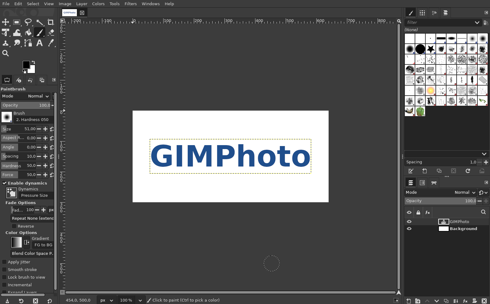
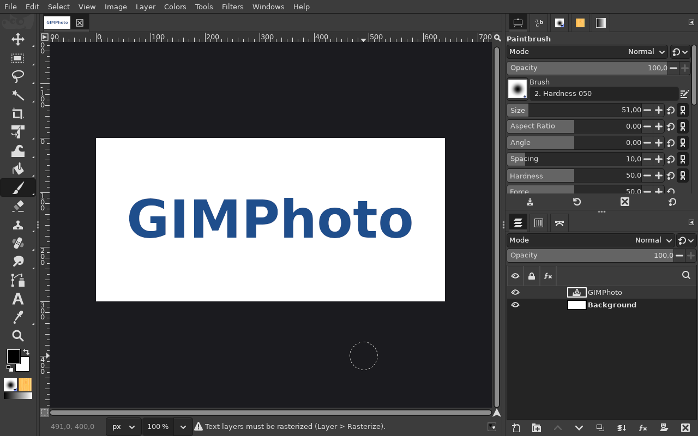
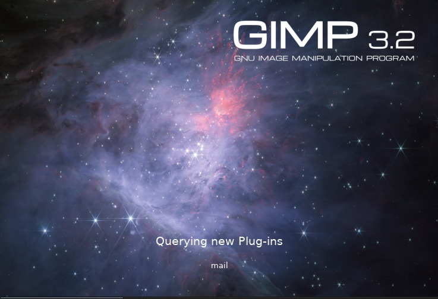
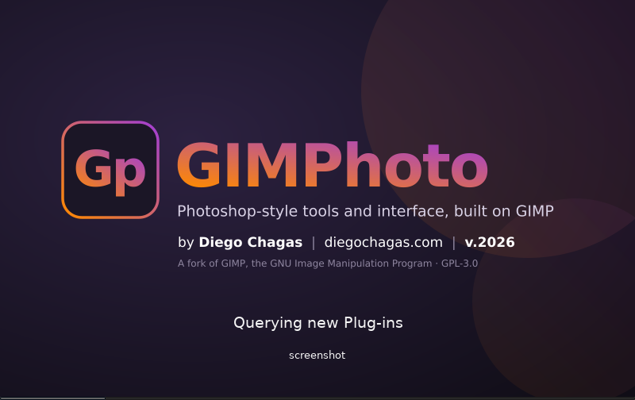

# Photoshop-style defaults, splash screen and icon

**Issue:** [#9](https://github.com/diegochagas/gimphoto/issues/9) ·
**Files:** [`defaults/`](../../defaults/) (`toolrc`, `sessionrc`, `gimprc`),
[`branding/`](../../branding/)

A new GIMPhoto profile opens Photoshop-style: the toolbox in one narrow
column with Photoshop's tool groups, Properties / Tool Options and Layers on the right, a
dark canvas surround, larger layer previews. It's PhotoGIMP's setup
(github.com/Diolinux/PhotoGIMP, GPL-3.0), shipped as GIMPhoto's defaults
instead of files copied into a profile, with GIMPhoto's own splash screen
and icon.

## Before and after

| Plain GIMP | GIMPhoto |
|---|---|
|  |  |
|  |  |

The launcher's icon:

## Use

Nothing to set up: a new GIMPhoto profile starts this way. Change anything
as in GIMP (Edit > Preferences, Windows, the toolbox's own settings): GIMP
saves your changes in your profile, and those win.

Profiles that already exist keep their own layout and settings. To start
over with GIMPhoto's, close GIMPhoto and move `sessionrc`, `toolrc` and
`gimprc` out of `~/.var/app/io.github.diegochagas.GIMPhoto/config/GIMPhoto/`.

## What came from PhotoGIMP

From PhotoGIMP 3.0 (commit eca3a8f), credited in each file:

| PhotoGIMP file | In GIMPhoto | Changes |
|---|---|---|
| `toolrc`: toolbox order and groups like Photoshop's | `defaults/toolrc` | GIMPhoto's [shape tools](shape-tool.md) grouped after Text |
| `sessionrc`: one window, toolbox on the left, GIMPhoto's [Properties panel](properties-panel.md) + Tool Options, brushes, patterns, fonts and gradients over Layers, Channels and Paths on the right | `defaults/sessionrc` | on GIMP 3.2's own sessionrc; without its window and dialog positions and sizes (made for one monitor); Paths is GIMP 3.2's `gimp-path-list` (PhotoGIMP's `gimp-vectors-list` no longer exists); the window starts maximized |
| `gimprc`: layer previews extra large, thumbnails large, undo previews medium, 8 undo levels, alpha channel on imported images, dark canvas padding, no layer boundary, snap to canvas, toolbox brush/pattern/gradient area | `defaults/gimprc` | without its monitor resolution, the padding colour's embedded monitor profile, the image view opening fullscreen, and its fill and stroke options; the padding is Photoshop's `#282828` with the [Photoshop theme](photoshop-theme.md) |
| `shortcutsrc` | — | GIMPhoto has its own Photoshop keymap ([#8](photoshop-shortcuts.md)) |
| `contextrc`, `tool-options/`, `plug-in-settings/`, `filters/` | — | left out: last-used values from PhotoGIMP's author's own sessions (a 1920×1080 crop ratio, the Starfield pattern, JPEG export settings), not Photoshop-style defaults |
| `theme.css` | — | written by GIMP on every start; GIMPhoto has its own [Photoshop theme](photoshop-theme.md) |
| splash screen, icon, `.desktop` file | — | PhotoGIMP's artwork: GIMPhoto has its own (below); the launcher is already named GIMPhoto |

## What changed

No change to GIMP's code: GIMP already reads `toolrc`, `sessionrc` and
`gimprc` from its system folder (`/app/etc/gimp/3.0/`) when the profile
has none of its own. The manifest's `gimphoto-defaults` module installs
`defaults/toolrc` and `defaults/sessionrc` there over GIMP's, and appends
`defaults/gimprc` to GIMP's system gimprc.

**Branding** (`branding/`, GIMPhoto's own artwork):

- the splash carries the author's by-line, as PhotoGIMP's does for
  Diolinux: "by Diego Chagas | diegochagas.com | v.2026", the year of the
  release (update it in `splash-source.svg` for a new year's release);
- `icon-source.svg` / `splash-source.svg`, rendered by
  `tools/make_branding.sh` (Inkscape, DejaVu Sans Bold, text as paths) to
  `icon.svg`, `icons/<size>.png` and `splash.png`;
- the `gimphoto-branding` module installs the splash over GIMP's
  `images/gimp-splash.png` (your own `gimp-splash.png` or `splashes/` in the
  profile still win, as in GIMP) and the icon as `gimp`, which Flathub's
  recipe then renames to the app ID for the launcher.

**Tests:** `scripts/smoke` checks the installed `toolrc` and `sessionrc` are
`defaults/`'s, that a new profile gets the `gimprc` settings, and that the
splash and launcher icon are `branding/`'s.

## Limits

- The window opens maximized only under a window manager that honours it.
- About GIMP, the window title and GIMP's own logo inside the program still
  say GIMP: GIMPhoto is GIMP underneath.
