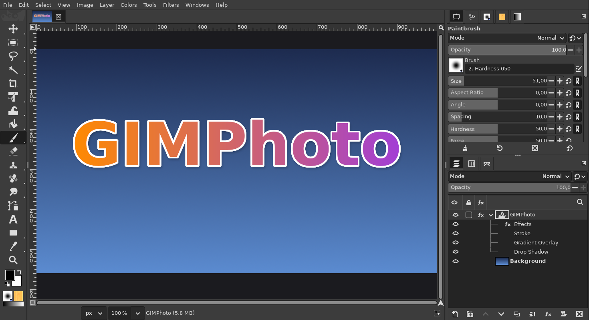
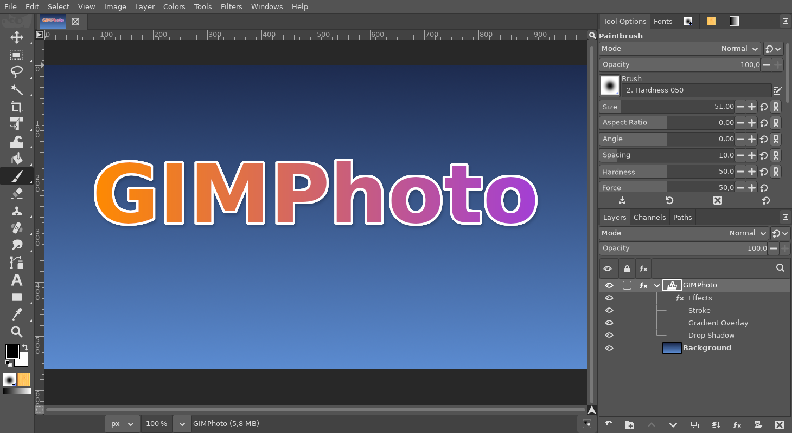

# Photoshop theme

**Issue:** [#27](https://github.com/diegochagas/gimphoto/issues/27) ·
**Theme:** [`themes/Photoshop/gimp.css`](../../themes/Photoshop/gimp.css)

Photoshop's default workspace is a medium grey: `#535353` panels, darker
tab strips and fields, flat tool tiles, Adobe blue for selection and focus.
GIMPhoto starts with a theme that looks like it, instead of GIMP's dark
theme.

## Before and after

| GIMP's dark theme | GIMPhoto's Photoshop theme |
|---|---|
|  |  |

| | Photoshop | GIMP's dark theme |
|---|---|---|
| Panels | `#535353` | `#3c3c3c` |
| Tab strips, inactive tabs | `#424242`, the active tab in the panel's colour, with names (*Layers*, *Channels*, *Paths*, *Tool Options*) | boxed tabs, icons only |
| Fields | `#454545`, blue `#1473e6` border on focus | dark fields |
| Selection, checkboxes, sliders | Adobe blue `#1473e6` | grey |
| Toolbox | flat tiles in one column, the active tool on a dark tile | boxed buttons |
| Pasteboard (around the image) | `#282828` | — |

## Use

Nothing to set up: a new profile uses it. GIMP's own themes stay one click
away: *Edit > Preferences > Interface > Theme* (*Default*, *System*).
The pasteboard colour is under *Image Windows > Appearance > Canvas
padding*.

Profiles that already exist keep their theme: pick *Photoshop* in
*Preferences > Interface > Theme*.

## What changed

No change to GIMP's code.

- **`themes/Photoshop/gimp.css`**: gimp-setup's
  [Photoshop theme](https://github.com/diegochagas/gimp-setup/blob/main/docs/PHOTOSHOP_THEME.md),
  the same rules. It reuses every widget rule of GIMP's Default theme,
  imported by a relative path (`../Default/common-dark.css`, the theme
  being installed next to it), and changes only colours and a few
  Photoshop-style overrides, so GIMP updates keep working.
- **Build:** the manifest's `gimphoto-themes` module installs every
  `themes/<Name>/gimp.css` into GIMP's data folder (`themes/<Name>/`) under
  each name GIMP reads (`gimp.css`, `gimp-dark.css`, `gimp-gray.css`,
  `gimp-light.css`), so the theme is the same whichever colour scheme is
  chosen.
- **Defaults:** `defaults/gimprc` selects it (`(theme "Photoshop")`) with
  Photoshop's `#282828` pasteboard; `defaults/sessionrc` shows the names on
  dock tabs and keeps the toolbox in one column (`left-docks-width` 40:
  the theme's flat tiles are narrower than GIMP's buttons).

**Tests:** `scripts/smoke` checks the installed theme is
`themes/Photoshop/gimp.css` and that a new profile gets it.

## Limits

GTK CSS can restyle widgets but not move them: the Layers panel's footer
buttons stay spread over its width instead of grouped on the right, and
dialogs keep GIMP's layout.
