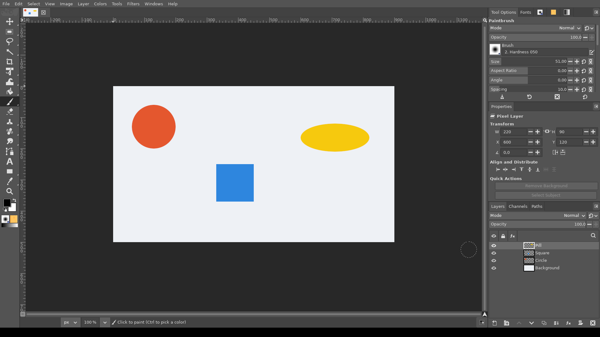
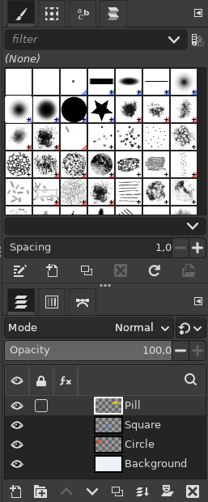
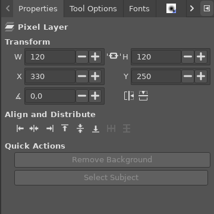
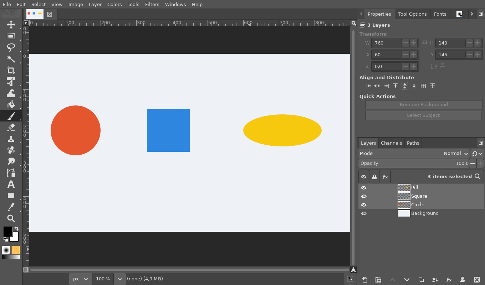

# Properties panel

**Issue:** [#38](https://github.com/diegochagas/gimphoto/issues/38) ·
**Patches:** [`patches/0008-…`](../../patches/0008-Properties-panel-Transform-Align-and-Distribute-Quic.patch), [`patches/0010-…`](../../patches/0010-Docks-drop-a-dockable-between-two-dock-books.patch) (docking between groups) ·
**Layout:** [`defaults/sessionrc`](../../defaults/sessionrc)

Photoshop's **Properties** panel, docked above Layers, shows what the selected
layer is and the commands used on it most: its size and position, alignment,
and quick actions. GIMP spreads these over the Layer menu, the Scale Layer
dialog, the transform tools and the Align tool. GIMPhoto adds the panel and,
as Photoshop, gives it **its own panel group in the middle of the right-hand
column**, between Tool Options (with fonts, brushes, patterns and
gradients) and Layers / Channels / Paths
([#50](https://github.com/diegochagas/gimphoto/issues/50)).

This is only the default: drag the Properties tab into another group (or
anywhere else) and GIMPhoto keeps it there. To put it back in the middle,
drag its tab to the boundary between Tool Options and Layers: a blue line
shows where it lands, and it becomes a group of its own again, tall enough
to show the whole panel (the space comes from the group above it).

## Before and after

| Plain GIMP | GIMPhoto |
|---|---|
|  |  |

Three layers selected and aligned on their vertical centers. The Transform
fields show the box around them, read-only:

## Use

Select one layer, or several, in the Layers panel.

- **Header:** the layer's kind (*Pixel Layer*, *Text Layer*, *Smart Object*,
  *Shape Layer*, *Layer Group*), or how many layers are selected.
- **Transform** (one layer):
  - **W** and **H**, linked by the chain: changing one keeps the aspect
    ratio, and the top-left corner stays where it is.
  - **X** and **Y** move the layer.
  - **∡** rotates the layer by the angle typed, about its centre; the field
    goes back to 0, as Photoshop's does for pixel layers.
  - The two buttons flip it horizontally / vertically.
  - With several layers selected, the fields show the box around them,
    greyed. A layer with its position locked cannot be moved; one with its
    contents locked cannot be resized, rotated or flipped.
- **Align and Distribute:**
  - Align left, horizontal centers, right, top, vertical centers, bottom.
  - One layer aligns to the canvas. Several align to the box around them.
    Both measure the layers' visible pixels, as Photoshop does.
  - Distribute horizontally / vertically (3 layers or more): the outer
    layers stay, and the gaps between all of them become equal.
- **Quick Actions:** **Select Subject** runs [Select Subject (AI)](select-subject.md).
  **Remove Background** comes with its own issue
  ([#33](https://github.com/diegochagas/gimphoto/issues/33)); until then
  its button is greyed and says so.

Every button and edit is **one undo step**. The panel follows the selected
layers and every change to them, including undo. *Windows › Dockable
Dialogs › Properties* opens it in a profile with another layout.

## What changed

**GIMP's code** (`patches/0008-…`):

- `app/widgets/gimppropertieseditor.c` (new): the panel, a `GimpImageEditor`.
  - It follows the image's `selected-layers-changed` and `undo-event`
    signals.
  - It scales, moves, rotates and flips through GIMP's own item functions
    (`gimp_item_scale`, `gimp_item_translate`, `gimp_item_transform`,
    `gimp_item_flip`).
  - It aligns by measuring the visible pixels as the Align tool does (its
    *align contents*).
  - It distributes with `gimp_image_arrange_objects`.
  - The Quick Actions run the plug-in actions `gimphoto-remove-background`
    and `gimphoto-select-subject`.
- Registration: `dialogs.c`, `dialogs-constructors.c/.h` (dockable
  `gimp-properties-editor`), `dialogs-actions.c` and `dialogs-menuitems.ui.in`
  (*Windows › Dockable Dialogs › Properties*), `widgets-types.h`,
  `meson.build`.

**Defaults:** `defaults/sessionrc` gives the panel its own group between
Tool Options and Layers (layout version 2).

**Docks** (`patches/0010-…`, `app/widgets/gimppanedbox.c`): GIMP accepted a
dropped panel as a new group only at the top or bottom edge of a dock
column, and could only add a group first or last. Each boundary between
two groups is now a drop area too (same size and blue line as the edges),
and a group dropped there is inserted in the middle, so a middle group
can be made again after it was emptied.

**Tests:** `scripts/smoke` checks that the panel is compiled in and is in the
default layout. Using it needs the GUI: it was checked on the built app
(screenshots above):

- align to the canvas and to each other;
- linked W/H;
- rotate and flip;
- distribute;
- four actions undone by four Ctrl+Z.

## Limits

- Transform edits one layer at a time; with several, it only shows them.
- Resizing, rotating or flipping a text layer from the panel turns it into
  pixels, as GIMP's own transform tools do (Photoshop keeps type editable).
- A group and a layer inside it, both selected, align as the group: the
  layer moves with it.
- No reference-point picker: resizing keeps the top-left corner, rotating
  uses the centre.
- Photoshop's other Properties pages (Adjustments, Libraries, text and shape
  properties) are not there; text and shape settings stay in Tool Options.
- A profile that already existed gets this layout when its saved layout is
  replaced by the current default (layout version 2, [#48](https://github.com/diegochagas/gimphoto/issues/48)).
  After that, moving or closing the panel is remembered; *Windows ›
  Dockable Dialogs › Properties* opens it again.
- The three groups' heights are set for a 1080-pixel-high screen; on a
  smaller one, drag the dividers between them.
