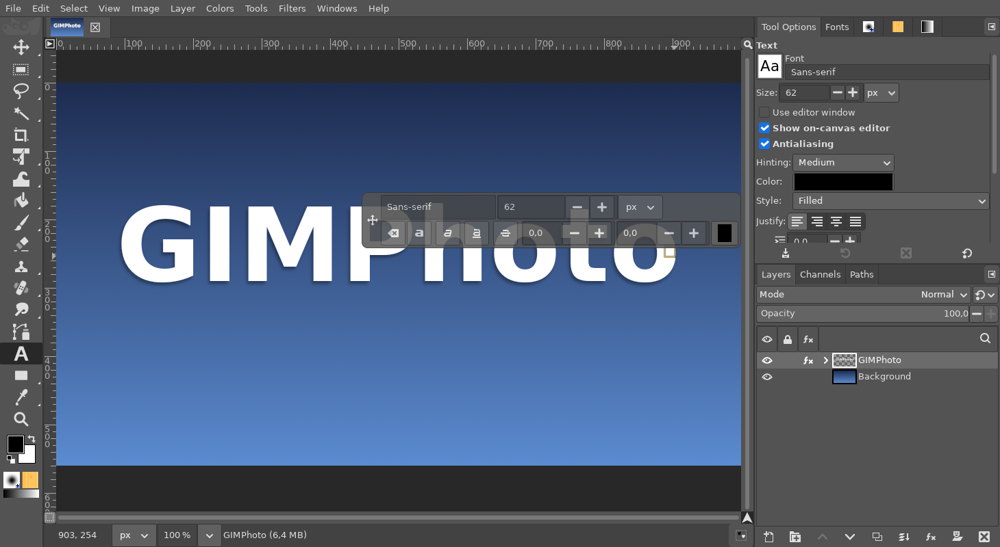
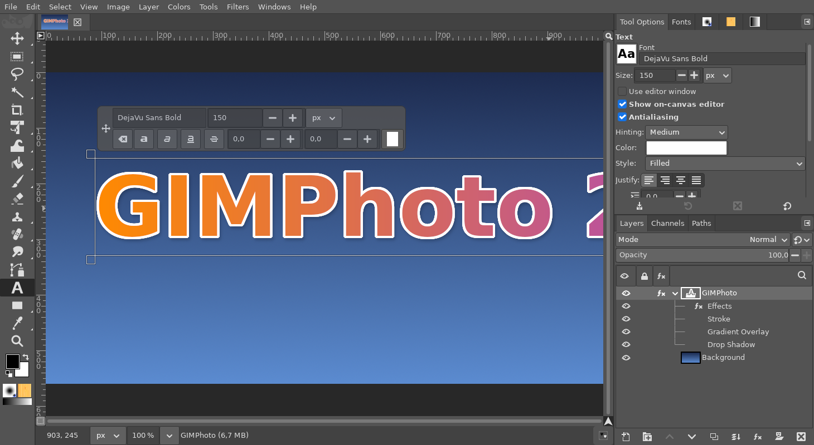

# PSD with editable text and Layer Styles

**Issue:** [#28](https://github.com/diegochagas/gimphoto/issues/28) ·
**Plug-in:** [`plugins/psd-text/`](../../plugins/psd-text/)

GIMP opens Photoshop files with their text turned into pixels, and writes
its own text into a PSD as pixels too. In GIMPhoto, text stays **editable
both ways**:

- **Open a `.psd`:** every Photoshop Type layer becomes a GIMP text layer
  you can edit with the Text tool (font, size, colour, justification,
  tracking, leading, paragraph box or point text, mixed bold / italic /
  colour / size runs), and its Layer Style an editable
  [Layer Style](layer-style-fx-button.md) (stroke, shadows, glows, bevel,
  colour and gradient overlay).
- **Export to `.psd`:** every GIMP text layer becomes a Photoshop Type layer
  that Photoshop can edit (it redraws it with its own fonts), and its
  Layer Style the same Photoshop effects.

Nothing to choose: *File → Open* a `.psd`, *File → Export As…*
`name.psd`.

## Before and after

| | GIMP | GIMPhoto |
|---|---|---|
| Photoshop Type layer → GIMP | pixels | GIMP text layer, editable |
| Photoshop Layer Style → GIMP | dropped | editable Layer Style |
| GIMP text layer → PSD | pixels | Type layer, editable in Photoshop |
| GIMP Layer Style → PSD | dropped | Photoshop effects with the same settings |

The same PSD (exported from GIMPhoto: a text layer with a stroke, a
gradient overlay and a drop shadow), opened again and clicked with the Text
tool:

| GIMP's own PSD support | GIMPhoto |
|---|---|
|  |  |

## How it works

GIMP's own PSD support runs first and brings the pixels, groups, masks,
blend modes and opacity; then the plug-in, registered for `.psd` ahead of
GIMP's own procedures, replaces the rasterized text and adds the effects
(opening), or writes the Type layers and effects into the file GIMP
exported (exporting).

The Photoshop text records are read and written by
[ag-psd](https://github.com/Agamnentzar/ag-psd) under Node.js.
GIMPhoto ships both: Node from Flathub's Node SDK extension
(`org.freedesktop.Sdk.Extension.node24`, copied into
`/app/lib/gimphoto/node`), and ag-psd with its two dependencies installed
next to the plug-in from its `package-lock.json`, each package checked
against the lockfile's SHA-512. Nothing to install.

## What changed

No change to GIMP's code.

- **Plug-in** `plugins/psd-text/`: gimp-setup's
  [PSD with editable text](https://github.com/diegochagas/gimp-setup/blob/main/docs/PSD_TEXT.md),
  adapted (see [plugins/README.md](../../plugins/README.md)): GIMPhoto's
  Node first, GIMPhoto's Layer Style engine, the Gradient Overlay's style
  (linear, radial, angle, reflected, diamond) both ways.
- **Build:** `tools/make_manifest.py` adds, for plug-ins with a
  `package-lock.json`, Flathub's Node SDK extension, a `gimphoto-node`
  module and a `gimphoto-<plug-in>-npm` module (the locked tarballs as
  checked sources, unpacked into `node_modules`); `scripts/bootstrap-tools`
  installs the extension at the SDK's freedesktop branch.
- **Tests:** unit tests for the generated modules;
  `tests/smoke_psd_text.py` (run by `scripts/smoke`) exports a text layer
  with a stroke and a radial gradient overlay to PSD, checks with ag-psd
  that the file holds a Type layer with that text and those effects, and
  opens it again as an editable text layer with the same Layer Style.

## Limits

From the plug-in ([its documentation](https://github.com/diegochagas/gimp-setup/blob/main/docs/PSD_TEXT.md)):

- Fonts missing on this computer are replaced by the closest one
  fontconfig finds, and said so when the file opens.
- Text rotated in Photoshop opens as vertical text (90°) or as a rotated
  text smart object; text scaled or freely rotated in GIMP is exported as
  pixels.
- Satin and Pattern Overlay are not converted (said so when the file
  opens); contours are linear.
