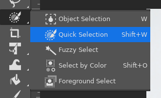
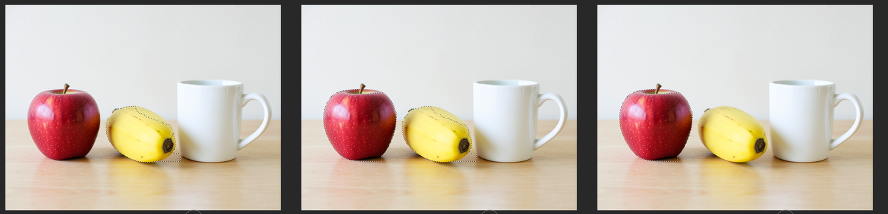
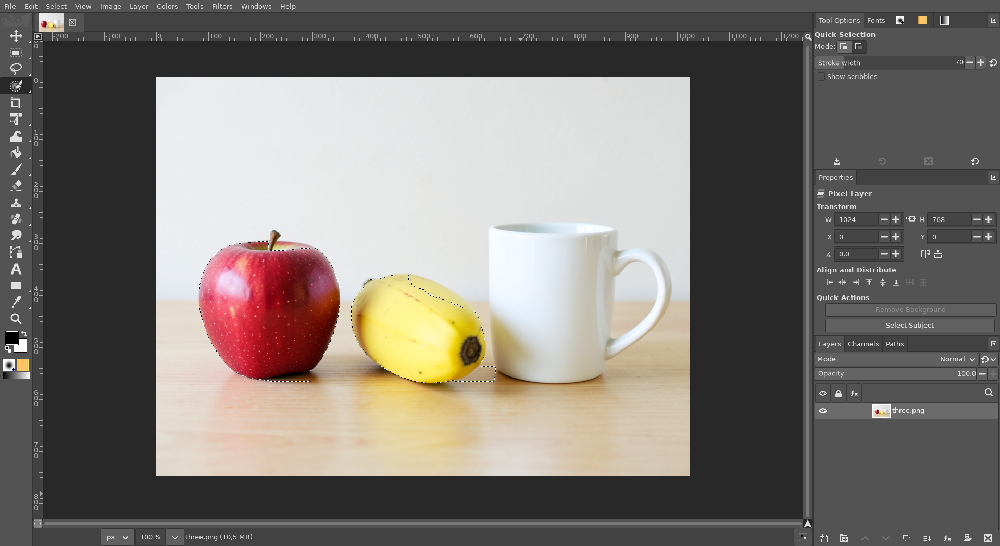

# Quick Selection tool

**Issue:** [#53](https://github.com/diegochagas/gimphoto/issues/53) ·
**Patch:** [`patches/0012-…`](../../patches/0012-Quick-Selection-GIMP-s-Paint-Select-in-the-toolbox-a.patch) ·
**GEGL operation:** [`gegl/paint-select.cc`](../../gegl/paint-select.cc)

Photoshop's **Quick Selection** tool (Shift+W): paint over an area with a
round brush and the selection grows to the edges of what you paint on.
GIMP 3.2 has a tool that does this, **Paint Select**, but hides it: it is
experimental, shown only with *Preferences › Playground › Paint Select
tool*, and Flathub's GIMP cannot show it at all (its GEGL is built without
the `gegl:paint-select` operation the tool needs). GIMPhoto builds that
operation and puts the tool in the toolbox as Quick Selection, second in
the W group, as in Photoshop. It runs on this computer, with no AI and no
download: a graph cut (maxflow) on the picture's colours, in under a tenth
of a second per stroke on a 1024×768 picture.

## Before and after

| GIMPhoto before: no Quick Selection | GIMPhoto: Quick Selection in the W group |
|---|---|
|  |  |

One stroke along the banana; then two strokes over the apple with
**Shift** (added); then an **Alt** stroke over the banana takes it back
out:

The picture is generated with the local FLUX.2 klein model.

## Use

1. Pick **Quick Selection** in the toolbox (**Shift+W**).
2. Paint over the area to select. The selection follows each stroke as
   you paint, out to the edges of what is under it; paint again to grow it.
3. **Shift** adds (the default), **Alt** or **Ctrl** subtracts; or pick the
   mode in Tool Options. Each stroke is one undo step.
4. **[** and **]** make the brush smaller and larger, by 5 px (*Stroke
   width* in Tool Options).

## What changed

**GEGL** (`gegl/paint-select.cc`): GEGL 0.4.72's own `gegl:paint-select`
(LGPL-3.0+, Thomas Manni), unchanged. GEGL builds it only with its
experimental "workshop" operations, which Flathub's recipe leaves out;
GIMPhoto compiles this one file in its `gimphoto-gegl-ops` module (C++,
linked to the maxflow library Flathub's recipe already builds), instead of
turning the whole workshop on.

**GIMP's code** (`patches/0012-…`):

- `app/tools/gimppaintselecttool.c`: registered whenever
  `gegl:paint-select` exists, not only from the Playground, as *Quick
  Selection*. Alt subtracts, as in Photoshop. It no longer runs pending
  events while it cuts the graph after a stroke: with GIMP's own code, a
  modifier let go right after the stroke was handled first and then
  undone by the display, which left the tool on Subtract after an Alt or
  Ctrl stroke.
- `app/tools/gimp-tools.c`: no longer an experimental tool, so it has its
  place in the toolbox file (see existing profiles below).
- `app/actions/tools-actions.c`, `tools-commands.c/.h`: the
  `tools-paint-select-size-set` action its tool already named for
  *Tool's Size* (**[** / **]**) but GIMP never defined.

**Defaults:** `defaults/toolrc` puts it second in the W group;
`defaults/photoshop-keymap.tsv` gives it **Shift+W** (Foreground Select,
which had it, keeps its place in the group without a key).

**Existing profiles:** a profile's toolbox file without Quick Selection is
now out of date for GIMP, which then uses GIMPhoto's default toolbox: the
W group with Object Selection and Quick Selection, as in a new profile.
Changes made to the toolbox's order in that profile are lost once. The
profile keeps its own shortcuts: there Shift+W stays Foreground Select
(*Edit › Keyboard Shortcuts* gives it to Quick Selection).

**Tests:**
- `tests/test_manifest.py`: a `.cc` operation is built with C++ and
  maxflow, after the maxflow module.
- `scripts/smoke` (`tests/smoke_paint_select.py`): the built
  `gegl:paint-select` turns a stroke in the red half of a red/blue picture
  into a selection of the whole red half and nothing of the blue; the tool
  is compiled in as Quick Selection.
- On the built app: the screenshots above, Shift / Alt / Ctrl, **[** / **]**,
  and the mode coming back to Add after modifier strokes.

## Limits

- It works on colours, not on what things are: an object the same colour
  as what is around it needs more strokes (in the screenshots the
  banana's selection takes in a little of its shadow on the table), and
  soft edges such as hair are selected hard. Object Selection and Select Subject (local AI) do
  better there.
- Photoshop's *Auto-Enhance* and *Sample All Layers* are not there: it
  reads the active layer.
- The Playground option in Preferences is still there and does nothing.
