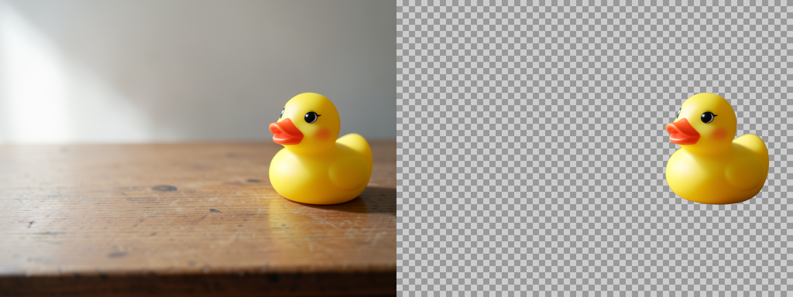
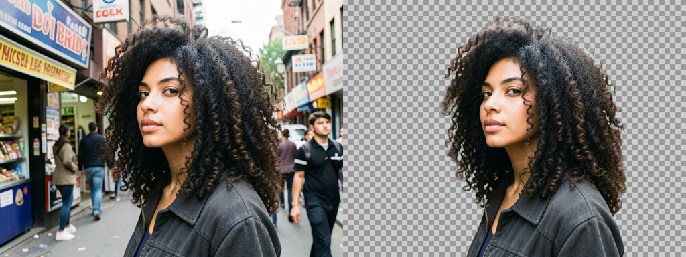
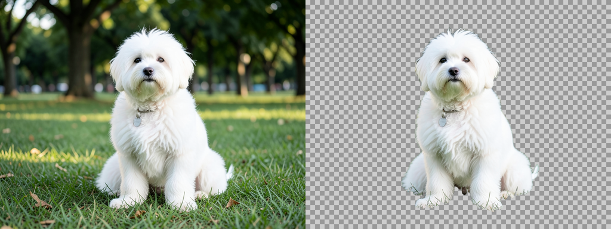
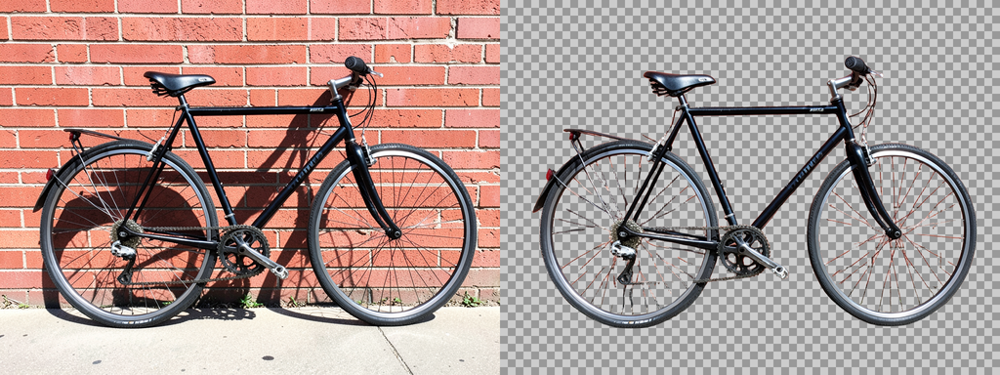
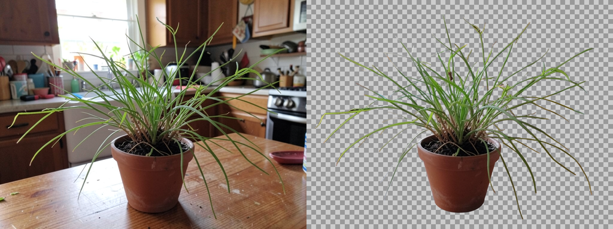
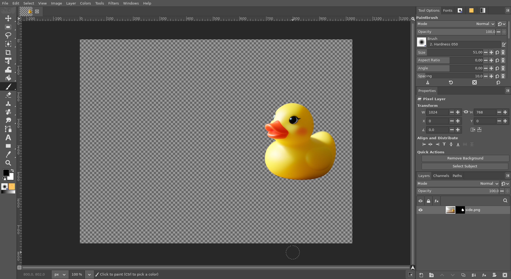
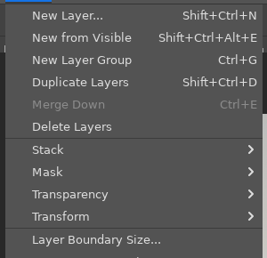

# Remove Background (AI)

**Issue:** [#33](https://github.com/diegochagas/gimphoto/issues/33) ·
**Plug-in:** [`plugins/ai-select/`](../../plugins/ai-select/) ·
**Backend:** [ComfyUI with GIMPhoto](comfyui-with-gimphoto.md)

Photoshop's **Remove Background** Quick Action: one click and the selected
layer's background disappears, hidden by a layer mask, so nothing is
deleted. GIMPhoto does the same from the Properties panel or *Layer ›
Remove Background*. A local AI model on this computer finds the subject
(no account, nothing uploaded): **BiRefNet** on the local ComfyUI, the
model Select Subject uses.

## Before and after

Five pictures, each left as it was and right after **Remove Background**
(the checkerboard is the transparent part), from the easy to the hard:

A rubber duck on a table:

Frizzy curly hair against a busy street: the curls are kept, with a faint
haze of the street left between the outermost ones:

A white long-haired dog on grass, wisps of fur included:

A bicycle against a brick wall: the wall and the shadow are gone, even
inside the frame and the wheels; the thinnest spokes are partly lost or
keep a reddish edge from the bricks:

A fern with thin fronds in a cluttered kitchen:

WithoutBG (the background removal gimp-setup used, on a server of its
own) was tried on the same five pictures: it was as good on the hair, the
dog and the fern, left pieces of the wall inside the bicycle, and took 5–6
s per picture where BiRefNet takes about 1 s (3 s the first time, to load
the model).

In GIMPhoto: the Properties panel's button, now active (until this
feature it was greyed out), and the new mask next to the layer's
thumbnail in Layers:

*Layer › Remove Background*:

The pictures are generated with the local FLUX.2 klein model.

## Use

1. Select one layer.
2. **Remove Background** in the Properties panel's Quick Actions, or
   *Layer › Remove Background*.
3. The subject's matte becomes the layer's mask, soft edges included, and
   the background is hidden. It is one undo step.

The mask is not applied, as in Photoshop: paint it in black or white to
fix it, or turn it off, apply it or delete it from *Layer › Mask*. A mask
the layer already has is replaced. A layer without transparency (a
picture's background layer) gets it first.

The model sees that layer only, not the layers above or below it. Parts
of the layer outside the canvas are masked too.

**Needs** the local AI: ComfyUI with the `birefnet` model set, installed by
[linux-mint-setup's ComfyUI steps](https://github.com/diegochagas/linux-mint-setup#local-ai-image-models-comfyui).
GIMPhoto starts and stops it ([ComfyUI with GIMPhoto](comfyui-with-gimphoto.md)).
Without it, Remove Background says so and where to install it, and the
layer is left alone.

## How it works

- **Plug-in** `plugins/ai-select/`, procedure `gimphoto-remove-background`.
  This is the action the Properties panel's Quick Action runs; its button
  is active once the procedure exists. It:
  1. waits for ComfyUI, as Select Subject does;
  2. sends the layer's own pixels (its transparent parts on white, at most
     2048 px) to BiRefNet through the shared client
     `plugins/comfyui-service/comfyui_api.py`;
  3. scales the matte that comes back to the layer, in an image of its
     own, and writes it into a new layer mask before adding it, all in one
     undo group. A mask made
     from a selection would be cut at the canvas edge, and copy and paste
     would replace the clipboard.
- **No GIMP patch:** the Properties panel's button was already there
  ([#38](https://github.com/diegochagas/gimphoto/issues/38)), waiting for
  this procedure.

**Tests:**
- `scripts/smoke`: the procedure is registered. With ComfyUI recorded as
  missing, it fails with a message naming linux-mint-setup, and leaves the
  layer without a mask and the selection unchanged. Tests never call the
  real ComfyUI.
- On the built app, with the real ComfyUI:
  - a batch run gives a white mask on the duck and black on the
    background;
  - the image's selection is kept;
  - a layer moved mostly off the canvas gets a full-size mask, with the
    duck white outside the canvas too;
  - a layer that already had a mask gets the new one;
  - in an indexed image (4 colours) the mask is still the model's greys,
    not palette colours (the matte is loaded in its own image);
  - in the GUI: the Properties button, the Layer menu, and one Ctrl+Z
    undoing it all (the screenshots above).

## Limits

- One layer at a time: with several layers selected, the button and the
  menu entry are greyed out.
- One subject: with several objects, BiRefNet keeps the ones it judges
  main, as Select Subject does.
- Checked on pixel layers; text layers and layer groups were not tried.
