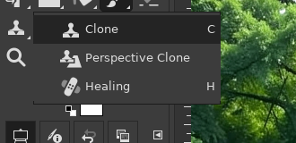
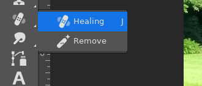
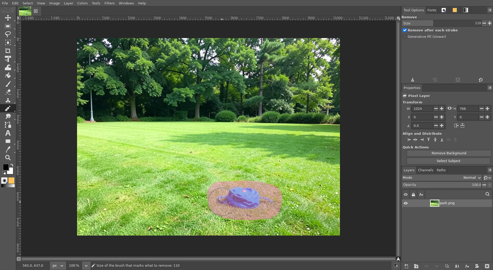
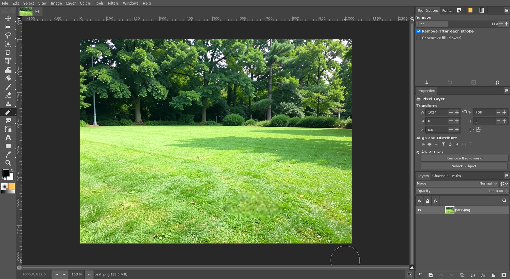
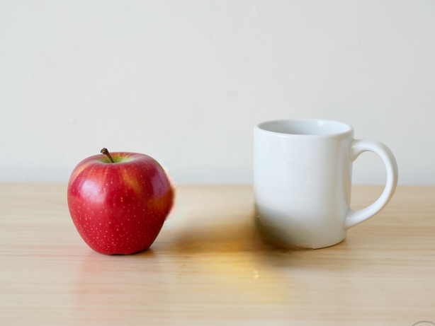

# Remove tool (AI)

**Issue:** [#31](https://github.com/diegochagas/gimphoto/issues/31) ·
**Patch:** [`patches/0014-…`](../../patches/0014-Remove-tool-paint-over-an-object-to-remove-it-AI.patch) ·
**Plug-in:** [`plugins/generative-fill/`](../../plugins/generative-fill/) ·
**Backend:** [ComfyUI with GIMPhoto](comfyui-with-gimphoto.md)

Photoshop's **Remove tool**: brush over an object and it disappears, with
the background filled in. GIMPhoto adds it to the toolbox, in the J group
next to GIMP's Healing tool, as in Photoshop. A local AI model on this
computer does the filling (no account, nothing uploaded): **LaMa**, a
model made for removing objects (about a second). **SAM 2.1** finds the
object under the brush, so brushing most of an object removes all of it.

## Before and after

| Plain GIMP: Healing is in the Clone group | GIMPhoto: Remove next to Healing, in the J group |
|---|---|
|  |  |

Brushing over a backpack on a lawn (Photoshop's see-through pink shows
what will go):

On release, the backpack is gone and the grass is filled in:

The picture is generated with the local FLUX.2 klein model.

## Use

1. Pick **Remove** in the toolbox (the J group: right-click the Healing
   button) and select the layer to remove from.
2. Set the brush **Size** in Tool Options, or use **[** and **]** (5 px a
   step). The circle under the pointer shows it.
3. Brush over the object, as much of it as you can. It is removed when you
   release the button. It is one undo step.

Tool Options:
- **Remove after each stroke** (on, as in Photoshop). When it is off,
  strokes add up, shown in pink, until **Enter** removes them all at
  once; **Escape** clears them.
- **Generative fill (slower):** FLUX.2 klein redraws the area instead of
  LaMa continuing what is around it (half a minute to a minute). Mostly worse for
  removing (see below); it is there for areas LaMa smears.

What the model sees is the visible image (all layers), as Photoshop's
*Sample All Layers*. The result goes into the selected layer: only where
the strokes and the objects under them are, keeping the layer's name,
position and size.

**Needs** the local AI: ComfyUI with the `lama` model set (and `sam` for
finding objects), installed by
[local-ai-setup](https://github.com/diegochagas/local-ai-setup).
GIMPhoto starts and stops it ([ComfyUI with GIMPhoto](comfyui-with-gimphoto.md)).
Without it, the tool says so and where to install it, and the layer is
left alone.

## How it works

- **The tool** (`patches/0014-…`):
  - `app/tools/gimpremovetool.c/.h` is a `GimpDrawTool`. It draws each
    stroke as a see-through pink pen (`GimpCanvasPen`) and the brush circle
    under the pointer. On release, or Enter, it runs the plug-in procedure
    `gimphoto-remove` from an idle callback with the strokes as JSON (size
    and points). The image, display and layer are kept alive until it
    returns, and there is one removal at a time.
  - `gimpremoveoptions.c/.h`: Size, *Remove after each stroke*, *Generative
    fill*.
  - The `tools-remove-size-set` action, for **[** and **]**.
  - Registered in `gimp-tools.c` and `meson.build`.
- **The plug-in** (`plugins/generative-fill/`, `gimphoto-remove`):
  1. paints the strokes into a mask with a hard round brush;
  2. for each stroke, asks SAM 2.1 for the object in the stroke's box. When
     the strokes cover at least half of that object, and it is at most 4
     times the painted area (not the table or the wall), the whole object
     goes into the mask, grown by 6 px. Otherwise the stroke is sent 18%
     wider than painted. Leaving a rim uncovered made the models draw the
     object again: a banana came back twice;
  3. LaMa (`comfyui_api.remove`: `INPAINT_LoadInpaintModel` and
     `INPAINT_InpaintWithModel` from comfyui-inpaint-nodes) fills in the
     mask. It gets only the area and the picture around it (256 px, or half
     the area's size if that is more), not the whole photo: a 6000×4000
     image takes about 7 s;
  4. the result, masked, is merged down into the layer, in one undo group.
     A plug-in's GEGL has no operations loaded, so the compositing is done
     with GIMP's own layer operations.
- **local-ai-setup:** the `lama` model set (Big-LaMa, Apache-2.0, about
  200 MB) and the comfyui-inpaint-nodes (GPL-3.0, pinned).

**Why LaMa:** on a ball on a beach and a backpack on a lawn, LaMa (about
1 s) removed both cleanly. FLUX.2 klein (33–64 s) left a flat patch on the
sand, and the backpack in place. Qwen-Image-Edit (2 min) invented a saucer
where a banana had been.

**Tests:**
- `tests/test_comfyui_api.py`: the LaMa graph (image, mask through
  `ImageToMask`, `big-lama.pt`), and the message naming local-ai-setup
  when its nodes are missing.
- `scripts/smoke`: the tool is compiled in and the procedure is
  registered. With ComfyUI recorded as missing, it fails with a message
  naming local-ai-setup and leaves the layer alone.
- On the built app, with the real ComfyUI: the screenshots above, Enter
  and Escape without *Remove after each stroke*, **[** / **]**, and one
  Ctrl+Z undoing a removal.

## Limits

- **Shadows and reflections next to other objects:** where the object
  touches others, LaMa can smear their shadows into the filled area. Here
  a banana between an apple and a mug was removed, but a dark smear and its
  yellow reflection were left on the table, and brushing over them again
  spread the smear:

  

- Pixel layers only: on a layer group, or a layer with its pixels locked,
  the tool says so and changes nothing.
- No *Sample All Layers* switch: the visible image is always what the
  model sees.
- No Photoshop *Spot Healing Brush*: J picks GIMP's Healing tool.
