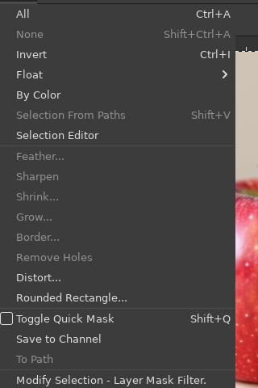
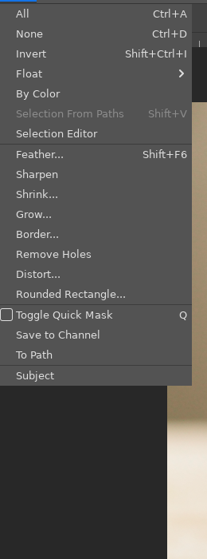
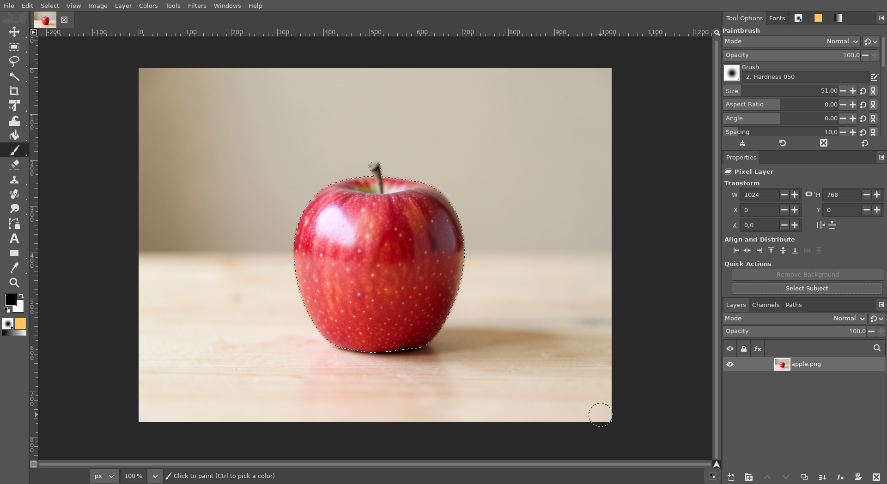

# Select Subject (AI)

**Issue:** [#39](https://github.com/diegochagas/gimphoto/issues/39) ·
**Plug-in:** [`plugins/ai-select/`](../../plugins/ai-select/) ·
**Backend:** [ComfyUI with GIMPhoto](comfyui-with-gimphoto.md)

Photoshop's *Select › Subject*: one click, and the main subject of the
picture becomes the selection. GIMPhoto does the same, with a local AI
model on this computer (no account, nothing uploaded): **BiRefNet**, a
model made to find the main object of a picture, on the local ComfyUI.

## Before and after

| Plain GIMP: no Subject | GIMPhoto: *Select › Subject* |
|---|---|
|  |  |

The apple selected with one click on the Properties panel's **Select
Subject** (stem included):

The subject does not have to be in the middle (left: the picture, right:
what Select Subject selects):

The pictures are generated with the local FLUX.2 klein model.

## Use

1. Open a picture.
2. **Select Subject** in the Properties panel's Quick Actions, or *Select ›
   Subject*.
3. The subject becomes the selection, its soft edges soft. **Shift** held
   while clicking adds it to the selection, as in Photoshop.

It is one undo step. The first run after GIMPhoto starts also loads the
model (a few seconds); later runs take about 2 seconds. What the model
sees is the visible picture (all layers), as Photoshop's "Sample All
Layers".

**Needs** the local AI: ComfyUI with the `birefnet` model set, installed by
[local-ai-setup](https://github.com/diegochagas/local-ai-setup).
GIMPhoto starts and stops it ([ComfyUI with GIMPhoto](comfyui-with-gimphoto.md)).
Without it, Select Subject says so and where to install it, and the
selection is left alone.

## How it works

- **Plug-in** `plugins/ai-select/` (procedure `gimphoto-select-subject`,
  the action the Properties panel's Quick Action runs). It:
  1. reads where ComfyUI is from the `gimphoto-comfyui` parasite of
     `comfyui-service`, and waits while ComfyUI is still starting;
  2. sends the flattened picture (at most 2048 px) to ComfyUI;
  3. turns the mask that comes back into the selection, in one undo
     group.
- **Shared client** `plugins/comfyui-service/comfyui_api.py`: the ComfyUI
  HTTP API (upload, run a graph, wait for the image), the BiRefNet graph,
  and the SAM 2.1 graph for Object Selection (#32). It is plain Python, so
  `tests/test_comfyui_api.py` tests it against a fake ComfyUI.
- **In ComfyUI** (local-ai-setup): the BiRefNet nodes
  (`LoadRembgByBiRefNetModel`, `GetMaskByBiRefNet`, MIT) and the BiRefNet
  general model (MIT, ~450 MB). The mask is soft: no threshold.
- **Why not SAM:** SAM 2.1 needs a prompt. Given the whole picture as its
  box, it selects the background; given the centre as a point, it misses a
  subject off to the side. BiRefNet finds the subject anywhere.

**Tests:**
- `tests/test_comfyui_api.py` (no network): the graph sent, the upload, the
  wait for a booting ComfyUI, missing nodes and failed runs explained.
- `scripts/smoke`: the procedure is registered; with ComfyUI recorded as
  missing, Select Subject fails with a message naming local-ai-setup and
  leaves the selection alone. Tests never call the real ComfyUI.
- On the built app, with the real ComfyUI: the screenshots above.

## Limits

- Shift to add works under X11 (GIMPhoto's default); under Wayland the
  plug-in cannot read the keyboard and always replaces the selection.
- One subject: with several objects, BiRefNet selects what it judges to be
  the main ones together.
- The *Subject* entry is at the end of the Select menu, where GIMP puts
  plug-ins, not after *Invert* as in Photoshop.
