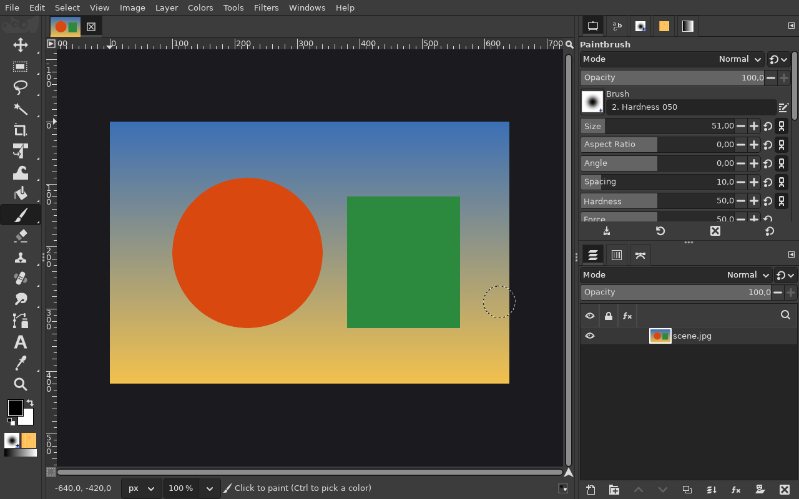
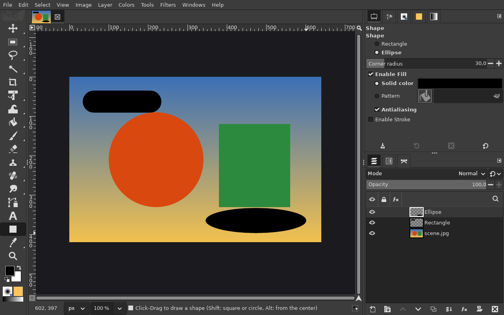
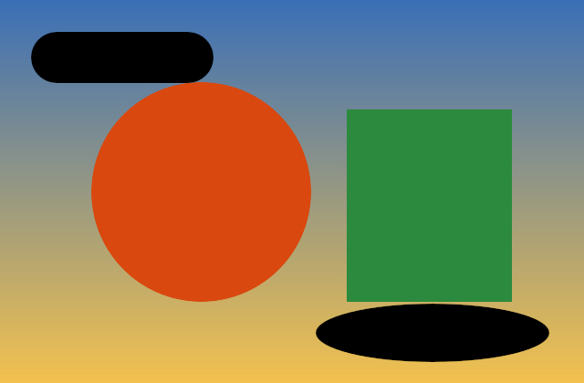

# Shape tool (U): Rectangle and Ellipse

**Issue:** [#2](https://github.com/diegochagas/gimphoto/issues/2) ·
**Patch:** [`patches/0004-Shape-tool-draw-rectangles-and-ellipses-as-vector-la.patch`](../../patches/0004-Shape-tool-draw-rectangles-and-ellipses-as-vector-la.patch)

Photoshop's shape tools draw a shape by dragging on the canvas and keep it
editable. GIMP 3.2 has vector layers (a path drawn with a live fill and
stroke) but no tool that draws shapes. GIMPhoto adds one to the toolbox,
after the Text tool, on **U**.

## Before and after

| Plain GIMP | GIMPhoto |
|---|---|
|  |  |

## Use

1. Pick the **Shape** tool (**U**) and, in its options, **Rectangle** or
   **Ellipse**, the **Corner radius** for a rectangle, and the **Fill** and
   **Stroke** (the same editors as the Paths tool's vector layers; a new
   shape is filled with black, without a stroke, as in Photoshop).
2. Drag on the canvas. **Shift**: a square or a circle. **Alt**: from the
   centre. Both can be pressed or released while dragging.
3. On release the shape is a new **vector layer** (named *Rectangle* or
   *Ellipse*) over the selected one, with its path in the Paths panel: one
   undo step.

Edit it afterwards as any vector layer: its fill and stroke in the Paths
tool's options (or *Layer > Vector Layer*), its points with the Paths tool
(**P**), and Layer Styles (**fx**) work on it.

## What changed

**GIMP's code** (`patches/0004-…`), new files only, plus two lines to build
and register them:

- `app/tools/gimpshapetool.c`: a `GimpDrawTool` that previews the box
  while dragging (Shift and Alt as above), then builds the path (a
  rectangle, its corners rounded with Bézier quarter circles, or
  `gimp_bezier_stroke_new_ellipse`) and adds it and a `GimpVectorLayer`
  in one undo group, as the Paths tool's *Create New Vector Layer* does;
- `app/tools/gimpshapeoptions.c`: the tool options, a subclass of the
  Paths tool's (which carry the vector layer's fill and stroke) with
  *Shape* and *Corner radius*; its reset (which GIMP also runs at
  startup) gives Photoshop's black fill without a stroke;
- `app/tools/gimp-tools.c`, `app/tools/meson.build`: registration.

**Defaults:** `defaults/toolrc` places the tool after Text; the keymap gives
it **U** (Photoshop's), which Fuzzy Select (GIMP's U) gives up, keeping
Photoshop's **W**.

## Limits

- Rectangle and Ellipse only for now: Triangle, Polygon, Line and Custom
  Shape follow in later pull requests (the *Shape* option grows).
- One tool with a *Shape* option, not a flyout of separate tools.
- The preview while dragging is the shape's box or ellipse outline, not
  the filled shape; a rounded rectangle previews as its box.
- Profiles that already exist keep their toolbox and shortcuts: the tool is
  at the end of the toolbox, without U, until the toolbox and shortcuts are
  reset.
