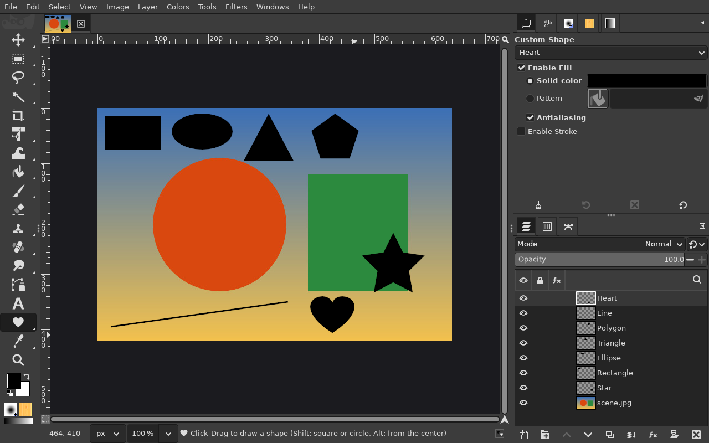

# Shape tools (U)

**Issue:** [#2](https://github.com/diegochagas/gimphoto/issues/2)
([#22](https://github.com/diegochagas/gimphoto/issues/22) Rectangle and Ellipse,
[#23](https://github.com/diegochagas/gimphoto/issues/23) the other shapes) ·
**Patches:** [`patches/0004-…`](../../patches/0004-Shape-tool-draw-rectangles-and-ellipses-as-vector-la.patch),
[`patches/0005-…`](../../patches/0005-Shape-tools-one-per-shape-grouped-in-the-toolbox-as-.patch)

Photoshop's shape tools draw a shape by dragging on the canvas and keep it
editable. GIMP 3.2 has vector layers (a path drawn with a live fill and
stroke) but no tool that draws shapes. GIMPhoto adds Photoshop's seven
shape tools to the toolbox, in one group after the Text tool, as
Photoshop's flyout: Rectangle (**U**), Ellipse, Triangle, Polygon, Star,
Line and Custom Shape.

## Before and after

| Plain GIMP | GIMPhoto |
|---|---|
|  |  |

A rounded rectangle, and an ellipse drawn from its centre:

Every shape tool, each shape its own vector layer (here the Custom Shape
tool is active, its options showing the custom shape):

## Use

1. Pick a shape tool in the toolbox group: **U** for the Rectangle tool;
   **right-click** the group's button (or hover it) for the others, as in
   Photoshop's flyout. Its options show only its own settings:

   | Tool | Settings | Drag |
   |---|---|---|
   | Rectangle | Corner radius | box; Shift: square |
   | Ellipse | — | box; Shift: circle |
   | Triangle | — | box, a point up |
   | Polygon | Sides | box (the polygon fills its ellipse, a point up) |
   | Star | Points, Indent sides by | box |
   | Line | Weight | from the press to the release; Shift: 45° steps |
   | Custom Shape | Heart, Star, Arrow, Speech Bubble, Burst, Check Mark, Lightning, Cross | box |

   **Fill** and **Stroke** are the same editors as the Paths tool's vector
   layers; a new shape is filled with black, without a stroke, as in
   Photoshop.
2. Drag on the canvas. **Alt**: from the centre (not for lines). Shift and
   Alt can be pressed or released while dragging; the outline previews the
   shape.
3. On release the shape is a new **vector layer**, named after it, over the
   selected one, with its path in the Paths panel: one undo step.

Edit it afterwards as any vector layer: its fill and stroke in the Paths
tool's options (or *Layer > Vector Layer*), its points with the Paths tool
(**P**), and Layer Styles (**fx**) work on it.

## What changed

**GIMP's code** (`patches/0004-…` and `0005-…`), new files only, plus two lines to build
and register them:

- `app/tools/gimpshapetool.c`: seven tools, `GimpShapeTool` subclasses
  that only set their shape, registered with GIMPhoto's icons
  (`icons/gimphoto-shape-*.svg`, installed into GIMP's icon theme by the
  manifest's `gimphoto-icons` module). `GimpShapeTool` is a `GimpDrawTool` that builds the shape's
  path while dragging (Shift and Alt as above) and previews its outline,
  then adds it and a `GimpVectorLayer` in one undo group, as the Paths
  tool's *Create New Vector Layer* does. Rectangles get Bézier
  quarter-circle corners, ellipses `gimp_bezier_stroke_new_ellipse`,
  polygons and stars their points on the box's ellipse, lines a polygon of
  the line's width, custom shapes unit-square path data (M, L, C, Z) from
  gimp-setup's Shape Tool plug-in, fitted to the box;
- `app/tools/gimpshapeoptions.c`: the tool options, a subclass of the
  Paths tool's (which carry the vector layer's fill and stroke) with
  each shape's settings, and one options GUI per tool; its reset (which GIMP also runs at
  startup) gives Photoshop's black fill without a stroke;
- `app/tools/gimp-tools.c`, `app/tools/meson.build`: registration.

**Defaults:** `defaults/toolrc` groups the seven tools after Text, the
Rectangle tool first; the keymap gives it **U** (Photoshop's), which Fuzzy
Select (GIMP's U) gives up, keeping Photoshop's **W**.

## Limits

- Only the Rectangle tool has **U**: GIMP gives a key to one action, so
  Photoshop's U for the whole group and Shift+U to cycle are not there; the
  others are one right-click away.
- The preview while dragging is the shape's outline, not the filled shape.
- Custom shapes are the eight built in; Photoshop's shape libraries (CSH)
  cannot be loaded.
- Profiles that already exist keep their toolbox and shortcuts: the tool is
  at the end of the toolbox, without U, until the toolbox and shortcuts are
  reset.
