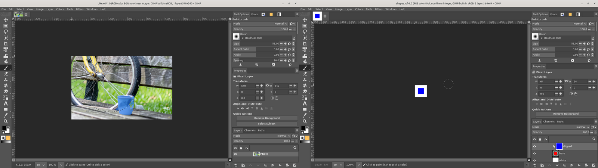
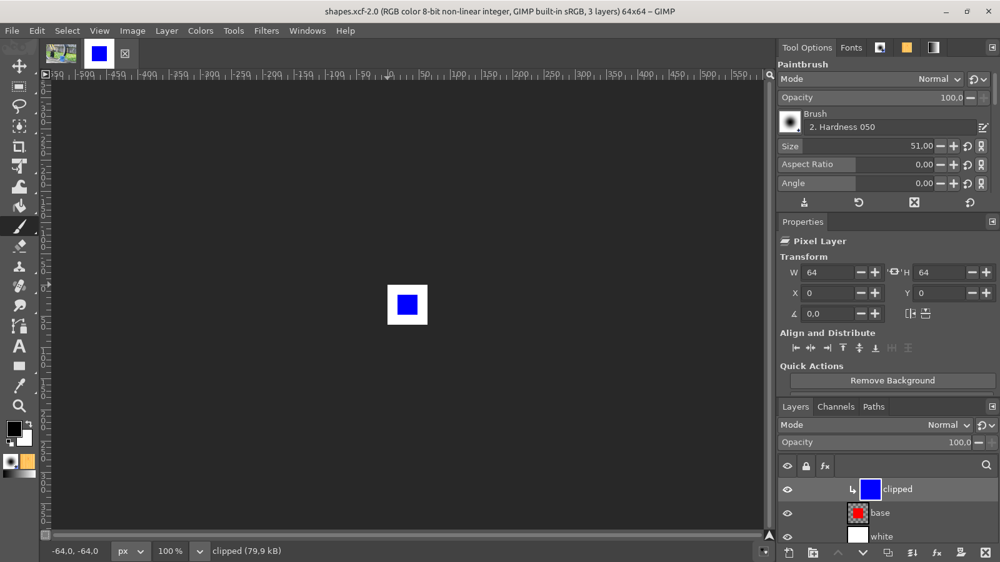

# One GIMPhoto for every image you open

**Issue:** [#142](https://github.com/diegochagas/gimphoto/issues/142) ·
**Patch:** [`patches/0019-…`](../../patches/0019-Single-instance-in-a-Flatpak-the-bus-name-follows-th.patch)

Opening an image from the file manager (a double click on a PSD, *Open
With › GIMPhoto*) while GIMPhoto is open should open it **as a new tab in
the GIMPhoto that is already open**, as Photoshop and the official GIMP do.
GIMPhoto started a new copy of itself instead, one more icon in the taskbar
for every image.

GIMP finds the copy that is already running through a name on the session
bus, `org.gimp.GIMP.UI`: the first GIMP owns it, and a second launch calls
its *Open* method with the files and exits. A Flatpak may only own names
under its own app ID. The official GIMP Flatpak is `org.gimp.GIMP`, so the
name is its own; GIMPhoto is `io.github.diegochagas.GIMPhoto`, so the
sandbox refused the name (GIMPhoto's log said *the name "org.gimp.GIMP.UI"
could not be acquired on the bus*), no copy was ever found running, and
every launch started a new one.

## Before and after

| GIMPhoto before: two images opened, two GIMPhotos, one image each | GIMPhoto: the second image opens as a tab in the GIMPhoto already open |
|---|---|
|  |  |

## Use

Open images the usual way while GIMPhoto is open: double-click them in the
file manager, *Open With › GIMPhoto*, drag them onto GIMPhoto's launcher, or
run `flatpak run io.github.diegochagas.GIMPhoto image.psd`. Each one opens
as a new tab in the open GIMPhoto, which comes to the front. With no
GIMPhoto open, the first image starts it.

`--new-instance` (`-n`) still starts a separate GIMPhoto on purpose.

## What changed

**GIMP's code** (`patches/0019-…`), one header: the bus name in
`app/gui/gimpdbusservice.h` follows the Flatpak's app ID: in a Flatpak
whose ID is not `org.gimp.GIMP` it is `<app ID>.UI`
(`io.github.diegochagas.GIMPhoto.UI`), which the sandbox lets GIMPhoto own
without any new permission. The official GIMP and builds outside Flatpak
keep `org.gimp.GIMP.UI`. Both sides read the name there: the running GIMP
that owns it (`app/gui/gui-unique.c`) and the launch that looks for it
(`app/unique.c`). It also keeps GIMPhoto and the official GIMP from handing
images to each other when both are open.

**Smoke test** (`scripts/smoke`, `tests/smoke_single_instance.sh`): on a
private session bus and X display, with a throwaway profile (the GIMPhoto
in use is never reached), it starts GIMPhoto, waits for it to own its bus
name, opens an image with a second launch, which must hand it over and
exit, then asks the running GIMPhoto (a batch command, which a launch hands
over too) which images it has open: the one passed. Before the fix it
failed with GIMPhoto's own message, the name could not be acquired.

## Limits

- An image opened while GIMPhoto is still starting (before its window is
  up) can start a second GIMPhoto, as in GIMP: the first one owns the name
  only once it has started.
- GIMPhotos already open from before the update do not own the new name:
  close them all once after updating.
