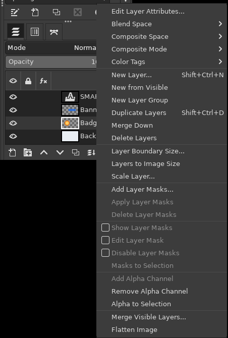
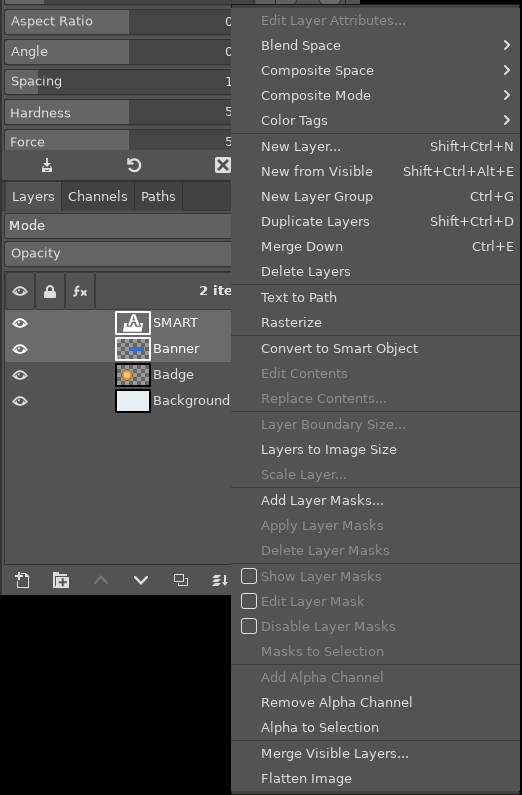
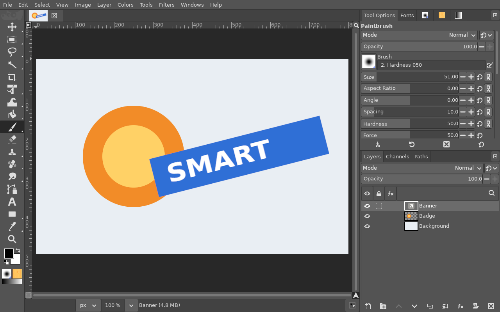
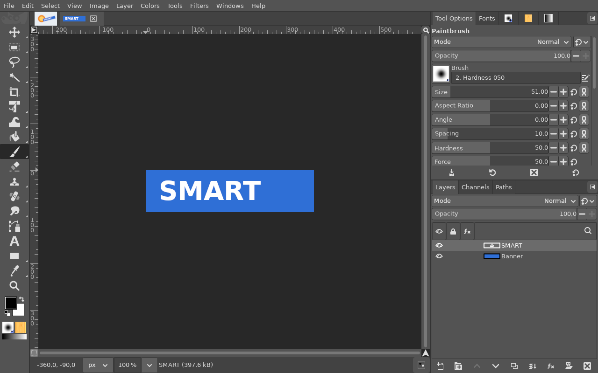
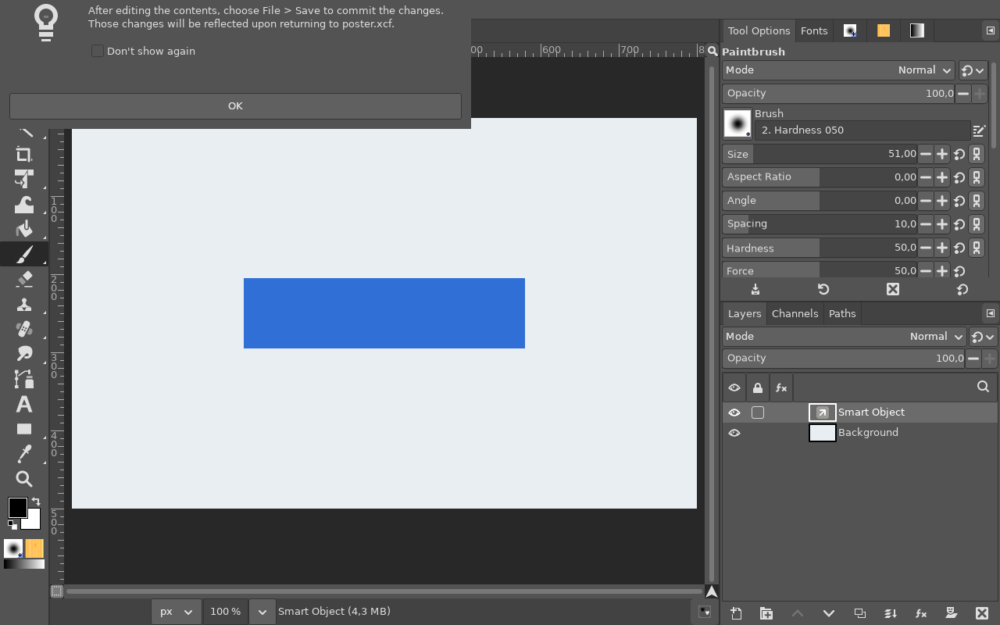

# Smart Objects

**Issue:** [#29](https://github.com/diegochagas/gimphoto/issues/29) ·
**Plug-ins:** [`plugins/smart-objects/`](../../plugins/smart-objects/),
[`plugins/psd-text/`](../../plugins/psd-text/) (PSD) ·
**Patches:** [`patches/0006-…`](../../patches/0006-Smart-Objects-right-click-menu-entries-link-layer-co.patch),
[`patches/0007-…`](../../patches/0007-Layers-dock-double-click-opens-a-smart-object-s-cont.patch)
(double click, [#43](https://github.com/diegochagas/gimphoto/issues/43))

In Photoshop, *Convert to Smart Object* wraps layers in a container you can
scale, rotate and distort as often as you like without losing quality, and
*Edit Contents* opens what is inside to change it. GIMP 3.2 has link layers
(a layer drawn from an image file, redrawn when that file changes, its
transforms non-destructive) but no command that turns layers into one.
GIMPhoto adds Photoshop's three commands, in *Layer > Smart Object* and in
the Layers panel's right-click menu, and keeps smart objects working in
**XCF and PSD**, both ways with Photoshop.

## Before and after

| Plain GIMP | GIMPhoto |
|---|---|
|  |  |

A banner (a shape and a text layer) converted into a smart object, scaled
down to 8% and back up, rotated, and exported to PSD; the PSD opened again:
the banner is still a smart object, sharp, on the same corners:

*Edit Contents* on it: its contents in a new tab, the text still an
editable text layer:

A double click on a smart object, as in Photoshop: the notice, then its
contents in a new tab:

## Use

1. Select one or more layers (groups, text and Layer Styles included) and
   right-click > **Convert to Smart Object** (*Layer > Smart Object*). They
   become one smart object (a link layer, named after the layer, or *Smart
   Object* for several) at the same place on the canvas and in the stack.
2. Scale, rotate or transform it with the transform tools: GIMP redraws it
   from its contents each time, so it never gets blurry.
3. **Double-click** the smart object in the Layers panel (or right-click >
   **Edit Contents**): as in Photoshop, a notice says *After editing the
   contents, choose File > Save to commit the changes…* (tick *Don't show
   again* to stop it), then its contents open in a new tab (when they are
   open already, the double click switches to their tab). Edit, **Ctrl+S**,
   and every smart object showing that file updates.
4. **Replace Contents…** makes it show another image file, at the same
   place and size.
5. *Layer > Rasterize* (GIMP's own) turns it back into a plain layer.

Each command is one undo step.

## Where the contents go

Photoshop keeps a smart object's contents inside the PSD; a GIMP link layer
shows a file. GIMPhoto saves the contents as an XCF in a folder next to the
image, **`<image name> smart objects/`**: copy that folder along with the
image. For an image never saved, they go in GIMPhoto's data folder
(`gimp-smart-objects/` under it); save the image first to keep them
together.

## PSD: smart objects both ways with Photoshop

- **Open a `.psd`:** every Photoshop smart object whose contents are
  embedded becomes a GIMPhoto smart object: its contents are opened (with
  their text editable and their own smart objects, see
  [PSD with editable text](psd-editable-text.md)), saved as an XCF in
  `<psd name> smart objects/` next to the PSD, and shown on the same
  corners (moved, scaled, rotated or distorted as in Photoshop).
  Instances (one smart object duplicated) share one XCF, so editing it
  updates them all, as in Photoshop.
- **Export to `.psd`:** every smart object becomes a Photoshop smart object
  with its contents **embedded** (an XCF is written as a PSD; a PSD, PNG or
  JPEG as it is), placed on the same corners: in Photoshop, double-click it
  to edit its contents, transform it without losing quality. Smart objects
  showing the same file are written as instances of one.

Nothing to choose: *File > Open* a `.psd`, *File > Export As…*
`name.psd`. In an XCF a smart object stays a link layer to its contents
file.

## What changed

- **Plug-in** `plugins/smart-objects/`: gimp-setup's
  [Smart Objects](https://github.com/diegochagas/gimp-setup) plug-in
  (see [plugins/README.md](../../plugins/README.md)), registering
  `smart-object-convert`, `smart-object-edit` and `smart-object-replace`
  in *Layer > Smart Object*.
- **PSD:** the [PSD with editable text](psd-editable-text.md) plug-in
  (`plugins/psd-text/`) also reads Photoshop's placed layers and embedded
  files (`psd_text_info.mjs`, ag-psd), turns them into link layers
  (`make_smart_object`), and writes link layers as placed layers with
  their contents embedded (`describe_smart`, `write_psd_text.mjs`).
- **GIMP's code** (`patches/0006-…`):
  - three lines in the Layers panel's right-click menu
    (`menus/layers-menu.ui`) under *Rasterize*; plug-in actions are named
    after their procedures, so the menu points at them;
  - a PDB procedure, `gimp-link-layer-get-corners`
    (`pdb/groups/link_layer.pdb` and the files pdbgen makes from it): where
    the four corners of a link layer's file are on the canvas after its
    transforms, which Photoshop stores for a smart object. GIMP keeps that
    transform but did not let plug-ins read it;
  - `app/xcf/xcf-load.c`: an XCF keeps a smart object's name (GIMP renamed
    link layers after their file when it loaded them).
  - `patches/0007-…`: in `app/actions/layers-commands.c`, the Layers
    panel's double click (`layers-edit`) runs the plug-in's Edit Contents on
    a smart object, instead of the layer attributes, or switches to its
    contents' tab when they are open already; a rasterized link layer keeps
    GIMP's behaviour.
- **Tests:** `tests/smoke_smart_objects.py`, run by `scripts/smoke`: two
  layers of a saved image become one smart object, its contents in
  `<name> smart objects/`, at the same place and looking the same, its name
  kept when the XCF is saved and opened again; scaled to
  15% and back it is still sharp; exported to PSD it is one smart object
  (checked with ag-psd, as Photoshop reads it) with its contents embedded as
  a PSD on the same corners, upright and rotated; that PSD opens as a smart
  object again, on the same corners, looking the same; two smart objects
  showing one file are instances of one in the PSD and share one XCF when
  it opens again, without touching files already in the folder; Replace
  Contents shows another file.

## Limits

- In an XCF the contents are a separate file, not embedded: moving the
  image without its `smart objects` folder leaves the smart object showing
  its last rendering, unable to update. A PSD carries them inside.
- Photoshop smart objects linked to a file outside the PSD (not embedded),
  warped ones (Edit > Transform > Warp) and their smart filters open as
  pixels; a smart object's layer mask is dropped.
- Edit Contents of a smart object showing a non-XCF file (after Replace
  Contents) needs *File > Overwrite*, not Save, for it to update.
- No Photoshop-style smart filters: filters applied to a link layer are
  GIMP's own non-destructive filters.
