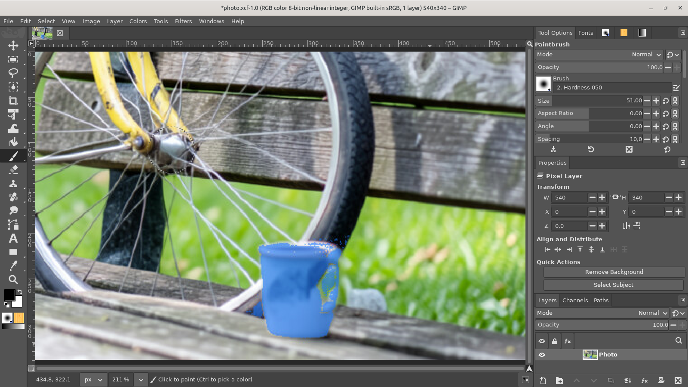
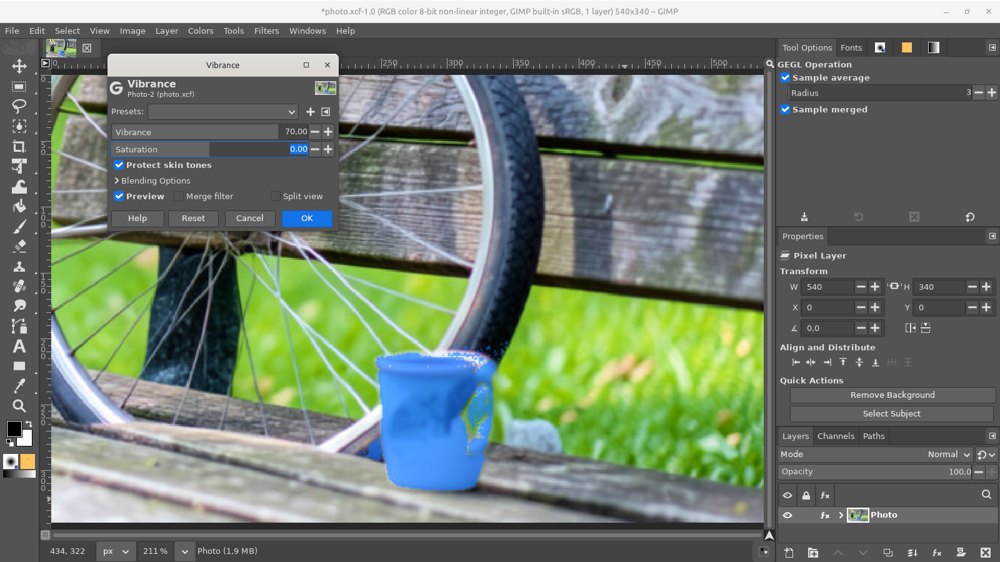
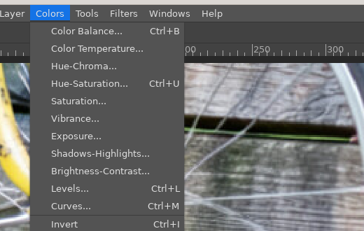
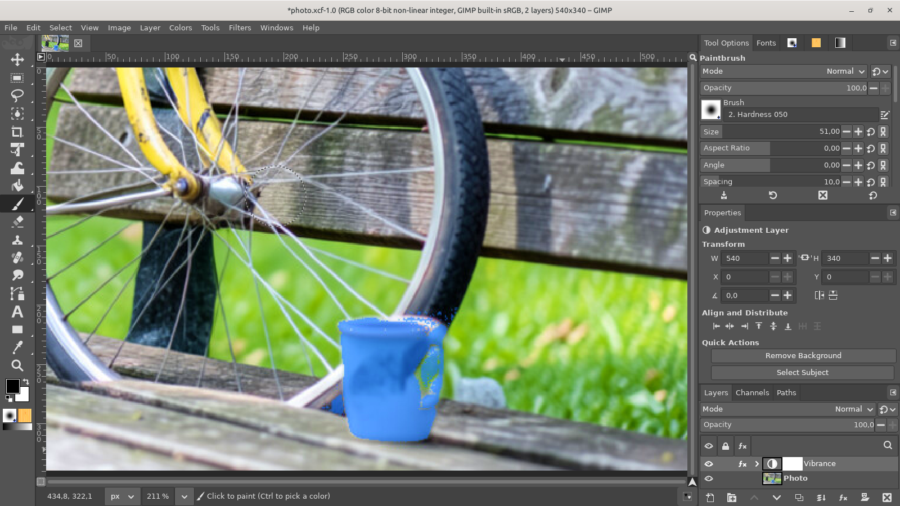

# Vibrance

**Issue:** [#71](https://github.com/diegochagas/gimphoto/issues/71) ·
**GEGL operation:** [`gegl/vibrance.c`](../../gegl/vibrance.c) ·
**Patch:** [`patches/0020-…`](../../patches/0020-Vibrance-Colors-Vibrance-and-Layer-New-Adjustment-La.patch)

Photoshop's **Image › Adjustments › Vibrance**: *Vibrance* raises (or
lowers) saturation more where colours are dull than where they are already
saturated, and spares skin tones, so a photo gets livelier without faces
turning orange and greys stay grey; *Saturation* is the plain, even slider
next to it. Photoshop also has it as an adjustment layer.

GIMP has *Colors › Saturation* and *Hue-Saturation*, which raise every
colour by the same amount. GEGL has a basic `gegl:vibrance` (both sliders,
no skin protection) that GIMP's menus do not offer. GIMPhoto adds its own
operation, `gimphoto:vibrance`, with Photoshop's skin protection, as
**Colors › Vibrance…** and **Layer › New Adjustment Layer › Vibrance…**.

## Before and after

| GIMPhoto before: the photo as it was | GIMPhoto: Colors › Vibrance at +70, previewed |
|---|---|
|  |  |

## Use

1. **Colors › Vibrance…** (next to Saturation), or **Layer › New
   Adjustment Layer › Vibrance…** to keep it as a layer you can change,
   mask and turn off later.

   

2. *Vibrance* (−100 to 100): positive values bring dull colours up most;
   negative ones take them down most. *Saturation* (−100 to 100): every
   colour by the same amount, as Photoshop's second slider.
3. *Protect skin tones* (on by default, as Photoshop): orange-red,
   moderately saturated colours get less of a raised Vibrance.

The dialog previews on the canvas and has GIMP's Presets, Split view and
blending options; as an adjustment layer it applies to everything below.

## What changed

**GEGL operation** (`gegl/vibrance.c`, built by the manifest's
`gimphoto-gegl-ops` module): each pixel moves away from (or towards) the
grey of its own luma by
`(1 + vibrance × (1 − s) × skin) × (1 + saturation)`, where `s` is its
saturation (0 grey, 1 pure colour) and `skin` is below 1 for hues and
saturations typical of skin when protection is on. It works on
gamma-encoded values, as Photoshop does, keeps alpha, leaves values above
1 in high bit depth images alone (no clipping, as GEGL's own saturation),
and is saved in the XCF like GIMP's own filters. Its type is `gimphoto_vibrance`, so it lives
next to GEGL's own `gegl:vibrance`.

**GIMP's code** (`patches/0020-…`), small: the `filters-vibrance` action
(`app/actions/filters-actions.c`) in the Colors menu after Saturation, and
`layers-new-adjustment-vibrance` (`app/actions/layers-actions.c`) in Layer ›
New Adjustment Layer after Exposure, where Photoshop lists it, in both the
Layer menu and the Layers panel's menu.

**Smoke test** (`scripts/smoke`, `tests/smoke_vibrance.py`): on a strip of
colours, merged as a filter: Vibrance and Saturation 0 change nothing; with
Vibrance +100 a muted colour gains more saturation than a vivid red and a
grey stays grey; a skin tone gains less than a blue just as saturated,
unless skin protection is off; Saturation −100 turns every colour grey; on
a 32-bit float image a value above 1 is not clipped; the two menu entries
are compiled into GIMP. It failed before the operation
existed, and caught the name clash with GEGL's own `gegl:vibrance`.

## Limits

- Skin protection is by colour (hue and saturation), not by finding faces:
  orange-red objects (wood, terracotta) are spared too, as in Photoshop.
- Grayscale images: the entries are greyed out, as Saturation's.
